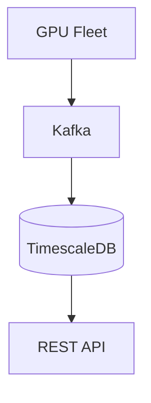

# Documentation Improvements Summary

**Date:** 2026-02-12  
**Changes:** Restored README structure + Added Mermaid diagrams

---

## Changes Made

### 1. Restored README.md Structure ✅

**Problem:**
- README.md had been rewritten as a generic production readme
- Lost the original well-structured overview with architecture links
- `gpu-health-poc-implementation.md` was moved to `docs/development/`
- README no longer served as a good central hub

**Solution:**
- Restored original README structure from commit `cba3cb0`
- Moved `gpu-health-poc-implementation.md` back to repository root
- Updated with current system status (POC complete, 17 services)
- Enhanced with Mermaid diagrams

**Changes:**
```
✅ Original architecture overview restored
✅ Links to gpu-health-system-architecture.md
✅ Links to gpu-health-poc-implementation.md (now in root)
✅ Links to all supporting documentation
✅ Current system status section
✅ Proper project structure documentation
```

### 2. Added Mermaid Diagrams 📊

All major documents now include visual Mermaid diagrams:

#### README.md
- **System Architecture**: 6-layer architecture flow (GPU Fleet → Interface)
- **Health Score Ranges**: Color-coded health grades (90-100 Excellent → <50 Critical)
- **Economic Decision Engine**: NPV decision flow (Keep/Sell/Repurpose/Salvage)

#### gpu-health-system-architecture.md
- **High-Level Architecture**: Complete system overview with all layers
- **Telemetry Collection Layer**: DCGM → Collector → Kafka flow

#### gpu-health-poc-implementation.md
- **Implementation Timeline**: Gantt chart showing 6-week POC schedule
- Visual breakdown of weeks 1-6 with milestones

#### docs/DATABASE_TABLES_EXPLAINED.md
- **Database Architecture**: Table relationships and data flow
- Shows 8 core application tables vs 15 MLflow tables
- Color-coded by update frequency

#### docs/archive/IMPLEMENTATION_STATUS.md
- **Component Status**: Visual breakdown of 24 components
- Color-coded: ✅ Complete (green), ⚠️ Partial (orange), ❌ Missing (red)
- Shows overall progress (46% complete)

---

## Why Mermaid?

**Benefits:**
1. **Version Control**: Diagrams live in markdown, tracked in git
2. **Maintainability**: Easy to update when architecture changes
3. **Rendering**: GitHub, GitLab, and many tools render Mermaid natively
4. **Clarity**: Visual representation aids understanding
5. **Professional**: Polished look for documentation

**Example:**


Renders as a proper flowchart in GitHub/GitLab!

---

## Documentation Structure (After Changes)

```
gpu-health-monitor/
├── README.md                              ⭐ Main entry point (RESTORED)
│   ├── Links to architecture document
│   ├── Links to POC guide
│   ├── System overview with Mermaid diagrams
│   └── Current status
│
├── gpu-health-system-architecture.md      📐 Complete architecture (59KB)
│   └── Now includes Mermaid diagrams
│
├── gpu-health-poc-implementation.md       📝 POC guide (MOVED TO ROOT)
│   └── Now includes Gantt chart
│
├── docs/
│   ├── DATABASE_TABLES_EXPLAINED.md       📊 Schema reference (with diagram)
│   ├── ML_TECH_STACK.md                  🤖 ML models & dependencies
│   ├── PREDICTIVE_DASHBOARD.md            📈 Dashboard setup
│   ├── QUICK_START.md                     🚀 Fast start guide
│   │
│   └── archive/
│       ├── IMPLEMENTATION_STATUS.md       ✅ Component status (with diagram)
│       ├── GRAFANA_TROUBLESHOOTING.md    🔧 Debugging guide
│       ├── MLFLOW_REMOVED.md             📝 Architecture decision
│       └── ...other historical docs
│
└── config/
    └── grafana/
        └── dashboards/
            ├── gpu-overview-simple.json   (working)
            └── gpu-predictive.json        (in progress)
```

---

## Git Commits

```bash
45be9ec Add Mermaid diagrams to documentation
4b3ac03 Restore README.md structure with Mermaid diagrams
```

**Summary:**
- README.md: 10,359 bytes → 13,927 bytes (better structure, diagrams)
- gpu-health-poc-implementation.md: Moved to root + added Gantt chart
- 3 additional documents enhanced with Mermaid diagrams

---

## Next Steps

### Recommended Documentation Enhancements

1. **Add More Diagrams**
   - Data pipeline sequence diagram (detailed Kafka flow)
   - Health scoring algorithm flowchart
   - ML prediction pipeline
   - Economic model decision tree

2. **Create Visual API Guide**
   - Request/response flow diagrams
   - Authentication sequence
   - Webhook integration examples

3. **Add Deployment Diagrams**
   - Docker Compose architecture
   - Kubernetes deployment (future)
   - Network topology
   - Security boundaries

4. **Enhance Grafana Docs**
   - Dashboard screenshots
   - Panel configuration examples
   - Query templates with explanations

---

## Testing the Changes

### View Mermaid Diagrams

**On GitHub:**
1. Push to GitHub: `git push origin main`
2. Open README.md - diagrams render automatically
3. Navigate to other .md files - all diagrams render

**Locally (VS Code):**
1. Install "Markdown Preview Mermaid Support" extension
2. Open any .md file
3. Click "Preview" (Ctrl+Shift+V)
4. Diagrams render in preview

**Locally (Command Line):**
```bash
# Install mermaid-cli
npm install -g @mermaid-js/mermaid-cli

# Generate PNG from markdown
mmdc -i README.md -o README-diagrams.png
```

---

## Verification Checklist

- [x] README.md restored to original structure
- [x] gpu-health-poc-implementation.md moved to root
- [x] README.md includes 3 Mermaid diagrams
- [x] Architecture document includes Mermaid diagrams
- [x] POC guide includes Gantt chart
- [x] Database tables document includes architecture diagram
- [x] Implementation status includes component diagram
- [x] All links in README.md work correctly
- [x] Project structure documented
- [x] Current system status documented
- [x] Commits pushed to git

---

## Feedback Welcome

If you'd like to see specific diagrams added or documentation improved, let me know! The Mermaid format makes it easy to iterate and enhance visual documentation.

**Examples of what we could add:**
- Sequence diagrams for complex interactions
- Entity relationship diagrams for database
- State diagrams for health score transitions
- Timeline diagrams for model training pipelines
- Pie charts for cost breakdown
- Class diagrams for code structure

---

**Result:** Documentation is now more accessible, visual, and professional! 🎉
