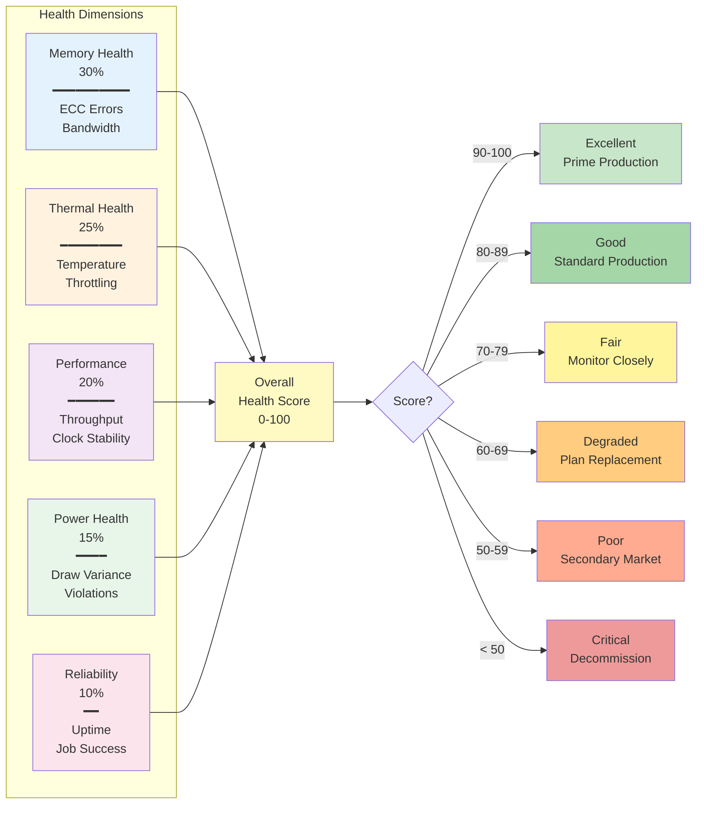
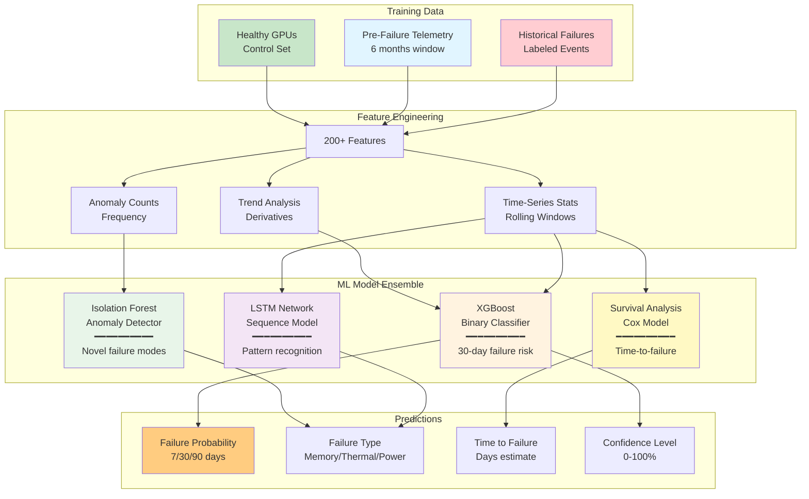
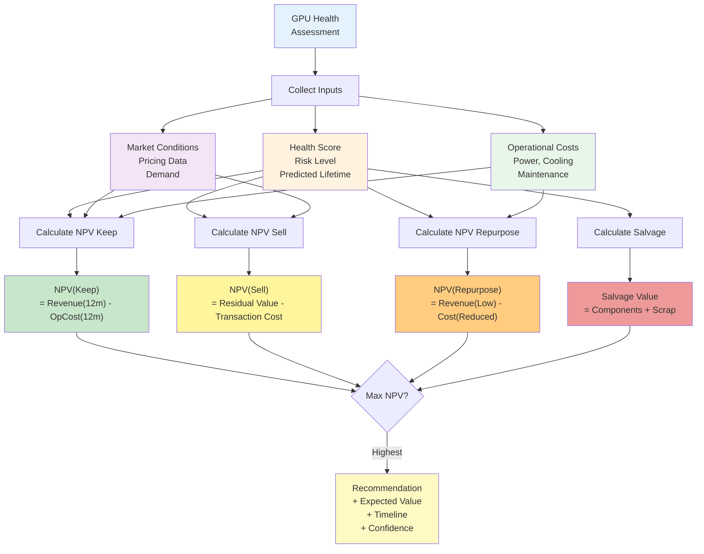

<div align="center">
  
</div>

<br>

<div align="center">

[](LICENSE)
[](https://www.python.org/downloads/)

</div>

# GPU Health Monitor

**Production-grade health monitoring and predictive fault management system for NVIDIA A100/H100 GPU fleets**

## Overview

GPU Health Monitor is a comprehensive system designed to monitor, predict, and manage the lifecycle of large-scale GPU deployments (10,000+ GPUs). It provides real-time health scoring, predictive failure detection, and economic decision-making capabilities to maximize GPU fleet ROI and minimize downtime.

### Key Features

- **Real-time Health Monitoring**: Multi-dimensional health scoring across thermal, memory, power, performance, and reliability metrics
- **Predictive Analytics**: Machine learning models predict failures 7-90 days in advance with >85% accuracy
- **Economic Decision Engine**: Data-driven recommendations for GPU lifecycle management (keep, sell, repurpose, decommission)
- **Secondary Market Integration**: Automated pricing recommendations based on health scores and market conditions
- **Production-grade Architecture**: Scalable to 10,000+ GPUs with 99.99% uptime

### Architecture

The system consists of six major layers:

1. **Telemetry Collection**: DCGM-based metrics collection (100+ metrics per GPU, 10s intervals)
2. **Stream Processing**: Real-time validation, enrichment, and anomaly detection via Kafka
3. **Storage**: TimescaleDB for time-series data, PostgreSQL for assets and metadata
4. **Analytics**: Health scoring, failure prediction (XGBoost/LSTM), and pattern analysis
5. **Decision Engine**: Economic modeling and lifecycle recommendations
6. **Interface**: Grafana dashboards, REST API, and alert management


## Documentation

This repository contains comprehensive documentation for implementing a GPU health monitoring system:

- **[System Architecture](gpu-health-system-architecture.md)**: Complete technical architecture, data models, health definitions, and economic decision engine
- **[POC Implementation Guide](gpu-health-poc-implementation.md)**: Step-by-step 6-week proof-of-concept deployment for 50 GPUs

## Quick Start

### Prerequisites

- NVIDIA A100/H100 GPUs with DCGM installed
- Docker & Docker Compose
- Python 3.8+
- Minimum 16-core CPU, 64GB RAM for monitoring server (POC)

### POC Deployment (6 weeks, 50 GPUs)

Follow the detailed [POC Implementation Guide](gpu-health-poc-implementation.md) for a complete walkthrough.

**Week 1-2: Infrastructure Setup**
```bash
# Deploy core infrastructure (Kafka, TimescaleDB, PostgreSQL)
docker-compose up -d

# Verify all services running
docker-compose ps
```

**Week 3-4: Health Scoring**
```bash
# Start health scoring engine
python health_scorer.py

# View health scores
psql -U gpuhealth -d gpu_assets -c "SELECT * FROM gpu_health_scores ORDER BY overall_score ASC LIMIT 10"
```

**Week 5-6: Predictive Analytics & Economic Model**
```bash
# Extract features and calculate risk scores
python feature_engineering.py
python risk_model.py

# Generate economic recommendations
python economic_model.py
```

## Health Scoring System

GPUs receive a multi-dimensional health score (0-100) based on:



| Dimension | Weight | Key Metrics |
|-----------|--------|-------------|
| **Memory Health** | 30% | ECC errors (correctable/uncorrectable), bandwidth |
| **Thermal Health** | 25% | Temperature, throttling events, cooling effectiveness |
| **Performance Health** | 20% | Compute throughput, clock stability, SM occupancy |
| **Power Health** | 15% | Power draw variance, violations, efficiency |
| **Reliability Health** | 10% | Uptime, job success rate, driver stability |

### Health Score Ranges

- **90-100**: Excellent - Prime production workloads
- **80-89**: Good - Standard production
- **70-79**: Fair - Monitor closely, lower-priority workloads
- **60-69**: Degraded - Reduce workload, plan replacement
- **50-59**: Poor - Secondary market candidate
- **< 50**: Critical/Failed - Immediate evaluation

## Predictive Analytics

The system uses ensemble machine learning models to predict failures:



**Model Performance Targets:**
- 7-day predictions: >95% accuracy, <2% false positive rate
- 30-day predictions: >85% accuracy, <5% false positive rate
- 90-day predictions: >70% accuracy, <10% false positive rate

## Economic Decision Engine

Data-driven lifecycle recommendations based on Net Present Value (NPV) analysis:



**Economic Formulas:**
```
NPV(Keep) = Revenue_Potential(12m) - Operational_Cost(12m)
NPV(Sell) = Residual_Value - Transaction_Cost
NPV(Repurpose) = Revenue_LowPriority(12m) - Cost_Reduced(12m)
Salvage_Value = Component_Value + Scrap_Value

Decision = max(NPV(Keep), NPV(Sell), NPV(Repurpose), Salvage_Value)
```

**Example H100 Economic Analysis:**
- Health Score: 85
- Residual Value: $32,000
- Monthly Revenue: $1,950 (90% utilization @ $3/hour)
- Monthly Cost: $276 (power, cooling, maintenance, risk)
- **Recommendation**: KEEP (12-month NPV: $20,088)

## API Reference

### Health API

```bash
# Get current health score
GET /api/v1/gpus/{gpu_id}/health

# Get failure prediction
GET /api/v1/gpus/{gpu_id}/prediction

# Get economic analysis
GET /api/v1/gpus/{gpu_id}/economic

# Fleet-wide summary
GET /api/v1/fleet/summary
```

### Metrics API

```bash
# Query time-series metrics
GET /api/v1/gpus/{gpu_id}/metrics?start=2026-02-08T00:00:00Z&interval=1m

# Real-time metrics stream
WS /api/v1/stream/metrics
```

See [System Architecture](gpu-health-system-architecture.md#api-specifications) for complete API documentation.

## Technology Stack

- **Metrics Collection**: NVIDIA DCGM, Go (collection agents)
- **Message Queue**: Apache Kafka + Kafka Streams
- **Databases**: TimescaleDB (time-series), PostgreSQL (relational)
- **ML/Analytics**: Python (scikit-learn, XGBoost, PyTorch)
- **Visualization**: Grafana, React + TypeScript
- **Infrastructure**: Kubernetes, Docker, Terraform

## Implementation Phases

1. **Phase 1 (4 weeks)**: Foundation - Telemetry pipeline and basic monitoring
2. **Phase 2 (4 weeks)**: Health Scoring - Multi-dimensional health assessment
3. **Phase 3 (6 weeks)**: Predictive Analytics - Failure prediction models
4. **Phase 4 (4 weeks)**: Economic Engine - Lifecycle decision framework
5. **Phase 5 (6 weeks)**: Full Fleet Rollout - Scale to 10,000+ GPUs
6. **Phase 6 (Ongoing)**: Continuous Improvement - Model refinement and optimization

## ROI & Business Value

**Expected Outcomes (10,000 GPU fleet):**

- **Failure Detection**: 80% of failures predicted 7+ days in advance
- **Downtime Reduction**: 60% reduction in unexpected downtime
- **Asset Optimization**: 15% improvement in secondary market recovery
- **Cost Savings**: $3-5M annually (vs $500K system cost)
- **ROI**: 6-10x

## POC Success Metrics

For 6-week, 50-GPU proof of concept:

| Metric | Target | 
|--------|--------|
| Data collection uptime | >99% |
| Metric samples collected | 1M+ |
| Health scores calculated | All 50 GPUs, every 15min |
| Degraded GPUs identified | 3-5 proactively |
| Failure predictions validated | ≥1 with 7+ days lead time |
| Economic value demonstrated | >$50K cost avoidance |

## Contributing

Contributions are welcome! Please read our [Contributing Guidelines](CONTRIBUTING.md) first.

## License

This project is licensed under the MIT License - see [LICENSE](LICENSE) file for details.

## Support

For questions or support:
- Open an issue on GitHub
- Email: stuarthart@msn.com
- Documentation: [Full System Architecture](gpu-health-system-architecture.md)

## Acknowledgments

- NVIDIA DCGM team for excellent GPU telemetry tools
- TimescaleDB for time-series database capabilities
- Open source ML community (scikit-learn, XGBoost, PyTorch)

## Roadmap

- [x] Core architecture design
- [x] POC implementation guide
- [ ] Production-ready codebase
- [ ] Pre-trained failure prediction models
- [ ] Secondary market integration APIs
- [ ] Multi-cloud deployment templates
- [ ] Advanced anomaly detection (deep learning)
- [ ] Automated remediation workflows

---

**Built for data center operators managing large-scale GPU infrastructure**
