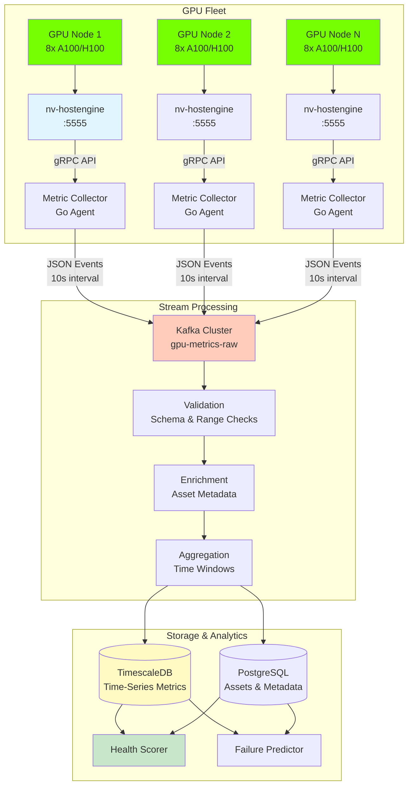
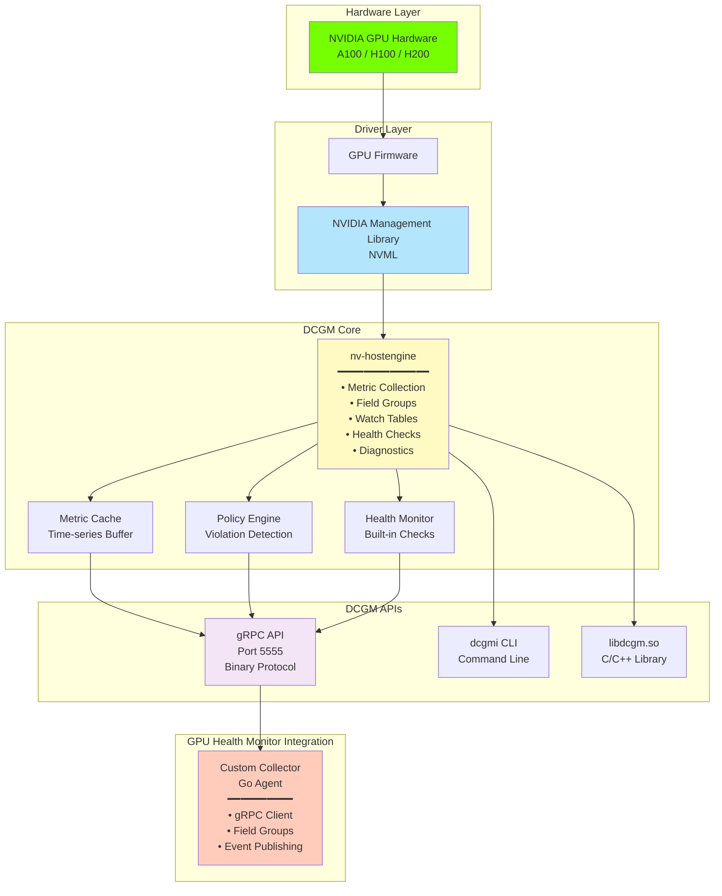
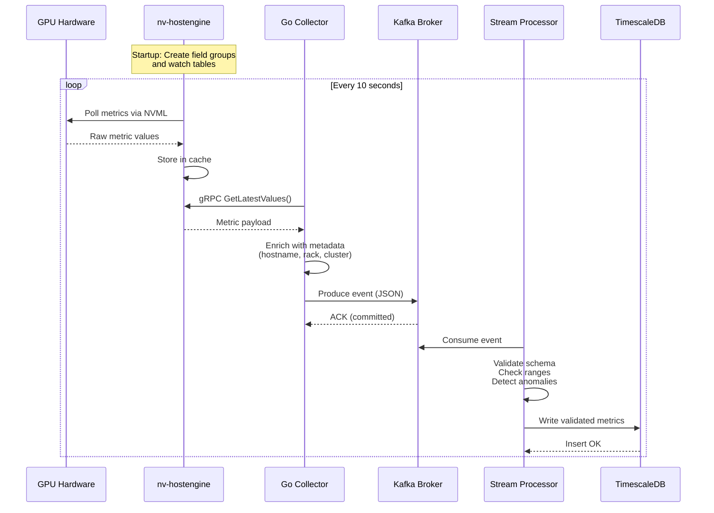
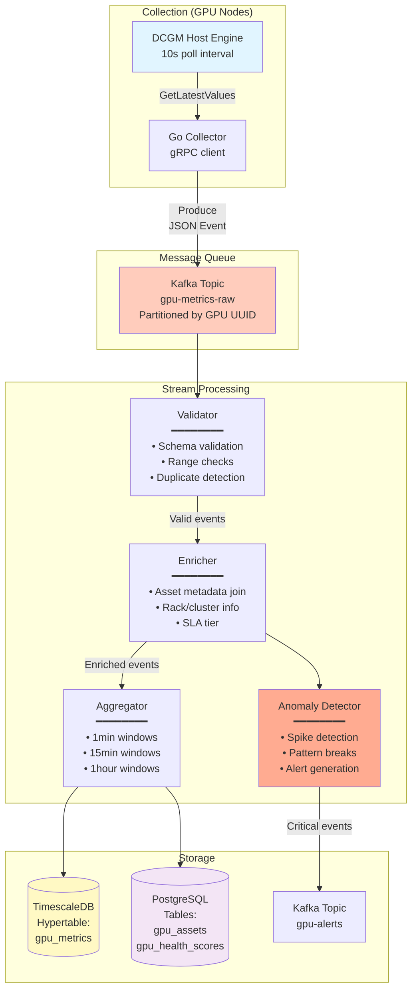

# DCGM Integration Guide

## Table of Contents

- [Overview](#overview)
- [DCGM Architecture](#dcgm-architecture)
- [Integration Pattern](#integration-pattern)
- [Metrics Collection](#metrics-collection)
- [Data Pipeline](#data-pipeline)
- [Data Models](#data-models)
- [Implementation Details](#implementation-details)
- [Configuration](#configuration)
- [Stream Processing](#stream-processing)
- [Monitoring & Troubleshooting](#monitoring--troubleshooting)
- [Performance Considerations](#performance-considerations)
- [Security](#security)

---

## Overview

NVIDIA Data Center GPU Manager (DCGM) is a suite of tools for managing and monitoring NVIDIA GPUs in cluster environments. For the GPU Health Monitor system, DCGM serves as the **primary telemetry source**, providing comprehensive hardware-level metrics essential for health scoring and predictive analytics.

### Why DCGM?

- **Comprehensive Coverage**: 100+ metrics per GPU covering performance, health, utilization, and diagnostics
- **Low Overhead**: Optimized C/C++ implementation with minimal performance impact (<1% GPU utilization)
- **Production Ready**: Battle-tested in data centers worldwide, supports A100/H100/H200
- **Real-time**: Sub-second metric collection intervals (down to 100ms)
- **Industry Standard**: De facto standard for GPU monitoring in enterprise environments

### System Architecture Overview

The GPU Health Monitor uses an **event-streaming architecture** with DCGM as the telemetry source, feeding into a Kafka-based data pipeline for real-time processing, health scoring, and predictive analytics.



---

## DCGM Architecture

### Component Stack



### DCGM Host Engine

The **nv-hostengine** daemon is the core of DCGM:

- **Runs as a system service** on each GPU node
- **Manages watch tables**: Periodic metric collection from GPUs
- **Maintains metric cache**: In-memory time-series buffer (configurable retention)
- **Exposes gRPC API**: Remote access for monitoring tools
- **Handles concurrent clients**: Multiple collectors can connect simultaneously

**Deployment Mode:**

For the GPU Health Monitor, we use **Standalone Mode**:
- Separate nv-hostengine process on each GPU node
- Custom Go collectors connect via gRPC
- Recommended for production environments

---

## Integration Pattern

### Event-Streaming Architecture

The GPU Health Monitor uses a **push-based, event-streaming** architecture optimized for real-time analytics and predictive modeling.



### Why Event Streaming?

This architecture provides:

1. **Decoupling**: Collectors publish events; consumers process independently
2. **Scalability**: Horizontal scaling via Kafka partitioning
3. **Reliability**: Kafka persistence ensures no data loss
4. **Flexibility**: Multiple consumers (TSDB, ML pipeline, alerts) from same stream
5. **Replay Capability**: Historical data reprocessing for model retraining
6. **Real-time Processing**: Stream processors detect anomalies and violations immediately

---

## Metrics Collection

### DCGM Metric Groups

DCGM organizes metrics into **field groups**. For GPU health monitoring, we collect:

#### 1. Health Metrics (`DCGM_FI_DEV_*`)

Core health indicators collected every **10 seconds**:

| Field ID | Metric Name | Description | Unit | Priority |
|----------|-------------|-------------|------|----------|
| `DCGM_FI_DEV_GPU_TEMP` | GPU Temperature | Current GPU temperature | °C | Critical |
| `DCGM_FI_DEV_MEMORY_TEMP` | Memory Temperature | HBM temperature | °C | Critical |
| `DCGM_FI_DEV_POWER_USAGE` | Power Usage | Current power draw | W | High |
| `DCGM_FI_DEV_TOTAL_ENERGY_CONSUMPTION` | Energy Consumed | Cumulative energy (counter) | mJ | Medium |
| `DCGM_FI_DEV_CLOCK_THROTTLE_REASONS` | Throttle Reasons | Bitmask of active throttle reasons | bitmask | Critical |
| `DCGM_FI_DEV_GPU_UTIL` | GPU Utilization | SM utilization (legacy) | % | High |
| `DCGM_FI_DEV_MEM_COPY_UTIL` | Memory Copy Utilization | Memory controller activity | % | Medium |

#### 2. Memory Health Metrics

Critical for detecting degradation and failure prediction:

| Field ID | Metric Name | Description | Unit | Priority |
|----------|-------------|-------------|------|----------|
| `DCGM_FI_DEV_FB_FREE` | Framebuffer Free | Free GPU memory | MiB | High |
| `DCGM_FI_DEV_FB_USED` | Framebuffer Used | Used GPU memory | MiB | High |
| `DCGM_FI_DEV_ECC_SBE_VOL_TOTAL` | Single-Bit Errors (Volatile) | Correctable ECC errors since boot | count | Critical |
| `DCGM_FI_DEV_ECC_DBE_VOL_TOTAL` | Double-Bit Errors (Volatile) | Uncorrectable ECC errors since boot | count | Critical |
| `DCGM_FI_DEV_ECC_SBE_AGG_TOTAL` | Single-Bit Errors (Aggregate) | Correctable ECC errors (lifetime) | count | High |
| `DCGM_FI_DEV_ECC_DBE_AGG_TOTAL` | Double-Bit Errors (Aggregate) | Uncorrectable ECC errors (lifetime) | count | High |
| `DCGM_FI_DEV_RETIRED_SBE` | Retired Pages (SBE) | Memory pages retired due to SBE | count | Medium |
| `DCGM_FI_DEV_RETIRED_DBE` | Retired Pages (DBE) | Memory pages retired due to DBE | count | Critical |

#### 3. Profiling Metrics (`DCGM_FI_PROF_*`)

High-resolution performance counters collected every **1 second**:

| Field ID | Metric Name | Description | Unit | Collection Frequency |
|----------|-------------|-------------|------|---------------------|
| `DCGM_FI_PROF_GR_ENGINE_ACTIVE` | Graphics Engine Active | % time graphics engine was active | % | 1s |
| `DCGM_FI_PROF_SM_ACTIVE` | SM Active | % time at least one SM was active | % | 1s |
| `DCGM_FI_PROF_SM_OCCUPANCY` | SM Occupancy | % of maximum theoretical occupancy | % | 1s |
| `DCGM_FI_PROF_PIPE_TENSOR_ACTIVE` | Tensor Core Active | % time tensor cores were active | % | 1s |
| `DCGM_FI_PROF_DRAM_ACTIVE` | DRAM Active | % time DRAM was accessed | % | 1s |
| `DCGM_FI_PROF_PCIE_TX_BYTES` | PCIe TX Bytes | Bytes transmitted over PCIe | bytes/s | 1s |
| `DCGM_FI_PROF_PCIE_RX_BYTES` | PCIe RX Bytes | Bytes received over PCIe | bytes/s | 1s |

#### 4. Clock Metrics

| Field ID | Metric Name | Description | Unit | Priority |
|----------|-------------|-------------|------|----------|
| `DCGM_FI_DEV_SM_CLOCK` | SM Clock | Current streaming multiprocessor clock | MHz | High |
| `DCGM_FI_DEV_MEM_CLOCK` | Memory Clock | Current memory clock | MHz | High |

### Throttle Reasons Bitmask

`DCGM_FI_DEV_CLOCK_THROTTLE_REASONS` is **critical** for identifying performance degradation:

| Bit | Constant | Meaning | Health Impact |
|-----|----------|---------|---------------|
| 0 | `DCGM_CLOCKS_THROTTLE_REASON_GPU_IDLE` | GPU idle (normal) | None |
| 1 | `DCGM_CLOCKS_THROTTLE_REASON_CLOCKS_SETTING` | Application clocks setting | None |
| 2 | `DCGM_CLOCKS_THROTTLE_REASON_SW_POWER_CAP` | Software power cap | Minor |
| 3 | `DCGM_CLOCKS_THROTTLE_REASON_HW_SLOWDOWN` | **Hardware slowdown (thermal)** | **-15 points** |
| 5 | `DCGM_CLOCKS_THROTTLE_REASON_SW_THERMAL` | Software thermal slowdown | -5 points |
| 6 | `DCGM_CLOCKS_THROTTLE_REASON_HW_THERMAL` | **Hardware thermal slowdown** | **-20 points** |
| 7 | `DCGM_CLOCKS_THROTTLE_REASON_HW_POWER_BRAKE` | **Hardware power brake** | **-15 points** |

**These throttle reasons directly impact health scores and trigger alerts.**

---

## Data Pipeline

### End-to-End Flow



---

## Data Models

### Metric Event Schema (Kafka Message)

Each collector publishes JSON events to the `gpu-metrics-raw` topic:

```json
{
  "schema_version": "1.0",
  "event_type": "gpu_metric_sample",
  "timestamp": "2026-02-11T10:30:00.123Z",
  "collection_timestamp": "2026-02-11T10:30:00.100Z",
  "processing_timestamp": "2026-02-11T10:30:00.125Z",
  
  "gpu": {
    "gpu_id": "GPU-abc123def456",
    "gpu_uuid": "GPU-abc123def456-789ghi-012jkl",
    "device_index": 0,
    "pci_bus_id": "0000:3B:00.0",
    "name": "NVIDIA A100-SXM4-80GB",
    "architecture": "Ampere",
    "compute_capability": "8.0"
  },
  
  "host": {
    "hostname": "gpu-node-042",
    "cluster": "production-cluster-1",
    "rack": "rack-12",
    "datacenter": "us-west-2a"
  },
  
  "metrics": {
    "health": {
      "gpu_temp_c": 65,
      "memory_temp_c": 72,
      "power_usage_w": 312.5,
      "throttle_reasons": 0,
      "throttle_reasons_decoded": []
    },
    
    "memory": {
      "fb_used_mib": 73728,
      "fb_free_mib": 8192,
      "fb_total_mib": 81920,
      "utilization_pct": 90.0,
      "ecc_sbe_volatile": 12,
      "ecc_dbe_volatile": 0,
      "ecc_sbe_aggregate": 1847,
      "ecc_dbe_aggregate": 0,
      "retired_pages_sbe": 0,
      "retired_pages_dbe": 0
    },
    
    "performance": {
      "sm_active_pct": 87.3,
      "sm_occupancy_pct": 45.2,
      "tensor_active_pct": 92.1,
      "dram_active_pct": 68.4,
      "pcie_tx_mb_per_sec": 145.2,
      "pcie_rx_mb_per_sec": 3892.1
    },
    
    "clocks": {
      "sm_clock_mhz": 1410,
      "mem_clock_mhz": 1593
    }
  },
  
  "quality": {
    "collection_latency_ms": 23,
    "stale": false,
    "sample_count": 1,
    "error": null
  }
}
```

### Kafka Topic Configuration

```yaml
topic: gpu-metrics-raw
partitions: 32  # Scale based on fleet size (1 partition per 300-500 GPUs)
replication_factor: 3
retention_ms: 604800000  # 7 days
compression_type: snappy
cleanup_policy: delete

# Partitioning strategy: hash(gpu_uuid)
# Ensures all events for same GPU go to same partition (ordering)
```

### TimescaleDB Schema

```sql
-- Hypertable for raw metrics (partitioned by time)
CREATE TABLE gpu_metrics (
    time TIMESTAMPTZ NOT NULL,
    gpu_uuid TEXT NOT NULL,
    hostname TEXT NOT NULL,
    
    -- Health metrics
    gpu_temp REAL,
    memory_temp REAL,
    power_usage REAL,
    throttle_reasons BIGINT,
    
    -- Memory metrics
    fb_used_mib BIGINT,
    fb_free_mib BIGINT,
    ecc_sbe_volatile INT,
    ecc_dbe_volatile INT,
    ecc_sbe_aggregate BIGINT,
    ecc_dbe_aggregate BIGINT,
    retired_pages_dbe INT,
    
    -- Performance metrics
    sm_active REAL,
    sm_occupancy REAL,
    tensor_active REAL,
    dram_active REAL,
    pcie_tx_mbps REAL,
    pcie_rx_mbps REAL,
    
    -- Clock metrics
    sm_clock_mhz INT,
    mem_clock_mhz INT,
    
    -- Quality metadata
    collection_latency_ms INT,
    
    PRIMARY KEY (time, gpu_uuid)
);

-- Convert to hypertable (time-series partitioning)
SELECT create_hypertable('gpu_metrics', 'time', 
    chunk_time_interval => INTERVAL '1 day');

-- Compression policy (compress data older than 7 days)
ALTER TABLE gpu_metrics SET (
    timescaledb.compress,
    timescaledb.compress_segmentby = 'gpu_uuid, hostname',
    timescaledb.compress_orderby = 'time DESC'
);

SELECT add_compression_policy('gpu_metrics', INTERVAL '7 days');

-- Retention policy (drop data older than 90 days)
SELECT add_retention_policy('gpu_metrics', INTERVAL '90 days');

-- Indexes for common queries
CREATE INDEX idx_gpu_metrics_uuid_time 
    ON gpu_metrics (gpu_uuid, time DESC);
CREATE INDEX idx_gpu_metrics_hostname_time 
    ON gpu_metrics (hostname, time DESC);
CREATE INDEX idx_gpu_metrics_throttle 
    ON gpu_metrics (time DESC) WHERE throttle_reasons > 0;
```

---

## Implementation Details

### Go Collector (Production Implementation)

```go
package main

import (
    "context"
    "encoding/json"
    "fmt"
    "log"
    "os"
    "time"
    
    "github.com/NVIDIA/go-dcgm/pkg/dcgm"
    "github.com/segmentio/kafka-go"
)

type MetricCollector struct {
    dcgmHandle  dcgm.Handle
    groupHandle dcgm.GroupHandle
    fieldGroup  dcgm.FieldHandle
    kafkaWriter *kafka.Writer
    
    gpuIDs      []uint
    hostname    string
    cluster     string
    rack        string
    datacenter  string
}

// Field groups for health monitoring
var healthFields = []dcgm.Short{
    dcgm.DCGM_FI_DEV_GPU_TEMP,
    dcgm.DCGM_FI_DEV_MEMORY_TEMP,
    dcgm.DCGM_FI_DEV_POWER_USAGE,
    dcgm.DCGM_FI_DEV_TOTAL_ENERGY_CONSUMPTION,
    dcgm.DCGM_FI_DEV_CLOCK_THROTTLE_REASONS,
    dcgm.DCGM_FI_DEV_GPU_UTIL,
    dcgm.DCGM_FI_DEV_MEM_COPY_UTIL,
}

var memoryFields = []dcgm.Short{
    dcgm.DCGM_FI_DEV_FB_FREE,
    dcgm.DCGM_FI_DEV_FB_USED,
    dcgm.DCGM_FI_DEV_ECC_SBE_VOL_TOTAL,
    dcgm.DCGM_FI_DEV_ECC_DBE_VOL_TOTAL,
    dcgm.DCGM_FI_DEV_ECC_SBE_AGG_TOTAL,
    dcgm.DCGM_FI_DEV_ECC_DBE_AGG_TOTAL,
    dcgm.DCGM_FI_DEV_RETIRED_SBE,
    dcgm.DCGM_FI_DEV_RETIRED_DBE,
}

var performanceFields = []dcgm.Short{
    dcgm.DCGM_FI_PROF_SM_ACTIVE,
    dcgm.DCGM_FI_PROF_SM_OCCUPANCY,
    dcgm.DCGM_FI_PROF_PIPE_TENSOR_ACTIVE,
    dcgm.DCGM_FI_PROF_DRAM_ACTIVE,
    dcgm.DCGM_FI_PROF_PCIE_TX_BYTES,
    dcgm.DCGM_FI_PROF_PCIE_RX_BYTES,
}

var clockFields = []dcgm.Short{
    dcgm.DCGM_FI_DEV_SM_CLOCK,
    dcgm.DCGM_FI_DEV_MEM_CLOCK,
}

// Initialize DCGM connection and field groups
func NewMetricCollector(kafkaBrokers []string, cluster, rack, datacenter string) (*MetricCollector, error) {
    // Initialize DCGM library
    cleanup, err := dcgm.Init(dcgm.Embedded)
    if err != nil {
        return nil, fmt.Errorf("failed to init DCGM: %v", err)
    }
    defer cleanup()
    
    // Start DCGM host engine (embedded mode)
    dcgmHandle, err := dcgm.StartEmbedded(dcgm.StartMode)
    if err != nil {
        return nil, fmt.Errorf("failed to start DCGM: %v", err)
    }
    
    // Create GPU group (all GPUs)
    groupHandle, err := dcgm.CreateGroup("gpu-health-monitor")
    if err != nil {
        return nil, fmt.Errorf("failed to create group: %v", err)
    }
    
    // Discover GPUs
    gpuIDs, err := dcgm.GetAllDevices()
    if err != nil {
        return nil, fmt.Errorf("failed to get GPUs: %v", err)
    }
    
    log.Printf("Discovered %d GPUs", len(gpuIDs))
    
    // Add GPUs to group
    for _, gpuID := range gpuIDs {
        err = dcgm.AddToGroup(groupHandle, gpuID)
        if err != nil {
            return nil, fmt.Errorf("failed to add GPU %d: %v", gpuID, err)
        }
    }
    
    // Combine all field groups
    allFields := append(healthFields, memoryFields...)
    allFields = append(allFields, performanceFields...)
    allFields = append(allFields, clockFields...)
    
    // Create field group
    fieldGroup, err := dcgm.FieldGroupCreate("all-metrics", allFields)
    if err != nil {
        return nil, fmt.Errorf("failed to create field group: %v", err)
    }
    
    // Start watching metrics
    // Update frequency: 10 seconds (10,000,000 microseconds)
    // Max keep age: 60 seconds
    err = dcgm.WatchFields(groupHandle, fieldGroup, 10000000, 60.0, 0)
    if err != nil {
        return nil, fmt.Errorf("failed to watch fields: %v", err)
    }
    
    log.Printf("DCGM watching %d fields with 10s interval", len(allFields))
    
    // Create Kafka writer
    writer := &kafka.Writer{
        Addr:     kafka.TCP(kafkaBrokers...),
        Topic:    "gpu-metrics-raw",
        Balancer: &kafka.Hash{}, // Hash by GPU UUID
        
        BatchSize:    100,
        BatchTimeout: 100 * time.Millisecond,
        
        Compression: kafka.Snappy,
        
        RequiredAcks: kafka.RequireAll, // Wait for all replicas
        Async:        false,             // Synchronous for reliability
    }
    
    hostname, _ := os.Hostname()
    
    return &MetricCollector{
        dcgmHandle:  dcgmHandle,
        groupHandle: groupHandle,
        fieldGroup:  fieldGroup,
        kafkaWriter: writer,
        gpuIDs:      gpuIDs,
        hostname:    hostname,
        cluster:     cluster,
        rack:        rack,
        datacenter:  datacenter,
    }, nil
}

// Collect metrics and send to Kafka
func (c *MetricCollector) Collect(ctx context.Context) error {
    ticker := time.NewTicker(10 * time.Second)
    defer ticker.Stop()
    
    log.Println("Starting metric collection loop (10s interval)")
    
    for {
        select {
        case <-ctx.Done():
            log.Println("Collection loop stopped")
            return ctx.Err()
            
        case collectTime := <-ticker.C:
            // Update all watched fields
            err := dcgm.UpdateAllFields(c.groupHandle)
            if err != nil {
                log.Printf("ERROR: Failed to update fields: %v", err)
                continue
            }
            
            // Get latest values for all GPUs
            values, err := dcgm.GetLatestValuesForFields(c.gpuIDs, c.fieldGroup)
            if err != nil {
                log.Printf("ERROR: Failed to get values: %v", err)
                continue
            }
            
            // Process and send each GPU's metrics
            var messages []kafka.Message
            
            for gpuID, fieldValues := range values {
                event, err := c.buildMetricEvent(gpuID, fieldValues, collectTime)
                if err != nil {
                    log.Printf("ERROR: Failed to build event for GPU %d: %v", gpuID, err)
                    continue
                }
                
                payload, err := json.Marshal(event)
                if err != nil {
                    log.Printf("ERROR: Failed to marshal event: %v", err)
                    continue
                }
                
                msg := kafka.Message{
                    Key:   []byte(event.GPU.GPUUUID),
                    Value: payload,
                    Time:  collectTime,
                }
                
                messages = append(messages, msg)
            }
            
            // Batch write to Kafka
            if len(messages) > 0 {
                err := c.kafkaWriter.WriteMessages(ctx, messages...)
                if err != nil {
                    log.Printf("ERROR: Failed to write to Kafka: %v", err)
                } else {
                    log.Printf("Published %d GPU metric events to Kafka", len(messages))
                }
            }
        }
    }
}

func (c *MetricCollector) buildMetricEvent(gpuID uint, values map[dcgm.Short]dcgm.FieldValue_v1, collectTime time.Time) (MetricEvent, error) {
    // Get GPU attributes (UUID, name, etc.)
    attrs, err := dcgm.GetDeviceAttributes(gpuID)
    if err != nil {
        return MetricEvent{}, fmt.Errorf("failed to get device attributes: %v", err)
    }
    
    now := time.Now()
    
    // Decode throttle reasons
    throttleReasons := values[dcgm.DCGM_FI_DEV_CLOCK_THROTTLE_REASONS].Int64()
    throttleDecoded := decodeThrottleReasons(throttleReasons)
    
    event := MetricEvent{
        SchemaVersion: "1.0",
        EventType:     "gpu_metric_sample",
        Timestamp:     collectTime,
        CollectionTimestamp: collectTime,
        ProcessingTimestamp: now,
        
        GPU: GPUInfo{
            GPUID:             attrs.Identifiers.DeviceID,
            GPUUUID:           attrs.Identifiers.UUID,
            DeviceIndex:       int(gpuID),
            PCIBusID:          attrs.Identifiers.PCIBusID,
            Name:              attrs.Identifiers.DeviceName,
            Architecture:      "Ampere", // Parse from compute capability
            ComputeCapability: fmt.Sprintf("%d.%d", attrs.Cuda.ComputeCapability.Major, attrs.Cuda.ComputeCapability.Minor),
        },
        
        Host: HostInfo{
            Hostname:   c.hostname,
            Cluster:    c.cluster,
            Rack:       c.rack,
            Datacenter: c.datacenter,
        },
        
        Metrics: Metrics{
            Health: HealthMetrics{
                GPUTempC:            values[dcgm.DCGM_FI_DEV_GPU_TEMP].Float64(),
                MemoryTempC:         values[dcgm.DCGM_FI_DEV_MEMORY_TEMP].Float64(),
                PowerUsageW:         values[dcgm.DCGM_FI_DEV_POWER_USAGE].Float64(),
                ThrottleReasons:     throttleReasons,
                ThrottleReasonsDecoded: throttleDecoded,
            },
            
            Memory: MemoryMetrics{
                FBUsedMiB:         values[dcgm.DCGM_FI_DEV_FB_USED].Int64(),
                FBFreeMiB:         values[dcgm.DCGM_FI_DEV_FB_FREE].Int64(),
                FBTotalMiB:        values[dcgm.DCGM_FI_DEV_FB_USED].Int64() + values[dcgm.DCGM_FI_DEV_FB_FREE].Int64(),
                UtilizationPct:    calculateMemoryUtil(values),
                ECCSBEVolatile:    int(values[dcgm.DCGM_FI_DEV_ECC_SBE_VOL_TOTAL].Int64()),
                ECCDBEVolatile:    int(values[dcgm.DCGM_FI_DEV_ECC_DBE_VOL_TOTAL].Int64()),
                ECCSBEAggregate:   values[dcgm.DCGM_FI_DEV_ECC_SBE_AGG_TOTAL].Int64(),
                ECCDBEAggregate:   values[dcgm.DCGM_FI_DEV_ECC_DBE_AGG_TOTAL].Int64(),
                RetiredPagesSBE:   int(values[dcgm.DCGM_FI_DEV_RETIRED_SBE].Int64()),
                RetiredPagesDBE:   int(values[dcgm.DCGM_FI_DEV_RETIRED_DBE].Int64()),
            },
            
            Performance: PerformanceMetrics{
                SMActivePct:      values[dcgm.DCGM_FI_PROF_SM_ACTIVE].Float64(),
                SMOccupancyPct:   values[dcgm.DCGM_FI_PROF_SM_OCCUPANCY].Float64(),
                TensorActivePct:  values[dcgm.DCGM_FI_PROF_PIPE_TENSOR_ACTIVE].Float64(),
                DRAMActivePct:    values[dcgm.DCGM_FI_PROF_DRAM_ACTIVE].Float64(),
                PCIeTxMBPerSec:   bytesToMB(values[dcgm.DCGM_FI_PROF_PCIE_TX_BYTES].Float64()),
                PCIeRxMBPerSec:   bytesToMB(values[dcgm.DCGM_FI_PROF_PCIE_RX_BYTES].Float64()),
            },
            
            Clocks: ClockMetrics{
                SMClockMHz:  int(values[dcgm.DCGM_FI_DEV_SM_CLOCK].Int64()),
                MemClockMHz: int(values[dcgm.DCGM_FI_DEV_MEM_CLOCK].Int64()),
            },
        },
        
        Quality: QualityMetadata{
            CollectionLatencyMS: int(now.Sub(collectTime).Milliseconds()),
            Stale:               false,
            SampleCount:         1,
            Error:               nil,
        },
    }
    
    return event, nil
}

func decodeThrottleReasons(bitmask int64) []string {
    reasons := []string{}
    
    if bitmask&(1<<3) != 0 {
        reasons = append(reasons, "HW_SLOWDOWN")
    }
    if bitmask&(1<<6) != 0 {
        reasons = append(reasons, "HW_THERMAL")
    }
    if bitmask&(1<<7) != 0 {
        reasons = append(reasons, "HW_POWER_BRAKE")
    }
    if bitmask&(1<<2) != 0 {
        reasons = append(reasons, "SW_POWER_CAP")
    }
    if bitmask&(1<<5) != 0 {
        reasons = append(reasons, "SW_THERMAL")
    }
    
    return reasons
}

func calculateMemoryUtil(values map[dcgm.Short]dcgm.FieldValue_v1) float64 {
    used := values[dcgm.DCGM_FI_DEV_FB_USED].Float64()
    free := values[dcgm.DCGM_FI_DEV_FB_FREE].Float64()
    total := used + free
    
    if total == 0 {
        return 0
    }
    
    return (used / total) * 100.0
}

func bytesToMB(bytes float64) float64 {
    return bytes / (1024 * 1024)
}

func (c *MetricCollector) Close() {
    log.Println("Shutting down collector...")
    
    if c.kafkaWriter != nil {
        c.kafkaWriter.Close()
    }
    
    dcgm.UnwatchFields(c.groupHandle, c.fieldGroup)
    dcgm.DestroyGroup(c.groupHandle)
    dcgm.FieldGroupDestroy(c.fieldGroup)
    dcgm.Shutdown()
    
    log.Println("Collector shutdown complete")
}

// Data structures
type MetricEvent struct {
    SchemaVersion       string    `json:"schema_version"`
    EventType           string    `json:"event_type"`
    Timestamp           time.Time `json:"timestamp"`
    CollectionTimestamp time.Time `json:"collection_timestamp"`
    ProcessingTimestamp time.Time `json:"processing_timestamp"`
    
    GPU     GPUInfo          `json:"gpu"`
    Host    HostInfo         `json:"host"`
    Metrics Metrics          `json:"metrics"`
    Quality QualityMetadata  `json:"quality"`
}

type GPUInfo struct {
    GPUID             string `json:"gpu_id"`
    GPUUUID           string `json:"gpu_uuid"`
    DeviceIndex       int    `json:"device_index"`
    PCIBusID          string `json:"pci_bus_id"`
    Name              string `json:"name"`
    Architecture      string `json:"architecture"`
    ComputeCapability string `json:"compute_capability"`
}

type HostInfo struct {
    Hostname   string `json:"hostname"`
    Cluster    string `json:"cluster"`
    Rack       string `json:"rack"`
    Datacenter string `json:"datacenter"`
}

type Metrics struct {
    Health      HealthMetrics      `json:"health"`
    Memory      MemoryMetrics      `json:"memory"`
    Performance PerformanceMetrics `json:"performance"`
    Clocks      ClockMetrics       `json:"clocks"`
}

type HealthMetrics struct {
    GPUTempC               float64  `json:"gpu_temp_c"`
    MemoryTempC            float64  `json:"memory_temp_c"`
    PowerUsageW            float64  `json:"power_usage_w"`
    ThrottleReasons        int64    `json:"throttle_reasons"`
    ThrottleReasonsDecoded []string `json:"throttle_reasons_decoded"`
}

type MemoryMetrics struct {
    FBUsedMiB       int64   `json:"fb_used_mib"`
    FBFreeMiB       int64   `json:"fb_free_mib"`
    FBTotalMiB      int64   `json:"fb_total_mib"`
    UtilizationPct  float64 `json:"utilization_pct"`
    ECCSBEVolatile  int     `json:"ecc_sbe_volatile"`
    ECCDBEVolatile  int     `json:"ecc_dbe_volatile"`
    ECCSBEAggregate int64   `json:"ecc_sbe_aggregate"`
    ECCDBEAggregate int64   `json:"ecc_dbe_aggregate"`
    RetiredPagesSBE int     `json:"retired_pages_sbe"`
    RetiredPagesDBE int     `json:"retired_pages_dbe"`
}

type PerformanceMetrics struct {
    SMActivePct     float64 `json:"sm_active_pct"`
    SMOccupancyPct  float64 `json:"sm_occupancy_pct"`
    TensorActivePct float64 `json:"tensor_active_pct"`
    DRAMActivePct   float64 `json:"dram_active_pct"`
    PCIeTxMBPerSec  float64 `json:"pcie_tx_mb_per_sec"`
    PCIeRxMBPerSec  float64 `json:"pcie_rx_mb_per_sec"`
}

type ClockMetrics struct {
    SMClockMHz  int `json:"sm_clock_mhz"`
    MemClockMHz int `json:"mem_clock_mhz"`
}

type QualityMetadata struct {
    CollectionLatencyMS int    `json:"collection_latency_ms"`
    Stale               bool   `json:"stale"`
    SampleCount         int    `json:"sample_count"`
    Error               *string `json:"error"`
}

func main() {
    // Configuration from environment
    kafkaBrokers := []string{"kafka-1:9092", "kafka-2:9092", "kafka-3:9092"}
    cluster := os.Getenv("CLUSTER_NAME")
    rack := os.Getenv("RACK_ID")
    datacenter := os.Getenv("DATACENTER")
    
    // Create collector
    collector, err := NewMetricCollector(kafkaBrokers, cluster, rack, datacenter)
    if err != nil {
        log.Fatalf("Failed to create collector: %v", err)
    }
    defer collector.Close()
    
    // Start collection loop
    ctx := context.Background()
    if err := collector.Collect(ctx); err != nil {
        log.Fatalf("Collection failed: %v", err)
    }
}
```

---

## Configuration

### DCGM Host Engine Configuration

`/etc/dcgm/dcgm.toml`:

```toml
# DCGM Host Engine Configuration for GPU Health Monitor

[service]
# Listen address for gRPC API
address = "0.0.0.0:5555"

# Run as standalone process (not embedded)
embedded = false

# Log level: NONE, ERROR, WARN, INFO, DEBUG, VERB
log_level = "INFO"

# Log file location
log_file = "/var/log/dcgm/nv-hostengine.log"

# Max log file size (MB)
log_file_max_size = 100

# Number of log files to rotate
log_file_max_backups = 5

[metrics]
# Default sample interval (microseconds)
# 10,000,000 µs = 10 seconds
default_sample_interval = 10000000

# Maximum sample age (seconds)
# Keep samples in cache for 60 seconds
max_sample_age = 60

# Maximum number of samples per field per GPU
max_samples_per_field = 100

[health]
# Enable built-in health watches
enabled = true

# Health check interval (seconds)
interval = 60

[policy]
# Enable policy engine (violation detection)
enabled = false

[profiling]
# Enable profiling metrics (DCGM_FI_PROF_*)
enabled = true

# Profiling sample rate (microseconds)
# 1,000,000 µs = 1 second
sample_rate = 1000000

[security]
# Authentication not required (collectors on trusted network)
auth_required = false
```

### Systemd Service

`/etc/systemd/system/nvidia-dcgm.service`:

```ini
[Unit]
Description=NVIDIA DCGM Host Engine
After=network.target nvidia-persistenced.service
Wants=nvidia-persistenced.service

[Service]
Type=forking
ExecStart=/usr/bin/nv-hostengine -n --config-file /etc/dcgm/dcgm.toml
ExecReload=/bin/kill -HUP $MAINPID
Restart=on-failure
RestartSec=5s

# Run as dedicated user
User=dcgm
Group=dcgm

# Security hardening
NoNewPrivileges=true
PrivateTmp=true
ProtectSystem=strict
ProtectHome=true
ReadWritePaths=/var/log/dcgm /var/lib/dcgm

# Resource limits
LimitNOFILE=65536
LimitNPROC=4096

[Install]
WantedBy=multi-user.target
```

### Collector Systemd Service

`/etc/systemd/system/gpu-metrics-collector.service`:

```ini
[Unit]
Description=GPU Metrics Collector
After=network.target nvidia-dcgm.service kafka.service
Requires=nvidia-dcgm.service

[Service]
Type=simple
ExecStart=/usr/local/bin/gpu-metrics-collector

# Environment
Environment="KAFKA_BROKERS=kafka-1:9092,kafka-2:9092,kafka-3:9092"
Environment="CLUSTER_NAME=production-cluster-1"
Environment="RACK_ID=rack-12"
Environment="DATACENTER=us-west-2a"

Restart=on-failure
RestartSec=10s

# Run as dedicated user
User=gpu-collector
Group=gpu-collector

# Security
NoNewPrivileges=true
PrivateTmp=true

[Install]
WantedBy=multi-user.target
```

---

## Stream Processing

### Kafka Streams Validation Processor

Example validation stage in the streaming pipeline:

```python
from kafka import KafkaConsumer, KafkaProducer
import json
import logging
from datetime import datetime

class MetricValidator:
    def __init__(self, bootstrap_servers):
        self.consumer = KafkaConsumer(
            'gpu-metrics-raw',
            bootstrap_servers=bootstrap_servers,
            group_id='metric-validator',
            value_deserializer=lambda m: json.loads(m.decode('utf-8')),
            auto_offset_reset='earliest',
            enable_auto_commit=True
        )
        
        self.producer = KafkaProducer(
            bootstrap_servers=bootstrap_servers,
            value_serializer=lambda v: json.dumps(v).encode('utf-8')
        )
        
        self.logger = logging.getLogger(__name__)
    
    def validate_event(self, event):
        """Validate metric event schema and ranges"""
        errors = []
        
        # Schema validation
        required_fields = ['schema_version', 'event_type', 'timestamp', 'gpu', 'metrics']
        for field in required_fields:
            if field not in event:
                errors.append(f"Missing required field: {field}")
        
        if errors:
            return False, errors
        
        # Range validation
        metrics = event.get('metrics', {})
        health = metrics.get('health', {})
        
        # Temperature ranges
        gpu_temp = health.get('gpu_temp_c', 0)
        if not (0 <= gpu_temp <= 120):
            errors.append(f"GPU temp out of range: {gpu_temp}°C")
        
        mem_temp = health.get('memory_temp_c', 0)
        if not (0 <= mem_temp <= 120):
            errors.append(f"Memory temp out of range: {mem_temp}°C")
        
        # Power ranges (A100 max 400W, H100 max 700W)
        power = health.get('power_usage_w', 0)
        if not (0 <= power <= 750):
            errors.append(f"Power out of range: {power}W")
        
        # Memory validation
        memory = metrics.get('memory', {})
        fb_used = memory.get('fb_used_mib', 0)
        fb_free = memory.get('fb_free_mib', 0)
        
        if fb_used < 0 or fb_free < 0:
            errors.append(f"Negative memory values: used={fb_used}, free={fb_free}")
        
        # ECC errors (DBE should be rare/zero)
        ecc_dbe = memory.get('ecc_dbe_volatile', 0)
        if ecc_dbe > 0:
            self.logger.warning(f"GPU {event['gpu']['gpu_uuid']} has {ecc_dbe} double-bit ECC errors")
        
        return len(errors) == 0, errors
    
    def process(self):
        """Main validation loop"""
        self.logger.info("Starting metric validation processor")
        
        for message in self.consumer:
            event = message.value
            
            valid, errors = self.validate_event(event)
            
            if valid:
                # Forward to validated topic
                self.producer.send('gpu-metrics-validated', event)
            else:
                # Log validation errors
                self.logger.error(f"Validation failed for GPU {event.get('gpu', {}).get('gpu_uuid', 'unknown')}: {errors}")
                
                # Send to dead-letter queue
                error_event = {
                    'original_event': event,
                    'validation_errors': errors,
                    'timestamp': datetime.utcnow().isoformat()
                }
                self.producer.send('gpu-metrics-invalid', error_event)

if __name__ == '__main__':
    logging.basicConfig(level=logging.INFO)
    
    validator = MetricValidator(['kafka-1:9092', 'kafka-2:9092', 'kafka-3:9092'])
    validator.process()
```

---

## Monitoring & Troubleshooting

### DCGM Health Checks

```bash
# Check DCGM host engine status
systemctl status nvidia-dcgm

# Verify DCGM can see GPUs
dcgmi discovery -l

# Get GPU health
dcgmi health -g 0 -c

# Run diagnostics (Level 1: Quick, Level 3: Stress)
dcgmi diag -r 1

# View real-time metrics
dcgmi dmon -e 150,155,203,251,252
# 150=GPU_TEMP, 155=MEM_TEMP, 203=POWER_USAGE, 
# 251=ECC_SBE, 252=ECC_DBE
```

### Kafka Monitoring

```bash
# Check consumer lag
kafka-consumer-groups.sh --bootstrap-server kafka-1:9092 \
    --group metric-validator --describe

# Monitor topic throughput
kafka-run-class.sh kafka.tools.GetOffsetShell \
    --broker-list kafka-1:9092 --topic gpu-metrics-raw

# View recent messages
kafka-console-consumer.sh --bootstrap-server kafka-1:9092 \
    --topic gpu-metrics-raw --from-beginning --max-messages 10
```

### Collector Health

```bash
# Check collector service
systemctl status gpu-metrics-collector

# View collector logs
journalctl -u gpu-metrics-collector -f

# Monitor Kafka producer metrics (if exposed)
curl http://localhost:9090/metrics | grep kafka
```

---

## Performance Considerations

### Collection Overhead

| Configuration | CPU Impact | Memory | Network | Latency |
|---------------|-----------|--------|---------|---------|
| 10s interval, 50 metrics | <0.5% per GPU | ~10 MB | ~5 KB/s/GPU | <5ms |
| 1s interval, profiling | ~1% per GPU | ~50 MB | ~50 KB/s/GPU | <10ms |

**Production recommendation**: 10-second interval for health metrics

### Kafka Throughput

**Per GPU:**
- Event size: ~2 KB (JSON, uncompressed)
- Event rate: 0.1 events/sec (10s interval)
- Throughput: ~0.2 KB/s per GPU

**Fleet scale (1,000 GPUs):**
- Total throughput: ~200 KB/s (~1.6 Mbps)
- Messages per hour: 360,000
- Daily volume: ~17 GB (raw JSON)

**Kafka cluster sizing:**
- 3 brokers handle 10,000+ GPUs easily
- 32 partitions (1 per 300 GPUs)
- Snappy compression reduces storage by 60%

---

## Security

### Network Security

```bash
# Restrict DCGM to trusted network
# /etc/dcgm/dcgm.toml
[service]
address = "10.0.0.100:5555"  # Private IP only

# Firewall rules
sudo ufw allow from 10.0.0.0/8 to any port 5555 proto tcp
sudo ufw deny 5555
```

### Kafka Security (Optional)

For production deployments, enable Kafka SASL/SSL:

```properties
# Kafka broker config
listeners=SASL_SSL://0.0.0.0:9093
security.inter.broker.protocol=SASL_SSL
sasl.mechanism.inter.broker.protocol=PLAIN
ssl.keystore.location=/etc/kafka/kafka.keystore.jks
ssl.keystore.password=<password>
```

### Data Privacy

DCGM telemetry **does not include**:
- Process names or command lines
- User identities
- Model parameters or training data
- Workload-specific information

Only hardware metrics (temps, power, errors) are collected.

---

## Appendix

### Complete Field Reference

See official documentation: [DCGM Field Identifiers](https://docs.nvidia.com/datacenter/dcgm/latest/dcgm-api/dcgm-api-field-ids.html)

### Version Compatibility

| DCGM Version | Supported GPUs | Key Features | Status |
|--------------|----------------|--------------|--------|
| 3.3.x | A100, H100, H200, Ada | Profiling v2, H100 support | **Recommended** |
| 3.2.x | A100, H100 | Hopper support | Supported |
| 3.1.x | A100, A30, A10 | Ampere support | Legacy |

### References

- [NVIDIA DCGM Documentation](https://docs.nvidia.com/datacenter/dcgm/)
- [DCGM GitHub Repository](https://github.com/NVIDIA/DCGM)
- [go-dcgm Bindings](https://github.com/NVIDIA/go-dcgm)
- [NVML Documentation](https://docs.nvidia.com/deploy/nvml-api/)
- [Apache Kafka Documentation](https://kafka.apache.org/documentation/)
- [TimescaleDB Documentation](https://docs.timescale.com/)

---

**Document Version**: 1.1  
**Last Updated**: 2026-02-11  
**Maintained By**: Stuart Hart (stuarthart@msn.com)  
**Project**: GPU Health Monitor - Production-grade monitoring for NVIDIA A100/H100 fleets
