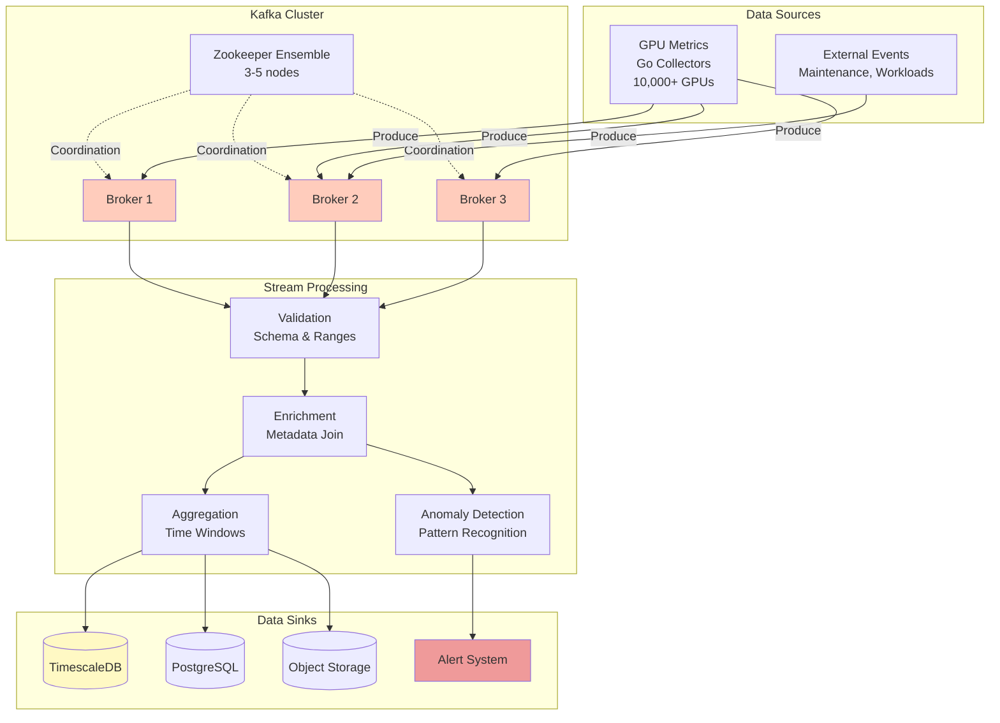
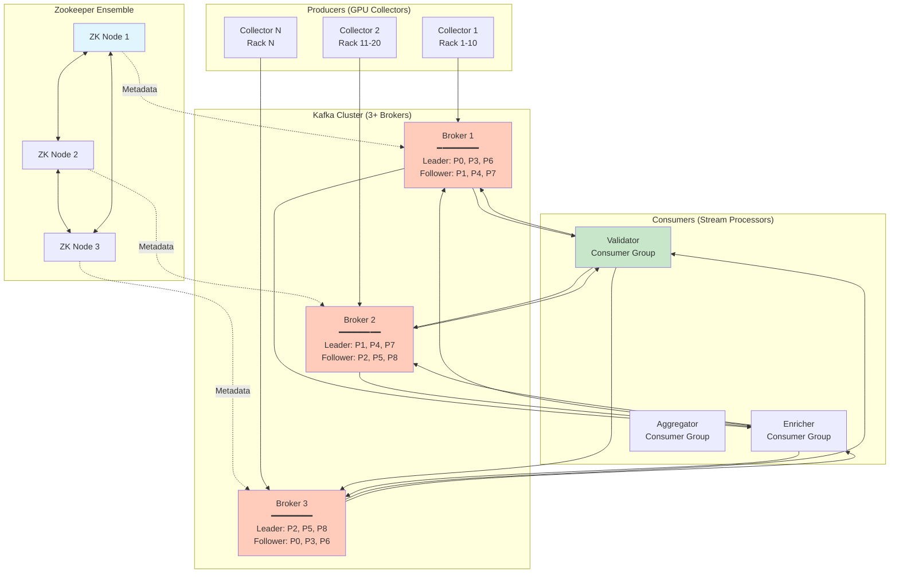
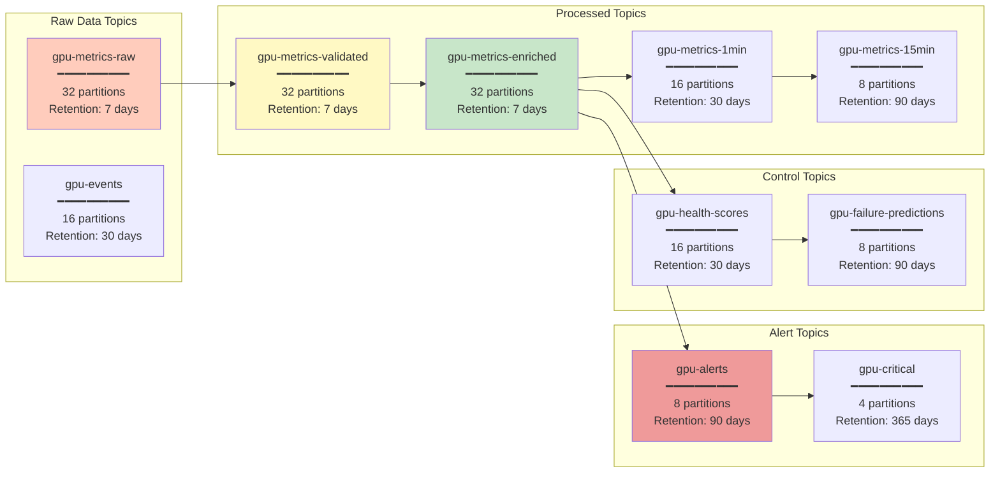
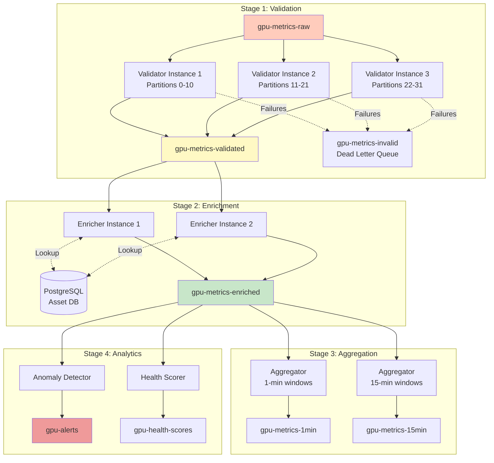
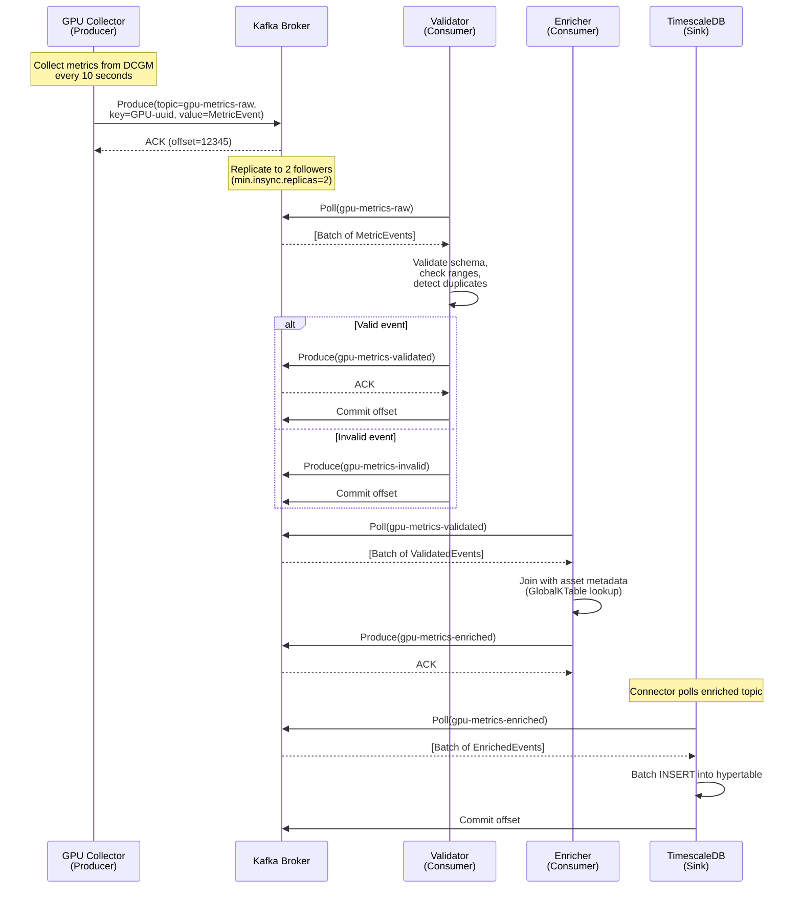
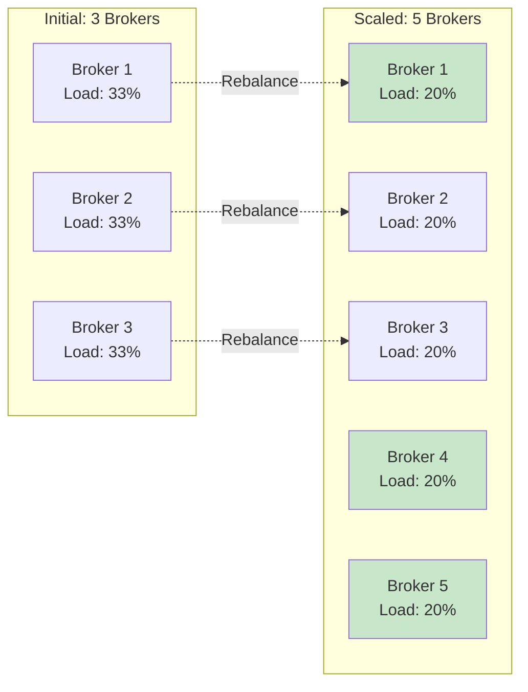
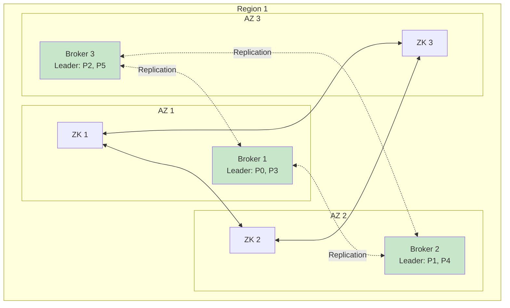

# Kafka & Stream Processing Architecture

## Table of Contents

- [Overview](#overview)
- [Architecture](#architecture)
- [Topic Design](#topic-design)
- [Stream Processing Pipeline](#stream-processing-pipeline)
- [Data Flow](#data-flow)
- [Implementation Details](#implementation-details)
- [Configuration](#configuration)
- [Monitoring & Operations](#monitoring--operations)
- [Performance & Scaling](#performance--scaling)
- [Reliability & Fault Tolerance](#reliability--fault-tolerance)
- [Security](#security)

---

## Overview

Apache Kafka serves as the **central nervous system** of the GPU Health Monitor, providing high-throughput, durable, and scalable event streaming for real-time telemetry processing, health scoring, and predictive analytics.

### Why Kafka?

- **High Throughput**: 1M+ messages/second per broker
- **Durability**: Persistent, replicated message log ensures no data loss
- **Scalability**: Horizontal scaling via partitioning
- **Decoupling**: Producers and consumers operate independently
- **Replay Capability**: Historical data reprocessing for model retraining
- **Stream Processing**: Native integration with Kafka Streams for real-time analytics

### System Context



---

## Architecture

### Kafka Cluster Design

**For GPU Health Monitor (10,000 GPU target):**



### Cluster Specifications

| Component | Configuration | Rationale |
|-----------|--------------|-----------|
| **Brokers** | 3 minimum, 5 for production | Tolerate 1-2 broker failures |
| **Zookeeper Nodes** | 3 or 5 (odd number) | Quorum-based consensus |
| **Replication Factor** | 3 | No data loss on single broker failure |
| **Min In-Sync Replicas** | 2 | Ensure data durability |
| **Partitions** | 32 per topic (baseline) | 1 partition per 300-500 GPUs |

---

## Topic Design

### Topic Hierarchy



### Topic Specifications

#### 1. `gpu-metrics-raw`

**Purpose**: Raw telemetry from DCGM collectors

```yaml
name: gpu-metrics-raw
partitions: 32
replication_factor: 3
min_insync_replicas: 2
retention_ms: 604800000  # 7 days
segment_ms: 86400000     # 1 day
compression_type: snappy
cleanup_policy: delete

# Message format: JSON
# Key: GPU UUID (ensures ordering per GPU)
# Value: MetricEvent (see DCGM integration doc)
```

**Partitioning Strategy**: Hash by GPU UUID
- Ensures all events for same GPU go to same partition
- Maintains temporal ordering per GPU
- Enables efficient windowed operations

**Expected Volume**:
- 10,000 GPUs × 0.1 events/sec = 1,000 events/sec
- Average message size: 2 KB
- Throughput: ~2 MB/sec (~17 GB/day)
- With compression (60%): ~7 GB/day

#### 2. `gpu-metrics-validated`

**Purpose**: Schema-validated, range-checked metrics

```yaml
name: gpu-metrics-validated
partitions: 32
replication_factor: 3
min_insync_replicas: 2
retention_ms: 604800000  # 7 days
compression_type: snappy
cleanup_policy: delete
```

**Enrichment**: Added fields
- `validation_timestamp`
- `validation_version`
- `quality_flags` (e.g., "late", "out_of_range")

#### 3. `gpu-metrics-enriched`

**Purpose**: Metrics joined with asset metadata

```yaml
name: gpu-metrics-enriched
partitions: 32
replication_factor: 3
retention_ms: 604800000  # 7 days
compression_type: snappy
```

**Enrichment**: Additional metadata
- Asset info (purchase date, warranty status, SLA tier)
- Topology (rack, cluster, datacenter, region)
- Workload context (job ID, user, project)

#### 4. `gpu-metrics-1min` / `gpu-metrics-15min`

**Purpose**: Pre-aggregated time windows

```yaml
name: gpu-metrics-1min
partitions: 16
replication_factor: 3
retention_ms: 2592000000  # 30 days
compression_type: lz4      # Better compression for aggregates
```

**Aggregations**:
- Min, max, mean, p50, p95, p99 for each metric
- Count, sum for counters (ECC errors)
- Distinct GPU count, event count

#### 5. `gpu-alerts`

**Purpose**: Anomaly detection and threshold violations

```yaml
name: gpu-alerts
partitions: 8
replication_factor: 3
retention_ms: 7776000000  # 90 days
compression_type: snappy
cleanup_policy: delete
```

**Alert Schema**:
```json
{
  "alert_id": "uuid",
  "alert_type": "temperature_spike | ecc_errors | throttling | failure_prediction",
  "severity": "info | warning | critical",
  "gpu_uuid": "GPU-...",
  "timestamp": "ISO-8601",
  "metric_name": "gpu_temp_c",
  "current_value": 95,
  "threshold": 85,
  "context": {
    "recent_values": [82, 84, 88, 95],
    "trend": "increasing"
  },
  "recommended_action": "reduce workload | inspect cooling | schedule maintenance"
}
```

#### 6. `gpu-health-scores`

**Purpose**: Computed health scores (0-100) for each GPU

```yaml
name: gpu-health-scores
partitions: 16
replication_factor: 3
retention_ms: 2592000000  # 30 days
compression_type: snappy
```

**Message Schema**:
```json
{
  "gpu_uuid": "GPU-...",
  "timestamp": "ISO-8601",
  "overall_score": 87,
  "dimension_scores": {
    "memory_health": 92,
    "thermal_health": 85,
    "performance_health": 88,
    "power_health": 90,
    "reliability_health": 95
  },
  "health_grade": "good",
  "degradation_trend": -0.2,  // points per day
  "contributing_factors": [
    "elevated_temperature",
    "minor_ecc_errors"
  ]
}
```

---

## Stream Processing Pipeline

### Pipeline Architecture



### Stream Processing Topology

**Using Kafka Streams DSL:**

```java
StreamsBuilder builder = new StreamsBuilder();

// Stage 1: Validation
KStream<String, MetricEvent> rawStream = builder.stream("gpu-metrics-raw");

KStream<String, MetricEvent>[] validated = rawStream.branch(
    (key, event) -> isValid(event),
    (key, event) -> true  // Invalid events
);

validated[0].to("gpu-metrics-validated");
validated[1].to("gpu-metrics-invalid");

// Stage 2: Enrichment (join with GlobalKTable for asset metadata)
GlobalKTable<String, AssetMetadata> assetTable = builder.globalTable("gpu-assets");

KStream<String, EnrichedMetricEvent> enriched = validated[0]
    .join(
        assetTable,
        (gpuUuid, event) -> gpuUuid,
        (event, asset) -> enrichEvent(event, asset)
    );

enriched.to("gpu-metrics-enriched");

// Stage 3: Aggregation (1-minute tumbling windows)
KTable<Windowed<String>, AggregatedMetrics> oneMinAgg = enriched
    .groupByKey()
    .windowedBy(TimeWindows.ofSizeWithNoGrace(Duration.ofMinutes(1)))
    .aggregate(
        AggregatedMetrics::new,
        (key, event, agg) -> agg.add(event),
        Materialized.with(Serdes.String(), aggregateSerde)
    );

oneMinAgg.toStream().to("gpu-metrics-1min");

// Stage 4: Anomaly Detection (stateful processing)
KStream<String, Alert> alerts = enriched
    .transformValues(() -> new AnomalyDetectorTransformer(), "anomaly-state-store");

alerts.to("gpu-alerts");
```

---

## Data Flow

### End-to-End Message Journey



### Exactly-Once Semantics

Kafka Streams provides **exactly-once processing** (EOS) guarantees:

1. **Idempotent Producers**: Automatic deduplication
2. **Transactional Writes**: Atomic commit of output + offset
3. **Read Committed Isolation**: Consumers only see committed data

**Configuration**:
```properties
# Producer
enable.idempotence=true
acks=all
retries=Integer.MAX_VALUE
max.in.flight.requests.per.connection=5

# Streams application
processing.guarantee=exactly_once_v2
commit.interval.ms=100
```

---

## Implementation Details

### Kafka Streams Validator (Java)

```java
package com.gpuhealth.streams;

import org.apache.kafka.streams.*;
import org.apache.kafka.streams.kstream.*;
import org.apache.kafka.common.serialization.Serdes;
import java.time.Duration;
import java.util.*;

public class MetricValidatorApp {
    
    public static void main(String[] args) {
        Properties props = new Properties();
        props.put(StreamsConfig.APPLICATION_ID_CONFIG, "metric-validator");
        props.put(StreamsConfig.BOOTSTRAP_SERVERS_CONFIG, "kafka-1:9092,kafka-2:9092,kafka-3:9092");
        props.put(StreamsConfig.DEFAULT_KEY_SERDE_CLASS_CONFIG, Serdes.String().getClass());
        props.put(StreamsConfig.DEFAULT_VALUE_SERDE_CLASS_CONFIG, MetricEventSerde.class);
        
        // Exactly-once processing
        props.put(StreamsConfig.PROCESSING_GUARANTEE_CONFIG, StreamsConfig.EXACTLY_ONCE_V2);
        props.put(StreamsConfig.COMMIT_INTERVAL_MS_CONFIG, 100);
        
        // Performance tuning
        props.put(StreamsConfig.NUM_STREAM_THREADS_CONFIG, 4);
        props.put(StreamsConfig.CACHE_MAX_BYTES_BUFFERING_CONFIG, 10 * 1024 * 1024);  // 10 MB
        
        StreamsBuilder builder = new StreamsBuilder();
        
        // Input stream
        KStream<String, MetricEvent> rawMetrics = builder.stream("gpu-metrics-raw");
        
        // Validation logic
        KStream<String, MetricEvent>[] branches = rawMetrics.branch(
            (key, event) -> validateEvent(event).isValid,
            (key, event) -> true  // Catch-all for invalid events
        );
        
        // Valid events -> validated topic
        branches[0]
            .mapValues(event -> enrichValidationMetadata(event))
            .to("gpu-metrics-validated");
        
        // Invalid events -> dead letter queue with error details
        branches[1]
            .mapValues(event -> {
                ValidationResult result = validateEvent(event);
                return new InvalidEventRecord(event, result.errors);
            })
            .to("gpu-metrics-invalid");
        
        KafkaStreams streams = new KafkaStreams(builder.build(), props);
        
        // Graceful shutdown
        Runtime.getRuntime().addShutdownHook(new Thread(streams::close));
        
        streams.start();
    }
    
    private static ValidationResult validateEvent(MetricEvent event) {
        List<String> errors = new ArrayList<>();
        
        // Schema validation
        if (event.gpu == null || event.gpu.gpuUuid == null) {
            errors.add("Missing GPU UUID");
        }
        
        if (event.metrics == null) {
            errors.add("Missing metrics object");
        }
        
        // Range validation
        if (event.metrics != null && event.metrics.health != null) {
            double gpuTemp = event.metrics.health.gpuTempC;
            if (gpuTemp < 0 || gpuTemp > 120) {
                errors.add(String.format("GPU temp out of range: %.1f°C", gpuTemp));
            }
            
            double memTemp = event.metrics.health.memoryTempC;
            if (memTemp < 0 || memTemp > 120) {
                errors.add(String.format("Memory temp out of range: %.1f°C", memTemp));
            }
            
            double power = event.metrics.health.powerUsageW;
            if (power < 0 || power > 750) {  // H100 max ~700W
                errors.add(String.format("Power out of range: %.1fW", power));
            }
        }
        
        // Timestamp validation (not too old, not in future)
        long now = System.currentTimeMillis();
        long eventTime = event.timestamp.toEpochMilli();
        
        if (eventTime < now - Duration.ofHours(1).toMillis()) {
            errors.add("Event timestamp too old (>1 hour)");
        }
        
        if (eventTime > now + Duration.ofMinutes(5).toMillis()) {
            errors.add("Event timestamp in future");
        }
        
        return new ValidationResult(errors.isEmpty(), errors);
    }
    
    private static MetricEvent enrichValidationMetadata(MetricEvent event) {
        event.quality.validationTimestamp = Instant.now();
        event.quality.validationVersion = "1.0";
        return event;
    }
    
    static class ValidationResult {
        boolean isValid;
        List<String> errors;
        
        ValidationResult(boolean isValid, List<String> errors) {
            this.isValid = isValid;
            this.errors = errors;
        }
    }
}
```

### Kafka Streams Enricher (Join with Asset DB)

```java
public class MetricEnricherApp {
    
    public static void main(String[] args) {
        Properties props = getStreamsConfig("metric-enricher");
        StreamsBuilder builder = new StreamsBuilder();
        
        // Input: validated metrics
        KStream<String, MetricEvent> validated = builder.stream("gpu-metrics-validated");
        
        // GPU asset metadata (GlobalKTable for broadcast join)
        GlobalKTable<String, AssetMetadata> assets = builder.globalTable(
            "gpu-assets",
            Materialized.with(Serdes.String(), new AssetMetadataSerde())
        );
        
        // Join metrics with asset metadata
        KStream<String, EnrichedMetricEvent> enriched = validated.join(
            assets,
            (gpuUuid, event) -> gpuUuid,  // Join key extractor
            (event, asset) -> {
                EnrichedMetricEvent enriched = new EnrichedMetricEvent(event);
                enriched.asset = asset;
                enriched.enrichmentTimestamp = Instant.now();
                return enriched;
            }
        );
        
        enriched.to("gpu-metrics-enriched");
        
        KafkaStreams streams = new KafkaStreams(builder.build(), props);
        streams.start();
    }
}
```

### Kafka Streams Aggregator (Time Windows)

```java
public class MetricAggregatorApp {
    
    public static void main(String[] args) {
        Properties props = getStreamsConfig("metric-aggregator");
        StreamsBuilder builder = new StreamsBuilder();
        
        KStream<String, EnrichedMetricEvent> enriched = builder.stream("gpu-metrics-enriched");
        
        // 1-minute tumbling windows
        TimeWindows oneMinuteWindows = TimeWindows
            .ofSizeWithNoGrace(Duration.ofMinutes(1));
        
        KTable<Windowed<String>, AggregatedMetrics> aggregated = enriched
            .groupByKey()
            .windowedBy(oneMinuteWindows)
            .aggregate(
                AggregatedMetrics::new,
                (key, event, agg) -> {
                    agg.count++;
                    agg.sumGpuTemp += event.metrics.health.gpuTempC;
                    agg.maxGpuTemp = Math.max(agg.maxGpuTemp, event.metrics.health.gpuTempC);
                    agg.minGpuTemp = Math.min(agg.minGpuTemp, event.metrics.health.gpuTempC);
                    
                    agg.sumPower += event.metrics.health.powerUsageW;
                    agg.maxPower = Math.max(agg.maxPower, event.metrics.health.powerUsageW);
                    
                    agg.eccSbeCount += event.metrics.memory.eccSbeVolatile;
                    agg.eccDbeCount += event.metrics.memory.eccDbeVolatile;
                    
                    return agg;
                },
                Materialized.<String, AggregatedMetrics, WindowStore<Bytes, byte[]>>as("agg-store")
                    .withKeySerde(Serdes.String())
                    .withValueSerde(new AggregatedMetricsSerde())
            );
        
        // Write windowed aggregates to output topic
        aggregated
            .toStream()
            .map((windowedKey, agg) -> {
                String key = windowedKey.key();
                long windowStart = windowedKey.window().start();
                long windowEnd = windowedKey.window().end();
                
                agg.gpuUuid = key;
                agg.windowStart = Instant.ofEpochMilli(windowStart);
                agg.windowEnd = Instant.ofEpochMilli(windowEnd);
                
                // Calculate averages
                if (agg.count > 0) {
                    agg.avgGpuTemp = agg.sumGpuTemp / agg.count;
                    agg.avgPower = agg.sumPower / agg.count;
                }
                
                return KeyValue.pair(key, agg);
            })
            .to("gpu-metrics-1min");
        
        KafkaStreams streams = new KafkaStreams(builder.build(), props);
        streams.start();
    }
}

class AggregatedMetrics {
    String gpuUuid;
    Instant windowStart;
    Instant windowEnd;
    
    long count = 0;
    
    // Temperature stats
    double sumGpuTemp = 0;
    double avgGpuTemp = 0;
    double minGpuTemp = Double.MAX_VALUE;
    double maxGpuTemp = Double.MIN_VALUE;
    
    // Power stats
    double sumPower = 0;
    double avgPower = 0;
    double maxPower = Double.MIN_VALUE;
    
    // ECC errors
    long eccSbeCount = 0;
    long eccDbeCount = 0;
}
```

---

## Configuration

### Broker Configuration

`/etc/kafka/server.properties`:

```properties
############################# Server Basics #############################

broker.id=1  # Unique per broker (1, 2, 3, ...)

############################# Socket Server Settings #############################

listeners=PLAINTEXT://0.0.0.0:9092
advertised.listeners=PLAINTEXT://kafka-1.internal:9092

num.network.threads=8
num.io.threads=16

socket.send.buffer.bytes=102400
socket.receive.buffer.bytes=102400
socket.request.max.bytes=104857600

############################# Log Basics #############################

log.dirs=/var/lib/kafka/data

num.partitions=32

num.recovery.threads.per.data.dir=4

############################# Log Retention Policy #############################

log.retention.hours=168  # 7 days default
log.retention.bytes=-1   # No size limit (use time-based retention)

log.segment.bytes=1073741824  # 1 GB segments
log.roll.hours=24             # New segment every 24 hours

############################# Replication #############################

default.replication.factor=3
min.insync.replicas=2

replica.lag.time.max.ms=30000
replica.fetch.max.bytes=1048576

############################# Performance #############################

compression.type=snappy
num.replica.fetchers=4

# Allow producer to use idempotence for exactly-once
enable.idempotence=true

############################# Zookeeper #############################

zookeeper.connect=zk-1:2181,zk-2:2181,zk-3:2181/kafka
zookeeper.connection.timeout.ms=18000

############################# Group Coordinator Settings #############################

group.initial.rebalance.delay.ms=3000

############################# Transaction Settings #############################

transaction.state.log.replication.factor=3
transaction.state.log.min.isr=2
transactional.id.expiration.ms=604800000  # 7 days
```

### Producer Configuration (Go Collector)

```go
config := kafka.WriterConfig{
    Brokers: []string{"kafka-1:9092", "kafka-2:9092", "kafka-3:9092"},
    Topic:   "gpu-metrics-raw",
    
    // Idempotence & exactly-once
    Balancer: &kafka.Hash{},  // Hash by key (GPU UUID)
    
    // Batching for throughput
    BatchSize:    100,         // Messages per batch
    BatchBytes:   1048576,     // 1 MB max batch size
    BatchTimeout: 100 * time.Millisecond,
    
    // Durability
    RequiredAcks: kafka.RequireAll,  // Wait for all in-sync replicas
    Async:        false,              // Synchronous for reliability
    
    // Compression
    Compression: kafka.Snappy,
    
    // Retry & timeout
    WriteTimeout: 10 * time.Second,
    ReadTimeout:  10 * time.Second,
    MaxAttempts:  3,
}
```

### Consumer Configuration (Stream Processor)

```java
Properties props = new Properties();

// Application
props.put(StreamsConfig.APPLICATION_ID_CONFIG, "gpu-metric-processor");
props.put(StreamsConfig.BOOTSTRAP_SERVERS_CONFIG, "kafka-1:9092,kafka-2:9092,kafka-3:9092");

// Processing guarantees
props.put(StreamsConfig.PROCESSING_GUARANTEE_CONFIG, StreamsConfig.EXACTLY_ONCE_V2);
props.put(StreamsConfig.COMMIT_INTERVAL_MS_CONFIG, 100);

// Parallelism
props.put(StreamsConfig.NUM_STREAM_THREADS_CONFIG, 4);

// State stores
props.put(StreamsConfig.STATE_DIR_CONFIG, "/var/lib/kafka-streams");
props.put(StreamsConfig.CACHE_MAX_BYTES_BUFFERING_CONFIG, 10 * 1024 * 1024);  // 10 MB

// Performance
props.put(ConsumerConfig.MAX_POLL_RECORDS_CONFIG, 500);
props.put(ConsumerConfig.FETCH_MIN_BYTES_CONFIG, 1024);
props.put(ConsumerConfig.FETCH_MAX_WAIT_MS_CONFIG, 500);

// Rebalancing
props.put(ConsumerConfig.SESSION_TIMEOUT_MS_CONFIG, 30000);
props.put(ConsumerConfig.HEARTBEAT_INTERVAL_MS_CONFIG, 3000);
```

---

## Monitoring & Operations

### Key Metrics to Monitor

#### Broker Metrics

| Metric | Description | Alert Threshold |
|--------|-------------|----------------|
| `kafka.server:type=BrokerTopicMetrics,name=MessagesInPerSec` | Message ingestion rate | < 500/sec (low), > 50k/sec (high) |
| `kafka.server:type=BrokerTopicMetrics,name=BytesInPerSec` | Data ingestion rate | < 1 MB/sec (low) |
| `kafka.server:type=ReplicaManager,name=UnderReplicatedPartitions` | Partitions missing replicas | > 0 (critical) |
| `kafka.server:type=ReplicaManager,name=OfflinePartitionsCount` | Offline partitions | > 0 (critical) |
| `kafka.network:type=RequestMetrics,name=TotalTimeMs,request=Produce` | Producer latency | p99 > 100ms |
| `kafka.network:type=RequestMetrics,name=TotalTimeMs,request=Fetch` | Consumer latency | p99 > 50ms |

#### Consumer Lag

```bash
# Check consumer group lag
kafka-consumer-groups.sh --bootstrap-server kafka-1:9092 \
  --group metric-validator --describe

# Expected output:
# GROUP             TOPIC              PARTITION  CURRENT-OFFSET  LOG-END-OFFSET  LAG
# metric-validator  gpu-metrics-raw    0          1234567         1234567         0
# metric-validator  gpu-metrics-raw    1          1234890         1234890         0
```

**Alert thresholds**:
- Warning: Lag > 10,000 messages
- Critical: Lag > 100,000 messages OR lag growing for > 5 minutes

#### Stream Processing Metrics

```java
// Expose Kafka Streams metrics to Prometheus
StreamsMetrics metrics = streams.metrics();

// Key metrics:
// - kafka.streams:type=stream-metrics,client-id=*,task-id=*,processor-node-id=*,name=process-rate
// - kafka.streams:type=stream-metrics,client-id=*,task-id=*,processor-node-id=*,name=process-latency-avg
```

### Monitoring Stack Integration

```yaml
# Prometheus JMX Exporter for Kafka brokers
---
lowercaseOutputName: true
rules:
  - pattern: 'kafka.server<type=(.+), name=(.+)PerSec\w*><>Count'
    name: kafka_server_$1_$2_total
    
  - pattern: 'kafka.server<type=(.+), name=(.+)><>Value'
    name: kafka_server_$1_$2
    
  - pattern: 'kafka.network<type=(.+), name=(.+)><>Value'
    name: kafka_network_$1_$2
```

### Operational Procedures

#### Adding Partitions to Topic

```bash
# Increase partitions for gpu-metrics-raw from 32 to 64
kafka-topics.sh --bootstrap-server kafka-1:9092 \
  --alter --topic gpu-metrics-raw \
  --partitions 64

# Note: Can only increase, never decrease
# Rebalance consumers to utilize new partitions
```

#### Rebalancing Partitions

```bash
# Generate partition reassignment plan
cat > reassignment.json <<EOF
{
  "topics": [{"topic": "gpu-metrics-raw"}],
  "version": 1
}
EOF

kafka-reassign-partitions.sh --bootstrap-server kafka-1:9092 \
  --topics-to-move-json-file reassignment.json \
  --broker-list "1,2,3" \
  --generate

# Execute reassignment
kafka-reassign-partitions.sh --bootstrap-server kafka-1:9092 \
  --reassignment-json-file reassignment-plan.json \
  --execute
```

#### Handling Consumer Lag

```bash
# Option 1: Scale out consumers (add instances)
# Kafka Streams auto-rebalances partitions

# Option 2: Reset consumer group offset (replay from specific time)
kafka-consumer-groups.sh --bootstrap-server kafka-1:9092 \
  --group metric-validator \
  --topic gpu-metrics-raw \
  --reset-offsets --to-datetime 2026-02-11T00:00:00.000 \
  --execute

# Option 3: Skip to latest (catch up, lose historical data)
kafka-consumer-groups.sh --bootstrap-server kafka-1:9092 \
  --group metric-validator \
  --topic gpu-metrics-raw \
  --reset-offsets --to-latest \
  --execute
```

---

## Performance & Scaling

### Throughput Benchmarks

**Single Broker (baseline):**
- Producer: ~50 MB/sec (~25k messages/sec at 2KB each)
- Consumer: ~100 MB/sec (read from disk cache)
- Replication overhead: ~30%

**3-Broker Cluster (production):**
- Aggregate ingestion: ~150 MB/sec
- With compression (60%): Effective ~375 MB/sec
- Supports 10,000+ GPUs @ 0.1 msg/sec = 1,000 msg/sec (~2 MB/sec)

### Scaling Strategies

#### Horizontal Scaling (Brokers)



**When to scale**:
- Broker CPU > 70% sustained
- Network saturation (>80% of NIC capacity)
- Disk I/O wait > 20%

#### Partition Scaling

**Rule of thumb**: 1 partition per 300-500 GPUs

| GPU Fleet Size | Partitions | Brokers | Replication Factor |
|----------------|-----------|---------|-------------------|
| 1,000 | 8-16 | 3 | 3 |
| 5,000 | 16-32 | 3-5 | 3 |
| 10,000 | 32-64 | 5-7 | 3 |
| 50,000+ | 128-256 | 9-15 | 3 |

---

## Reliability & Fault Tolerance

### High Availability Design



**Guarantees**:
- **No data loss**: Min 2 in-sync replicas before ACK
- **Availability**: Tolerate 1 broker + 1 ZK node failure
- **Durability**: Replication factor 3 across AZs

### Failure Scenarios

| Scenario | Impact | Recovery | RTO | RPO |
|----------|--------|----------|-----|-----|
| Single broker failure | No data loss, leader election | Automatic | < 30s | 0 |
| Multiple brokers (minority) | No data loss | Automatic | < 1m | 0 |
| Zookeeper node failure | No impact (quorum maintained) | Automatic | 0 | 0 |
| Network partition | Partition with ZK quorum continues | Manual intervention may be needed | < 5m | 0 |
| Entire cluster failure | Data loss if not replicated to DR | Restore from backup + replay | Hours | Minutes |

### Backup & Disaster Recovery

```bash
# Topic backup using MirrorMaker 2
# Replicate to secondary cluster in different region

cat > mm2.properties <<EOF
clusters = primary, secondary
primary.bootstrap.servers = kafka-1:9092,kafka-2:9092,kafka-3:9092
secondary.bootstrap.servers = kafka-dr-1:9092,kafka-dr-2:9092,kafka-dr-3:9092

primary->secondary.enabled = true
primary->secondary.topics = gpu-metrics-.*, gpu-alerts, gpu-health-scores

replication.factor = 3
checkpoints.topic.replication.factor = 3
heartbeats.topic.replication.factor = 3
offset-syncs.topic.replication.factor = 3
EOF

connect-mirror-maker.sh mm2.properties
```

---

## Security

### Authentication & Authorization

**SASL/SCRAM** (recommended for production):

```properties
# Broker config
listeners=SASL_PLAINTEXT://0.0.0.0:9093
security.inter.broker.protocol=SASL_PLAINTEXT
sasl.mechanism.inter.broker.protocol=SCRAM-SHA-512
sasl.enabled.mechanisms=SCRAM-SHA-512

# ACLs enabled
authorizer.class.name=kafka.security.authorizer.AclAuthorizer
super.users=User:admin
```

**Create users**:
```bash
kafka-configs.sh --bootstrap-server kafka-1:9092 \
  --alter --add-config 'SCRAM-SHA-512=[password=secret123]' \
  --entity-type users --entity-name gpu-collector

kafka-configs.sh --bootstrap-server kafka-1:9092 \
  --alter --add-config 'SCRAM-SHA-512=[password=secret456]' \
  --entity-type users --entity-name metric-processor
```

**Set ACLs**:
```bash
# Allow gpu-collector to produce to gpu-metrics-raw
kafka-acls.sh --bootstrap-server kafka-1:9092 \
  --add --allow-principal User:gpu-collector \
  --operation Write --topic gpu-metrics-raw

# Allow metric-processor to consume from gpu-metrics-raw
kafka-acls.sh --bootstrap-server kafka-1:9092 \
  --add --allow-principal User:metric-processor \
  --operation Read --topic gpu-metrics-raw \
  --group metric-validator
```

### Encryption

**TLS/SSL** (optional, for sensitive environments):

```properties
# Broker
listeners=SSL://0.0.0.0:9093
ssl.keystore.location=/etc/kafka/kafka.server.keystore.jks
ssl.keystore.password=<password>
ssl.key.password=<password>
ssl.truststore.location=/etc/kafka/kafka.server.truststore.jks
ssl.truststore.password=<password>
ssl.client.auth=required
```

### Data Governance

**PII Handling**:
- GPU telemetry does NOT contain PII
- Metadata (hostname, rack) considered internal but not sensitive
- No encryption at rest required for telemetry

**Retention Policies**:
- Raw metrics: 7 days (operational monitoring)
- Aggregates: 30-90 days (trending)
- Alerts: 90 days (incident review)
- Health scores: 30 days (model training)

---

## Appendix

### Complete Topic Catalog

| Topic | Purpose | Partitions | Retention | Consumers |
|-------|---------|-----------|-----------|-----------|
| `gpu-metrics-raw` | Raw DCGM telemetry | 32 | 7d | Validator |
| `gpu-metrics-validated` | Schema-validated metrics | 32 | 7d | Enricher |
| `gpu-metrics-enriched` | Metadata-enriched | 32 | 7d | Aggregator, Anomaly Detector, Health Scorer, TSDB Sink |
| `gpu-metrics-1min` | 1-min aggregates | 16 | 30d | TSDB Sink, Analytics |
| `gpu-metrics-15min` | 15-min aggregates | 8 | 90d | TSDB Sink, Analytics |
| `gpu-metrics-invalid` | Dead letter queue | 8 | 7d | Monitoring, Manual Review |
| `gpu-alerts` | Anomaly alerts | 8 | 90d | Alert Manager, Grafana |
| `gpu-critical` | Critical failures | 4 | 365d | Alert Manager, Incident Management |
| `gpu-health-scores` | Computed health scores | 16 | 30d | ML Pipeline, Grafana |
| `gpu-failure-predictions` | ML predictions | 8 | 90d | Economic Model, Alert Manager |
| `gpu-assets` | Asset metadata (compacted) | 16 | Infinite | Enricher (GlobalKTable) |
| `gpu-events` | External events (maintenance, etc.) | 16 | 30d | Correlation Engine |

### Kafka Streams State Stores

| Store Name | Type | Purpose | Retention |
|------------|------|---------|-----------|
| `anomaly-state-store` | KeyValueStore | Per-GPU anomaly detection state | 7 days |
| `agg-store` | WindowStore | Windowed aggregations | Window size + grace |
| `health-score-store` | KeyValueStore | Latest health scores | 30 days |

### References

- [Apache Kafka Documentation](https://kafka.apache.org/documentation/)
- [Kafka Streams Documentation](https://kafka.apache.org/documentation/streams/)
- [Confluent Best Practices](https://docs.confluent.io/platform/current/kafka/deployment.html)
- [Kafka: The Definitive Guide](https://www.confluent.io/resources/kafka-the-definitive-guide/) (Book)

---

**Document Version**: 1.0  
**Last Updated**: 2026-02-11  
**Maintained By**: Stuart Hart (stuarthart@msn.com)  
**Project**: GPU Health Monitor - Production-grade monitoring for NVIDIA A100/H100 fleets
