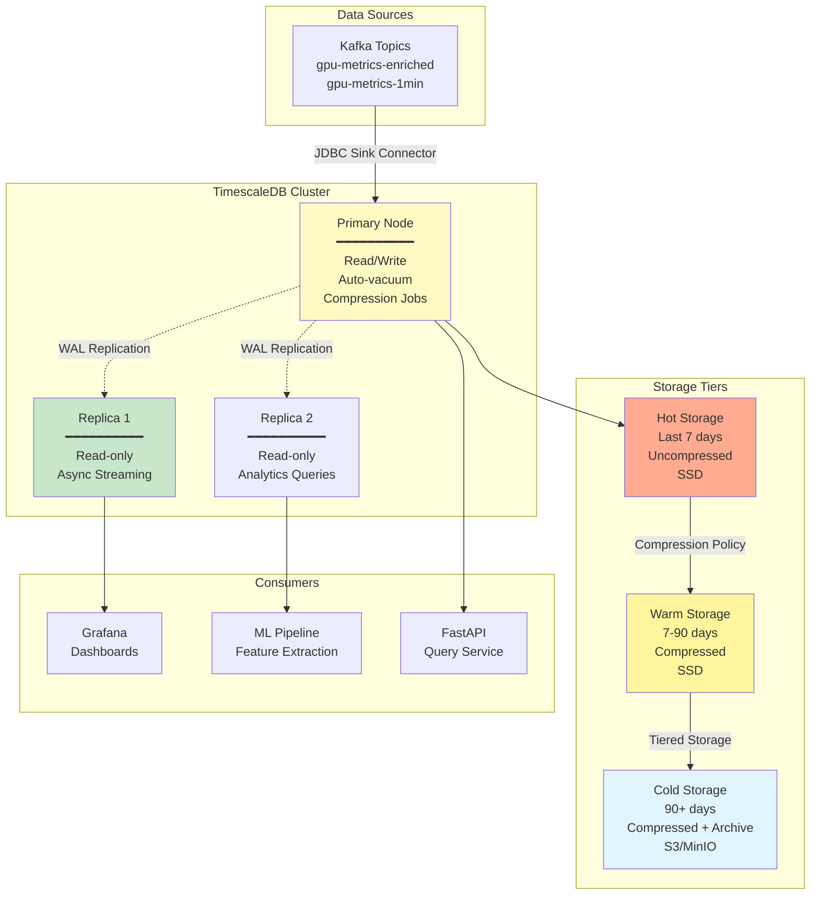
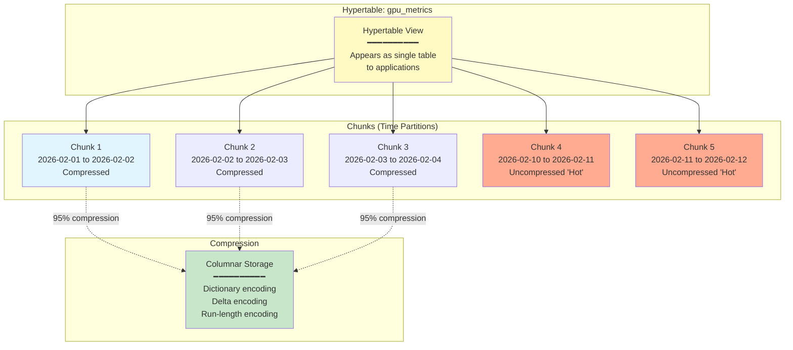
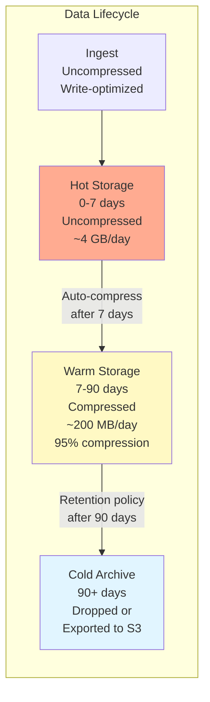
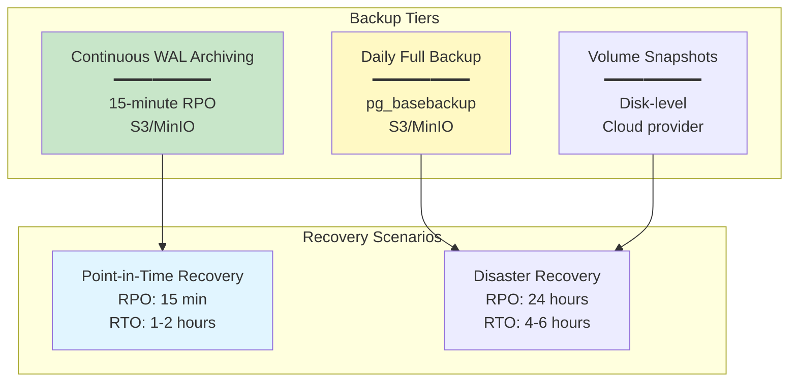

# TimescaleDB Integration Guide

## Table of Contents

- [Overview](#overview)
- [Architecture](#architecture)
- [Schema Design](#schema-design)
- [Data Ingestion](#data-ingestion)
- [Query Patterns](#query-patterns)
- [Compression & Retention](#compression--retention)
- [Performance Optimization](#performance-optimization)
- [Continuous Aggregates](#continuous-aggregates)
- [Backup & Recovery](#backup--recovery)
- [Monitoring & Operations](#monitoring--operations)
- [Scaling](#scaling)

---

## Overview

TimescaleDB is a PostgreSQL extension optimized for time-series data. For the GPU Health Monitor, TimescaleDB serves as the **primary storage layer** for telemetry metrics, enabling efficient querying, compression, and retention management at scale.

### Why TimescaleDB?

- **PostgreSQL-Based**: Leverage familiar SQL, tools, and ecosystem
- **Automatic Partitioning**: Time-based chunks for efficient queries
- **Excellent Compression**: 95%+ compression ratios with columnar storage
- **Continuous Aggregates**: Materialized views that update automatically
- **Native Time-Series Functions**: Interpolation, gap filling, time bucketing
- **Cost-Effective**: Open-source, runs on commodity hardware

### System Context



---

## Architecture

### Hypertable Design

TimescaleDB uses **hypertables** that automatically partition data into **chunks** based on time intervals.



**Key Concepts**:
- **Hypertable**: Logical table spanning multiple chunks
- **Chunk**: Physical partition covering a time range (e.g., 1 day)
- **Chunk Interval**: Time range per chunk (configurable, default 7 days)
- **Compression**: Applied to chunks older than compression threshold

---

## Schema Design

### Core Hypertables

#### 1. `gpu_metrics` (Raw 10-Second Metrics)

```sql
-- Create table
CREATE TABLE gpu_metrics (
    time TIMESTAMPTZ NOT NULL,
    gpu_uuid TEXT NOT NULL,
    hostname TEXT NOT NULL,
    
    -- GPU identification
    pci_bus_id TEXT,
    device_index SMALLINT,
    
    -- Health metrics
    gpu_temp REAL,
    memory_temp REAL,
    power_usage REAL,
    throttle_reasons BIGINT,
    
    -- Memory metrics
    fb_used_bytes BIGINT,
    fb_free_bytes BIGINT,
    fb_total_bytes BIGINT,
    memory_utilization REAL,
    ecc_sbe_volatile INT,
    ecc_dbe_volatile INT,
    ecc_sbe_aggregate BIGINT,
    ecc_dbe_aggregate BIGINT,
    retired_pages_dbe INT,
    
    -- Performance metrics
    sm_active REAL,
    sm_occupancy REAL,
    tensor_active REAL,
    dram_active REAL,
    pcie_tx_bytes_per_sec REAL,
    pcie_rx_bytes_per_sec REAL,
    
    -- Clock metrics
    sm_clock_mhz INT,
    mem_clock_mhz INT,
    
    -- Utilization
    gpu_utilization REAL,
    mem_copy_utilization REAL,
    
    -- Quality metadata
    collection_latency_ms INT,
    validation_passed BOOLEAN DEFAULT true,
    
    PRIMARY KEY (time, gpu_uuid)
);

-- Create hypertable (1-day chunks)
SELECT create_hypertable(
    'gpu_metrics',
    'time',
    chunk_time_interval => INTERVAL '1 day'
);

-- Indexes
CREATE INDEX idx_gpu_metrics_uuid_time ON gpu_metrics (gpu_uuid, time DESC);
CREATE INDEX idx_gpu_metrics_hostname_time ON gpu_metrics (hostname, time DESC);

-- Index for anomaly queries (throttling, ECC errors)
CREATE INDEX idx_gpu_metrics_throttle ON gpu_metrics (time DESC) 
    WHERE throttle_reasons > 0;
    
CREATE INDEX idx_gpu_metrics_ecc_errors ON gpu_metrics (time DESC) 
    WHERE ecc_dbe_volatile > 0 OR ecc_sbe_volatile > 100;

-- Compression policy (compress chunks older than 7 days)
ALTER TABLE gpu_metrics SET (
    timescaledb.compress,
    timescaledb.compress_segmentby = 'gpu_uuid, hostname',
    timescaledb.compress_orderby = 'time DESC'
);

SELECT add_compression_policy('gpu_metrics', INTERVAL '7 days');

-- Retention policy (drop chunks older than 90 days)
SELECT add_retention_policy('gpu_metrics', INTERVAL '90 days');
```

**Expected Data Volume**:
- 10,000 GPUs × 6 samples/min × 1440 min/day = 86.4M rows/day
- Uncompressed: ~50 bytes/row × 86.4M = ~4.3 GB/day
- Compressed (95%): ~215 MB/day
- 90-day retention: ~19 GB compressed

#### 2. `gpu_metrics_1min` (1-Minute Aggregates)

```sql
CREATE TABLE gpu_metrics_1min (
    time TIMESTAMPTZ NOT NULL,
    gpu_uuid TEXT NOT NULL,
    hostname TEXT NOT NULL,
    
    -- Aggregated metrics (avg, min, max, stddev)
    gpu_temp_avg REAL,
    gpu_temp_min REAL,
    gpu_temp_max REAL,
    gpu_temp_stddev REAL,
    
    memory_temp_avg REAL,
    memory_temp_max REAL,
    
    power_usage_avg REAL,
    power_usage_min REAL,
    power_usage_max REAL,
    
    sm_active_avg REAL,
    sm_occupancy_avg REAL,
    tensor_active_avg REAL,
    
    pcie_tx_mbps_avg REAL,
    pcie_rx_mbps_avg REAL,
    
    -- Counters (sum/delta)
    ecc_sbe_count INT,
    ecc_dbe_count INT,
    
    -- Derived metrics
    throttle_events INT,  -- Count of non-zero throttle_reasons
    
    -- Sample metadata
    sample_count INT,
    
    PRIMARY KEY (time, gpu_uuid)
);

SELECT create_hypertable(
    'gpu_metrics_1min',
    'time',
    chunk_time_interval => INTERVAL '7 days'
);

-- Compression (older than 14 days)
ALTER TABLE gpu_metrics_1min SET (
    timescaledb.compress,
    timescaledb.compress_segmentby = 'gpu_uuid, hostname'
);

SELECT add_compression_policy('gpu_metrics_1min', INTERVAL '14 days');

-- Retention (365 days for trend analysis)
SELECT add_retention_policy('gpu_metrics_1min', INTERVAL '365 days');
```

**Data Volume**:
- 10,000 GPUs × 1 row/min × 1440 min/day = 14.4M rows/day
- Compressed: ~70 MB/day
- 365-day retention: ~25 GB

#### 3. `gpu_metrics_15min` (15-Minute Aggregates)

```sql
CREATE TABLE gpu_metrics_15min (
    time TIMESTAMPTZ NOT NULL,
    gpu_uuid TEXT NOT NULL,
    
    -- Aggregates
    gpu_temp_avg REAL,
    gpu_temp_max REAL,
    power_usage_avg REAL,
    sm_active_avg REAL,
    
    -- ECC error delta
    ecc_sbe_delta INT,
    ecc_dbe_delta INT,
    
    sample_count INT,
    
    PRIMARY KEY (time, gpu_uuid)
);

SELECT create_hypertable('gpu_metrics_15min', 'time', chunk_time_interval => INTERVAL '30 days');
ALTER TABLE gpu_metrics_15min SET (timescaledb.compress);
SELECT add_compression_policy('gpu_metrics_15min', INTERVAL '30 days');
SELECT add_retention_policy('gpu_metrics_15min', INTERVAL '730 days');  -- 2 years
```

### Supporting Tables (Regular PostgreSQL)

#### `gpu_assets` (Asset Metadata)

```sql
CREATE TABLE gpu_assets (
    gpu_uuid TEXT PRIMARY KEY,
    
    -- Hardware info
    model TEXT NOT NULL,  -- "NVIDIA A100-SXM4-80GB"
    architecture TEXT,    -- "Ampere"
    compute_capability TEXT,
    memory_gb INT,
    
    -- Deployment info
    hostname TEXT,
    pci_bus_id TEXT,
    rack_id TEXT,
    cluster_id TEXT,
    datacenter TEXT,
    region TEXT,
    
    -- Asset lifecycle
    purchase_date DATE,
    deployment_date DATE,
    warranty_expiry DATE,
    expected_eol DATE,
    
    -- SLA tier
    sla_tier TEXT,  -- "production", "development", "research"
    priority INT,
    
    -- Metadata
    tags JSONB,
    notes TEXT,
    
    created_at TIMESTAMPTZ DEFAULT NOW(),
    updated_at TIMESTAMPTZ DEFAULT NOW()
);

CREATE INDEX idx_gpu_assets_hostname ON gpu_assets (hostname);
CREATE INDEX idx_gpu_assets_cluster ON gpu_assets (cluster_id);
CREATE INDEX idx_gpu_assets_tags ON gpu_assets USING GIN (tags);
```

#### `gpu_health_scores` (Daily Health Scores)

```sql
CREATE TABLE gpu_health_scores (
    time TIMESTAMPTZ NOT NULL,
    gpu_uuid TEXT NOT NULL,
    
    -- Overall health score (0-100)
    overall_score REAL NOT NULL,
    health_grade TEXT,  -- "excellent", "good", "fair", "degraded", "poor", "critical"
    
    -- Dimension scores (0-100 each)
    memory_health REAL,
    thermal_health REAL,
    performance_health REAL,
    power_health REAL,
    reliability_health REAL,
    
    -- Trends
    score_delta_7d REAL,    -- Change over 7 days
    score_delta_30d REAL,   -- Change over 30 days
    degradation_rate REAL,  -- Points per day
    
    -- Contributing factors
    degradation_factors JSONB,  -- ["elevated_temp", "ecc_errors"]
    
    -- Scoring metadata
    scoring_version TEXT,
    scored_at TIMESTAMPTZ DEFAULT NOW(),
    
    PRIMARY KEY (time, gpu_uuid)
);

SELECT create_hypertable('gpu_health_scores', 'time', chunk_time_interval => INTERVAL '30 days');

CREATE INDEX idx_health_scores_score ON gpu_health_scores (time DESC, overall_score ASC);
CREATE INDEX idx_health_scores_grade ON gpu_health_scores (time DESC, health_grade);
```

#### `gpu_failure_predictions` (ML Predictions)

```sql
CREATE TABLE gpu_failure_predictions (
    time TIMESTAMPTZ NOT NULL,
    gpu_uuid TEXT NOT NULL,
    
    -- Failure probability (0.0 - 1.0)
    failure_prob_7d REAL,
    failure_prob_30d REAL,
    failure_prob_90d REAL,
    
    -- Predicted failure type
    predicted_failure_type TEXT,  -- "memory", "thermal", "power", "unknown"
    
    -- Time to failure estimate
    estimated_ttf_days INT,
    
    -- Model metadata
    model_name TEXT,
    model_version TEXT,
    confidence REAL,
    
    -- Features used (for explainability)
    feature_importance JSONB,
    
    predicted_at TIMESTAMPTZ DEFAULT NOW(),
    
    PRIMARY KEY (time, gpu_uuid)
);

SELECT create_hypertable('gpu_failure_predictions', 'time', chunk_time_interval => INTERVAL '30 days');

CREATE INDEX idx_predictions_high_risk ON gpu_failure_predictions (time DESC)
    WHERE failure_prob_30d > 0.2;
```

---

## Data Ingestion

### Kafka JDBC Sink Connector

**Connector Configuration** (`gpu-metrics-sink.json`):

```json
{
  "name": "gpu-metrics-timescale-sink",
  "config": {
    "connector.class": "io.confluent.connect.jdbc.JdbcSinkConnector",
    "tasks.max": "8",
    
    "topics": "gpu-metrics-enriched,gpu-metrics-1min,gpu-metrics-15min",
    
    "connection.url": "jdbc:postgresql://timescale-primary:5432/gpu_health",
    "connection.user": "kafka_connect",
    "connection.password": "${file:/secrets/db-password.txt:password}",
    
    "auto.create": "false",
    "auto.evolve": "false",
    
    "insert.mode": "insert",
    "batch.size": 3000,
    "max.retries": 10,
    "retry.backoff.ms": 3000,
    
    "table.name.format": "${topic}",
    
    "pk.mode": "record_value",
    "pk.fields": "time,gpu_uuid",
    
    "transforms": "convertTime,renameTable",
    
    "transforms.convertTime.type": "org.apache.kafka.connect.transforms.TimestampConverter$Value",
    "transforms.convertTime.field": "time",
    "transforms.convertTime.target.type": "Timestamp",
    
    "transforms.renameTable.type": "org.apache.kafka.connect.transforms.RegexRouter",
    "transforms.renameTable.regex": "gpu-metrics-enriched",
    "transforms.renameTable.replacement": "gpu_metrics"
  }
}
```

**Deploy Connector**:

```bash
curl -X POST http://kafka-connect:8083/connectors \
  -H "Content-Type: application/json" \
  -d @gpu-metrics-sink.json

# Check status
curl http://kafka-connect:8083/connectors/gpu-metrics-timescale-sink/status
```

### Direct Ingestion (Python Alternative)

For custom processing or when Kafka Connect isn't available:

```python
from kafka import KafkaConsumer
import psycopg2
from psycopg2.extras import execute_values
import json

class TimescaleDBWriter:
    def __init__(self, db_config):
        self.conn = psycopg2.connect(**db_config)
        self.cursor = self.conn.cursor()
        
    def write_batch(self, events):
        """Batch insert events into gpu_metrics"""
        
        # Prepare values
        values = []
        for event in events:
            values.append((
                event['timestamp'],
                event['gpu']['gpu_uuid'],
                event['host']['hostname'],
                event['gpu']['pci_bus_id'],
                event['gpu']['device_index'],
                event['metrics']['health']['gpu_temp_c'],
                event['metrics']['health']['memory_temp_c'],
                event['metrics']['health']['power_usage_w'],
                event['metrics']['health']['throttle_reasons'],
                event['metrics']['memory']['fb_used_mib'] * 1024 * 1024,  # Convert to bytes
                event['metrics']['memory']['fb_free_mib'] * 1024 * 1024,
                # ... other fields
            ))
        
        # Batch insert with execute_values (fast)
        execute_values(
            self.cursor,
            """
            INSERT INTO gpu_metrics (
                time, gpu_uuid, hostname, pci_bus_id, device_index,
                gpu_temp, memory_temp, power_usage, throttle_reasons,
                fb_used_bytes, fb_free_bytes
                -- ... other columns
            ) VALUES %s
            ON CONFLICT (time, gpu_uuid) DO NOTHING
            """,
            values,
            page_size=1000
        )
        
        self.conn.commit()

def main():
    consumer = KafkaConsumer(
        'gpu-metrics-enriched',
        bootstrap_servers=['kafka-1:9092', 'kafka-2:9092', 'kafka-3:9092'],
        group_id='timescale-writer',
        value_deserializer=lambda m: json.loads(m.decode('utf-8')),
        auto_offset_reset='earliest',
        max_poll_records=3000,
        max_poll_interval_ms=300000
    )
    
    db_config = {
        'host': 'timescale-primary',
        'port': 5432,
        'database': 'gpu_health',
        'user': 'writer',
        'password': 'secret'
    }
    
    writer = TimescaleDBWriter(db_config)
    
    batch = []
    for message in consumer:
        batch.append(message.value)
        
        if len(batch) >= 3000:
            writer.write_batch(batch)
            batch = []

if __name__ == '__main__':
    main()
```

---

## Query Patterns

### Common Queries

#### 1. Latest Metrics for GPU

```sql
-- Get last 100 samples for a specific GPU
SELECT 
    time,
    gpu_temp,
    memory_temp,
    power_usage,
    sm_active,
    ecc_dbe_volatile
FROM gpu_metrics
WHERE gpu_uuid = 'GPU-abc123def456'
ORDER BY time DESC
LIMIT 100;
```

#### 2. Temperature Trend (Last 24 Hours)

```sql
-- 5-minute averages
SELECT 
    time_bucket('5 minutes', time) AS bucket,
    AVG(gpu_temp) AS avg_temp,
    MAX(gpu_temp) AS max_temp,
    STDDEV(gpu_temp) AS temp_stddev
FROM gpu_metrics
WHERE 
    gpu_uuid = 'GPU-abc123def456'
    AND time > NOW() - INTERVAL '24 hours'
GROUP BY bucket
ORDER BY bucket DESC;
```

#### 3. Fleet-Wide Aggregates

```sql
-- Current status of entire fleet
SELECT 
    COUNT(DISTINCT gpu_uuid) AS total_gpus,
    AVG(gpu_temp) AS avg_temp,
    MAX(gpu_temp) AS max_temp,
    SUM(CASE WHEN throttle_reasons > 0 THEN 1 ELSE 0 END) AS throttling_count,
    SUM(CASE WHEN ecc_dbe_volatile > 0 THEN 1 ELSE 0 END) AS dbe_error_count
FROM gpu_metrics
WHERE time > NOW() - INTERVAL '5 minutes';
```

#### 4. Anomaly Detection (Spike Detection)

```sql
-- GPUs with temperature spike (>15°C in 5 minutes)
WITH recent AS (
    SELECT 
        gpu_uuid,
        time_bucket('5 minutes', time) AS bucket,
        AVG(gpu_temp) AS avg_temp
    FROM gpu_metrics
    WHERE time > NOW() - INTERVAL '1 hour'
    GROUP BY gpu_uuid, bucket
),
deltas AS (
    SELECT 
        gpu_uuid,
        bucket,
        avg_temp,
        avg_temp - LAG(avg_temp) OVER (PARTITION BY gpu_uuid ORDER BY bucket) AS temp_delta
    FROM recent
)
SELECT 
    gpu_uuid,
    bucket,
    avg_temp,
    temp_delta
FROM deltas
WHERE temp_delta > 15
ORDER BY temp_delta DESC;
```

#### 5. ECC Error Rate

```sql
-- ECC errors per hour per GPU (last 7 days)
SELECT 
    gpu_uuid,
    time_bucket('1 hour', time) AS hour,
    MAX(ecc_sbe_aggregate) - MIN(ecc_sbe_aggregate) AS sbe_errors_per_hour,
    MAX(ecc_dbe_aggregate) - MIN(ecc_dbe_aggregate) AS dbe_errors_per_hour
FROM gpu_metrics
WHERE time > NOW() - INTERVAL '7 days'
GROUP BY gpu_uuid, hour
HAVING 
    MAX(ecc_dbe_aggregate) - MIN(ecc_dbe_aggregate) > 0
    OR MAX(ecc_sbe_aggregate) - MIN(ecc_sbe_aggregate) > 100
ORDER BY dbe_errors_per_hour DESC, sbe_errors_per_hour DESC;
```

#### 6. Power Efficiency Analysis

```sql
-- Power efficiency: compute utilization per watt
SELECT 
    gpu_uuid,
    time_bucket('15 minutes', time) AS bucket,
    AVG(sm_active) AS avg_utilization,
    AVG(power_usage) AS avg_power,
    AVG(sm_active) / NULLIF(AVG(power_usage), 0) AS utilization_per_watt
FROM gpu_metrics
WHERE time > NOW() - INTERVAL '24 hours'
GROUP BY gpu_uuid, bucket
ORDER BY utilization_per_watt DESC;
```

#### 7. Health Score Trend

```sql
-- Health score trend for top 10 degrading GPUs
SELECT 
    gpu_uuid,
    overall_score,
    score_delta_7d,
    score_delta_30d,
    degradation_rate,
    health_grade,
    degradation_factors
FROM gpu_health_scores
WHERE time = (SELECT MAX(time) FROM gpu_health_scores)
ORDER BY degradation_rate ASC
LIMIT 10;
```

---

## Compression & Retention

### Compression Strategy



### Compression Configuration

```sql
-- Enable compression on hypertable
ALTER TABLE gpu_metrics SET (
    timescaledb.compress,
    timescaledb.compress_segmentby = 'gpu_uuid, hostname',  -- Group by these columns
    timescaledb.compress_orderby = 'time DESC'              -- Order within segments
);

-- Add automatic compression policy
SELECT add_compression_policy(
    'gpu_metrics',
    INTERVAL '7 days'  -- Compress chunks older than 7 days
);

-- Manual compression (if needed)
SELECT compress_chunk(chunk_name)
FROM timescaledb_information.chunks
WHERE hypertable_name = 'gpu_metrics'
  AND NOT is_compressed
  AND range_end < NOW() - INTERVAL '7 days';
```

**Compression Effectiveness**:
```sql
-- Check compression ratio
SELECT 
    h.table_name,
    pg_size_pretty(SUM(c.total_bytes)) AS total_size,
    pg_size_pretty(SUM(c.compressed_total_bytes)) AS compressed_size,
    ROUND(100.0 * SUM(c.compressed_total_bytes) / NULLIF(SUM(c.total_bytes), 0), 2) AS compression_ratio
FROM timescaledb_information.hypertables h
JOIN timescaledb_information.chunks c ON c.hypertable_name = h.table_name
WHERE h.table_name = 'gpu_metrics'
GROUP BY h.table_name;
```

### Retention Policies

```sql
-- Automatic data retention (drop old chunks)
SELECT add_retention_policy('gpu_metrics', INTERVAL '90 days');
SELECT add_retention_policy('gpu_metrics_1min', INTERVAL '365 days');
SELECT add_retention_policy('gpu_metrics_15min', INTERVAL '730 days');

-- View active retention policies
SELECT * FROM timescaledb_information.jobs
WHERE proc_name = 'policy_retention';

-- Remove retention policy
SELECT remove_retention_policy('gpu_metrics');
```

### Tiered Storage (Cold Archive)

Export old data to object storage before deletion:

```sql
-- Export chunk to CSV (for S3 upload)
CREATE EXTENSION IF NOT EXISTS pg_partman;

\COPY (
    SELECT * FROM gpu_metrics
    WHERE time >= '2026-01-01' AND time < '2026-01-02'
) TO '/tmp/gpu_metrics_2026-01-01.csv' WITH CSV HEADER;

-- After upload to S3, drop the chunk
SELECT drop_chunks('gpu_metrics', INTERVAL '91 days');
```

---

## Performance Optimization

### Index Strategy

```sql
-- Primary index (automatic with PRIMARY KEY)
-- Covers: (time, gpu_uuid)

-- Additional indexes for common query patterns
CREATE INDEX idx_gpu_metrics_uuid_time ON gpu_metrics (gpu_uuid, time DESC);
CREATE INDEX idx_gpu_metrics_hostname ON gpu_metrics (hostname, time DESC);

-- Partial indexes for anomalies (smaller, faster)
CREATE INDEX idx_gpu_metrics_throttling ON gpu_metrics (time DESC)
    WHERE throttle_reasons > 0;

CREATE INDEX idx_gpu_metrics_dbe_errors ON gpu_metrics (time DESC)
    WHERE ecc_dbe_volatile > 0;

-- Covering index for common dashboard queries
CREATE INDEX idx_gpu_metrics_dashboard ON gpu_metrics (time DESC)
    INCLUDE (gpu_uuid, gpu_temp, power_usage, sm_active);
```

### Query Optimization

#### Use `time_bucket` for Aggregations

```sql
-- BAD: Full scan
SELECT DATE_TRUNC('hour', time), AVG(gpu_temp)
FROM gpu_metrics
GROUP BY 1;

-- GOOD: Uses time_bucket (optimized for TimescaleDB)
SELECT time_bucket('1 hour', time), AVG(gpu_temp)
FROM gpu_metrics
GROUP BY 1;
```

#### Push Down Filters

```sql
-- BAD: Filters after aggregation
SELECT gpu_uuid, AVG(gpu_temp)
FROM gpu_metrics
WHERE time > NOW() - INTERVAL '24 hours'
GROUP BY gpu_uuid
HAVING AVG(gpu_temp) > 80;

-- GOOD: Filter early, aggregate later
WITH hot_gpus AS (
    SELECT gpu_uuid, gpu_temp
    FROM gpu_metrics
    WHERE 
        time > NOW() - INTERVAL '24 hours'
        AND gpu_temp > 75  -- Pre-filter
)
SELECT gpu_uuid, AVG(gpu_temp)
FROM hot_gpus
GROUP BY gpu_uuid
HAVING AVG(gpu_temp) > 80;
```

### Connection Pooling

Use **PgBouncer** for connection pooling:

```ini
# /etc/pgbouncer/pgbouncer.ini
[databases]
gpu_health = host=timescale-primary port=5432 dbname=gpu_health

[pgbouncer]
listen_addr = 0.0.0.0
listen_port = 6432
auth_type = scram-sha-256
auth_file = /etc/pgbouncer/userlist.txt

pool_mode = transaction
max_client_conn = 1000
default_pool_size = 50
reserve_pool_size = 10
reserve_pool_timeout = 3
```

Application connects to PgBouncer (port 6432) instead of PostgreSQL directly.

---

## Continuous Aggregates

### Materialized Views That Auto-Update

Continuous aggregates are **materialized views** that incrementally update as new data arrives.

```sql
-- Create continuous aggregate for 15-minute GPU temperature averages
CREATE MATERIALIZED VIEW gpu_temp_15min
WITH (timescaledb.continuous) AS
SELECT 
    time_bucket('15 minutes', time) AS bucket,
    gpu_uuid,
    AVG(gpu_temp) AS avg_temp,
    MAX(gpu_temp) AS max_temp,
    MIN(gpu_temp) AS min_temp,
    STDDEV(gpu_temp) AS stddev_temp,
    COUNT(*) AS sample_count
FROM gpu_metrics
GROUP BY bucket, gpu_uuid
WITH NO DATA;

-- Add refresh policy (update every 15 minutes)
SELECT add_continuous_aggregate_policy(
    'gpu_temp_15min',
    start_offset => INTERVAL '1 hour',
    end_offset => INTERVAL '15 minutes',
    schedule_interval => INTERVAL '15 minutes'
);

-- Query the continuous aggregate (fast!)
SELECT * FROM gpu_temp_15min
WHERE bucket > NOW() - INTERVAL '24 hours'
  AND gpu_uuid = 'GPU-abc123'
ORDER BY bucket DESC;
```

### Pre-Aggregated Health Dashboard

```sql
-- Fleet-wide health summary (updated every 5 minutes)
CREATE MATERIALIZED VIEW fleet_health_summary
WITH (timescaledb.continuous) AS
SELECT 
    time_bucket('5 minutes', time) AS bucket,
    COUNT(DISTINCT gpu_uuid) AS total_gpus,
    AVG(gpu_temp) AS avg_temp,
    MAX(gpu_temp) AS max_temp,
    PERCENTILE_CONT(0.95) WITHIN GROUP (ORDER BY gpu_temp) AS p95_temp,
    AVG(power_usage) AS avg_power,
    SUM(CASE WHEN throttle_reasons > 0 THEN 1 ELSE 0 END) AS throttling_count,
    SUM(CASE WHEN ecc_dbe_volatile > 0 THEN 1 ELSE 0 END) AS dbe_error_count
FROM gpu_metrics
GROUP BY bucket
WITH NO DATA;

SELECT add_continuous_aggregate_policy(
    'fleet_health_summary',
    start_offset => INTERVAL '30 minutes',
    end_offset => INTERVAL '5 minutes',
    schedule_interval => INTERVAL '5 minutes'
);
```

---

## Backup & Recovery

### Backup Strategy



### WAL Archiving (Continuous Backup)

```sql
-- Configure WAL archiving in postgresql.conf
wal_level = replica
archive_mode = on
archive_command = 'wal-g wal-push %p'
archive_timeout = 900  -- 15 minutes
```

**Using WAL-G** (S3-based archiving):

```bash
# Install WAL-G
wget https://github.com/wal-g/wal-g/releases/download/v2.0.0/wal-g-pg-ubuntu-20.04-amd64.tar.gz
tar -xzf wal-g-pg-ubuntu-20.04-amd64.tar.gz
mv wal-g-pg-ubuntu-20.04-amd64 /usr/local/bin/wal-g

# Configure WAL-G
export WALG_S3_PREFIX="s3://gpu-health-backups/timescale"
export AWS_REGION="us-west-2"
export AWS_ACCESS_KEY_ID="..."
export AWS_SECRET_ACCESS_KEY="..."

# Perform base backup
wal-g backup-push /var/lib/postgresql/15/main
```

### Daily Backup Script

```bash
#!/bin/bash
# /usr/local/bin/timescale-backup.sh

DATE=$(date +%Y-%m-%d)
BACKUP_DIR="/backups/timescale"
S3_BUCKET="s3://gpu-health-backups/daily"

# Full backup using pg_basebackup
pg_basebackup \
    -h localhost \
    -U postgres \
    -D "${BACKUP_DIR}/${DATE}" \
    -Ft \
    -z \
    -P

# Upload to S3
aws s3 sync "${BACKUP_DIR}/${DATE}" "${S3_BUCKET}/${DATE}/"

# Clean up local backups (keep 7 days)
find "${BACKUP_DIR}" -type d -mtime +7 -exec rm -rf {} \;

echo "Backup completed: ${DATE}"
```

### Point-in-Time Recovery

```bash
# Stop PostgreSQL
systemctl stop postgresql

# Restore base backup
cd /var/lib/postgresql/15/main
rm -rf *
wal-g backup-fetch /var/lib/postgresql/15/main LATEST

# Create recovery configuration
cat > recovery.conf <<EOF
restore_command = 'wal-g wal-fetch %f %p'
recovery_target_time = '2026-02-11 10:30:00'
recovery_target_action = 'promote'
EOF

# Start PostgreSQL (will replay WAL)
systemctl start postgresql

# Verify recovery
psql -U postgres -d gpu_health -c "SELECT MAX(time) FROM gpu_metrics;"
```

---

## Monitoring & Operations

### Key Metrics

```sql
-- Database size
SELECT 
    pg_database.datname,
    pg_size_pretty(pg_database_size(pg_database.datname)) AS size
FROM pg_database;

-- Hypertable sizes
SELECT 
    hypertable_name,
    pg_size_pretty(hypertable_size(hypertable_name::regclass)) AS total_size,
    pg_size_pretty(hypertable_size(hypertable_name::regclass, 'table')) AS table_size,
    pg_size_pretty(hypertable_size(hypertable_name::regclass, 'indexes')) AS index_size
FROM timescaledb_information.hypertables;

-- Chunk statistics
SELECT 
    chunk_name,
    range_start,
    range_end,
    is_compressed,
    pg_size_pretty(total_bytes) AS total_size
FROM timescaledb_information.chunks
WHERE hypertable_name = 'gpu_metrics'
ORDER BY range_start DESC
LIMIT 20;

-- Compression jobs
SELECT * FROM timescaledb_information.jobs
WHERE proc_name = 'policy_compression';

-- Active queries
SELECT 
    pid,
    now() - query_start AS duration,
    state,
    query
FROM pg_stat_activity
WHERE state != 'idle'
  AND query NOT LIKE '%pg_stat_activity%'
ORDER BY duration DESC;
```

### Performance Views

```sql
-- Slow queries (pg_stat_statements extension)
CREATE EXTENSION IF NOT EXISTS pg_stat_statements;

SELECT 
    calls,
    mean_exec_time,
    total_exec_time,
    query
FROM pg_stat_statements
ORDER BY mean_exec_time DESC
LIMIT 10;

-- Index usage
SELECT 
    schemaname,
    tablename,
    indexname,
    idx_scan,
    idx_tup_read,
    idx_tup_fetch
FROM pg_stat_user_indexes
ORDER BY idx_scan DESC;

-- Table bloat
SELECT 
    schemaname,
    tablename,
    pg_size_pretty(pg_total_relation_size(schemaname||'.'||tablename)) AS size,
    n_live_tup,
    n_dead_tup,
    ROUND(100.0 * n_dead_tup / NULLIF(n_live_tup + n_dead_tup, 0), 2) AS dead_pct
FROM pg_stat_user_tables
WHERE n_dead_tup > 1000
ORDER BY dead_pct DESC;
```

### Vacuum & Maintenance

```sql
-- Manual vacuum analyze (usually automatic)
VACUUM ANALYZE gpu_metrics;

-- Reindex (if index bloat detected)
REINDEX TABLE gpu_metrics;

-- Update table statistics
ANALYZE gpu_metrics;
```

**Autovacuum tuning** (`postgresql.conf`):

```ini
autovacuum = on
autovacuum_max_workers = 4
autovacuum_naptime = 15s
autovacuum_vacuum_threshold = 50
autovacuum_vacuum_scale_factor = 0.05
autovacuum_analyze_threshold = 50
autovacuum_analyze_scale_factor = 0.05
```

---

## Scaling

### Vertical Scaling (Single Node)

**Hardware Recommendations**:

| Fleet Size | CPU | RAM | Storage | Configuration |
|------------|-----|-----|---------|---------------|
| 1,000 GPUs | 8 cores | 32 GB | 500 GB SSD | shared_buffers=8GB, effective_cache_size=24GB |
| 5,000 GPUs | 16 cores | 64 GB | 2 TB SSD | shared_buffers=16GB, effective_cache_size=48GB |
| 10,000 GPUs | 32 cores | 128 GB | 5 TB SSD | shared_buffers=32GB, effective_cache_size=96GB |

**PostgreSQL Tuning**:

```ini
# Memory
shared_buffers = 16GB
effective_cache_size = 48GB
work_mem = 64MB
maintenance_work_mem = 2GB

# Checkpoint
checkpoint_timeout = 15min
checkpoint_completion_target = 0.9
max_wal_size = 8GB

# Parallelism
max_parallel_workers_per_gather = 4
max_parallel_workers = 16
max_worker_processes = 16

# Connections
max_connections = 200

# Logging
log_min_duration_statement = 1000  # Log queries > 1 second
```

### Horizontal Scaling (Distributed)

For > 50,000 GPUs, use **Timescale Cloud** or **Citus** (horizontal sharding extension):

```sql
-- Convert to distributed hypertable (Timescale Cloud)
SELECT create_distributed_hypertable(
    'gpu_metrics',
    'time',
    partitioning_column => 'gpu_uuid',
    number_partitions => 8
);
```

---

## Appendix

### Complete Schema DDL

See `/schema/timescaledb-schema.sql` for full schema definition.

### Useful Extensions

```sql
CREATE EXTENSION IF NOT EXISTS timescaledb;
CREATE EXTENSION IF NOT EXISTS pg_stat_statements;
CREATE EXTENSION IF NOT EXISTS pgcrypto;
CREATE EXTENSION IF NOT EXISTS btree_gin;
```

### References

- [TimescaleDB Documentation](https://docs.timescale.com/)
- [PostgreSQL Performance Tuning](https://wiki.postgresql.org/wiki/Performance_Optimization)
- [pg_stat_statements](https://www.postgresql.org/docs/current/pgstatstatements.html)

---

**Document Version**: 1.0  
**Last Updated**: 2026-02-11  
**Maintained By**: Stuart Hart (stuarthart@msn.com)  
**Project**: GPU Health Monitor - Production-grade monitoring for NVIDIA A100/H100 fleets
