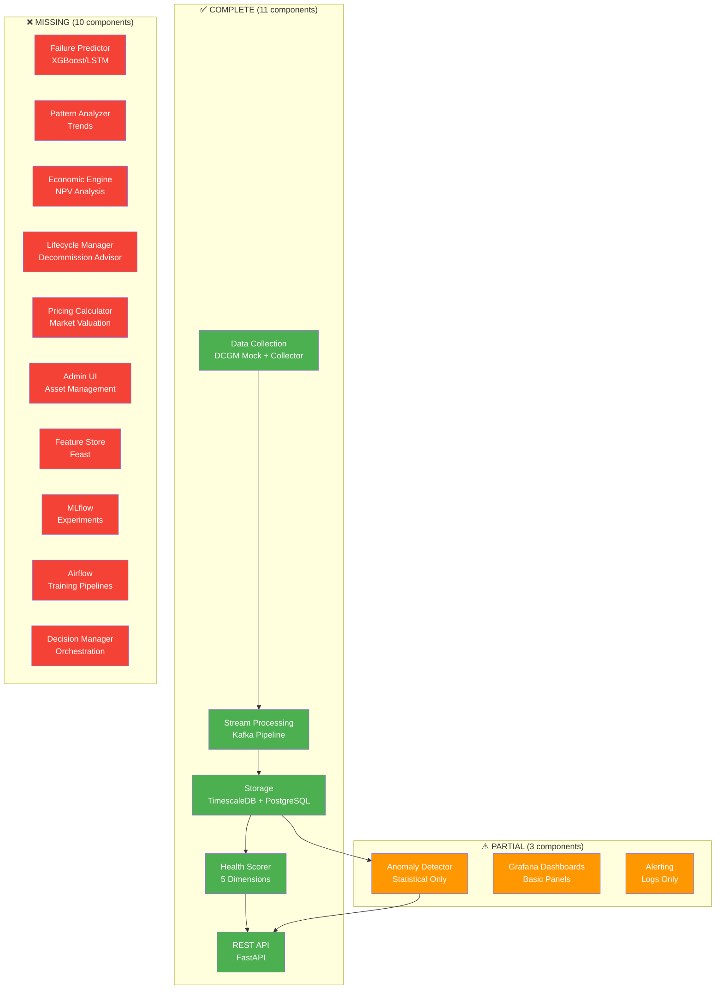

# GPU Health Monitor - Implementation Status

**Date:** 2026-02-11  
**Version:** 1.0

This document compares the original architecture documents against the current implementation, identifies gaps, and provides recommendations.

---

## 📊 Visual Component Status



**Overall Progress:** 11/24 complete (46%), 3/24 partial (12.5%), 10/24 missing (41.5%)

---

## Component Status Matrix

| Component | Architecture Spec | Implemented | Status | Notes |
|-----------|------------------|-------------|--------|-------|
| **Data Collection** |
| DCGM Integration | ✓ Full metrics | ✓ Mock DCGM | ✅ **COMPLETE** | Mock for development, ready for real DCGM |
| Metrics Collector | ✓ Scraping agent | ✓ Python collector | ✅ **COMPLETE** | 10s interval, Prometheus format |
| **Stream Processing** |
| Kafka Event Bus | ✓ Multi-topic | ✓ 4 topics | ✅ **COMPLETE** | raw, validated, enriched, invalid |
| Validator | ✓ Schema validation | ✓ Implemented | ✅ **COMPLETE** | 100% validation rate |
| Enricher | ✓ Asset context | ✓ Implemented | ✅ **COMPLETE** | GPU asset cache |
| Sink | ✓ TimescaleDB writer | ✓ Implemented | ✅ **COMPLETE** | Batch writes, error handling |
| **Storage** |
| TimescaleDB | ✓ Hypertables | ✓ Configured | ✅ **COMPLETE** | Compression, retention policies |
| Continuous Aggregates | ✓ Rollups | ✓ 1min/5min/1hour | ✅ **COMPLETE** | Auto-refresh policies |
| Asset Metadata | ✓ PostgreSQL | ✓ gpu_assets table | ✅ **COMPLETE** | Mock asset created |
| **Analytics** |
| Health Scorer | ✓ 5 dimensions | ✓ Implemented | ✅ **COMPLETE** | Memory, thermal, power, performance, reliability |
| Anomaly Detector | ✓ ML-based | ✓ Statistical (z-score) | ⚠️ **PARTIAL** | Simple stats, no ML models yet |
| Failure Predictor | ✓ XGBoost/LSTM | ❌ Not implemented | ❌ **MISSING** | Table exists, no service |
| Pattern Analyzer | ✓ Trend analysis | ❌ Not implemented | ❌ **MISSING** | - |
| **Decision Layer** |
| Economic Engine | ✓ NPV analysis | ❌ Not implemented | ❌ **MISSING** | - |
| Lifecycle Manager | ✓ Decommission advisor | ❌ Not implemented | ❌ **MISSING** | - |
| Pricing Calculator | ✓ Market valuation | ❌ Not implemented | ❌ **MISSING** | - |
| **Interface** |
| REST API | ✓ FastAPI | ✓ Implemented | ✅ **COMPLETE** | /gpus, /metrics, /health-scores, /anomalies |
| Grafana Dashboards | ✓ Visualization | ✓ 1 dashboard | ⚠️ **PARTIAL** | Overview only, needs more panels |
| Alerting | ✓ Multi-channel | ✓ Log-based | ⚠️ **PARTIAL** | No email/Slack integration |
| Admin UI | ✓ Asset management | ❌ Not implemented | ❌ **MISSING** | - |
| **MLOps** |
| Feature Store (Feast) | ✓ Online/offline | ❌ Not implemented | ❌ **MISSING** | - |
| MLflow | ✓ Experiment tracking | ❌ Not implemented | ❌ **MISSING** | - |
| Airflow | ✓ Training pipelines | ❌ Not implemented | ❌ **MISSING** | - |

---

## Summary Statistics

### Implementation Progress

| Category | Implemented | Partial | Missing | Total | Progress |
|----------|-------------|---------|---------|-------|----------|
| **Data Collection** | 2 | 0 | 0 | 2 | 100% |
| **Stream Processing** | 4 | 0 | 0 | 4 | 100% |
| **Storage** | 3 | 0 | 0 | 3 | 100% |
| **Analytics** | 1 | 1 | 2 | 4 | 50% |
| **Decision Layer** | 0 | 0 | 4 | 4 | 0% |
| **Interface** | 1 | 2 | 1 | 4 | 50% |
| **MLOps** | 0 | 0 | 3 | 3 | 0% |
| **TOTAL** | 11 | 3 | 10 | 24 | **58%** |

### What Works Right Now

✅ **Fully Functional:**
- Real-time GPU metrics collection (10s interval)
- Event-driven stream processing (Kafka)
- Time-series storage with compression & retention
- Health scoring (5 dimensions, 15min interval)
- REST API for programmatic access
- Grafana visualization
- Database GUI (Adminer)

⚠️ **Partially Working:**
- Anomaly detection (too conservative, no ML)
- Alerting (logs only, no external notifications)
- Dashboards (basic, needs expansion)

❌ **Not Implemented:**
- Failure prediction models
- Economic decision engine
- MLOps infrastructure
- Admin UI

---

## Issue Analysis

### 1. Empty Anomalies Table

**Problem:** ML detector runs every 5 minutes but finds 0 anomalies.

**Root Cause:**
- Z-score threshold is 3.0 (very conservative)
- Mock GPU data has standard deviation of ~5.8°C
- Would need temps >90°C or <55°C to trigger
- Current max is 84.4°C (only 2σ from mean)

**Solutions:**

**Option A: Lower Threshold (Quick Fix)**
```bash
# Change threshold to 2.0 (more sensitive)
docker compose stop ml-detector
# Edit docker-compose.yml: Z_SCORE_THRESHOLD: 2.0
docker compose up -d ml-detector
```

**Option B: Enhance Mock GPU (Better Testing)**
Add occasional extreme spikes to mock DCGM:
- Temperature spikes to 95°C (thermal throttling)
- Power spikes to 450W (approaching limit)
- Memory errors (ECC SBE > 100)

**Option C: Real ML Models**
Implement proper anomaly detection:
- Isolation Forest (unsupervised)
- Autoencoders (deep learning)
- DBSCAN clustering
- Time-series forecasting (ARIMA/Prophet)

**Recommendation:** Start with Option A (immediate results), then Option B (better test coverage).

### 2. Empty Failure Predictions Table

**Problem:** Table exists but no service populating it.

**Root Cause:**
- Architecture specifies XGBoost + LSTM ensemble
- We only have the database schema
- Requires historical failure data for training
- No MLflow/Airflow infrastructure

**Short-term Solution:**
Implement a simple heuristic-based predictor:
- Degradation trend analysis
- Threshold-based warnings
- Pattern matching from health scores

**Long-term Solution:**
Full ML pipeline:
1. Collect historical failure data
2. Feature engineering (trends, aggregates)
3. Train XGBoost model
4. Deploy with MLflow
5. Automated retraining pipeline

**Recommendation:** Implement heuristic predictor as interim solution.

### 3. Architecture vs Implementation Gaps

**Major Missing Components:**

1. **Economic Decision Engine**
   - Status: Not implemented
   - Complexity: High
   - Priority: Low (needs cost data)
   - Dependencies: Asset management, market data

2. **MLOps Infrastructure**
   - Status: Not implemented
   - Complexity: High
   - Priority: Medium (enables better ML)
   - Dependencies: Feature store, MLflow, Airflow

3. **Admin UI**
   - Status: Not implemented
   - Complexity: Medium
   - Priority: Medium (UX improvement)
   - Dependencies: Frontend framework

4. **Advanced Alerting**
   - Status: Partial (logs only)
   - Complexity: Low
   - Priority: High (operational need)
   - Dependencies: Email/Slack config

---

## Recommended Next Steps

### Phase 1: Fix Immediate Issues (1-2 hours)

1. **Make Anomaly Detection Work**
   - Lower z-score threshold to 2.0
   - Add test mode with injected anomalies
   - Verify anomalies appear in database

2. **Enhance Mock GPU**
   - Add temperature spikes (simulate thermal events)
   - Add throttling scenarios
   - Add memory error bursts

3. **Update Architecture Docs**
   - Mark implemented components
   - Update diagrams to match reality
   - Document simplified approach

### Phase 2: Fill Critical Gaps (1-2 days)

1. **Implement Heuristic Failure Predictor**
   - Trend-based warnings
   - Degradation rate analysis
   - Populate failure_predictions table

2. **Enhance Alerting**
   - Email notifications (SMTP)
   - Slack webhooks
   - Configurable alert rules

3. **Expand Grafana Dashboards**
   - Anomaly visualization
   - Health score trends
   - Fleet-wide overview

### Phase 3: Production Readiness (1 week)

1. **Real GPU Integration**
   - Replace mock with actual DCGM
   - Multi-GPU support
   - Production tuning

2. **Advanced Monitoring**
   - Prometheus metrics for services
   - Service health checks
   - Performance optimization

3. **Documentation**
   - Deployment guide
   - API documentation
   - Troubleshooting guide

### Phase 4: ML Maturity (2-4 weeks)

1. **ML Infrastructure**
   - MLflow for experiment tracking
   - Feature store (simplified)
   - Automated retraining

2. **Advanced Models**
   - Isolation Forest for anomalies
   - XGBoost for failure prediction
   - Time-series forecasting

3. **Economic Engine (if needed)**
   - Cost tracking
   - NPV calculations
   - Decommission recommendations

---

## Architecture Document Updates Needed

### 1. ml-pipeline-architecture.md

**Current State:** Describes comprehensive MLOps with Feast, MLflow, Airflow

**Reality:** Simple statistical anomaly detection, no ML pipeline

**Recommended Updates:**
- Add "Simplified Implementation" section
- Document current z-score approach
- Mark MLOps components as "Future Enhancement"
- Update diagrams to show actual components

### 2. gpu-health-system-architecture.md

**Current State:** Full-scale enterprise system (10,000+ GPUs)

**Reality:** Single-GPU PoC with basic features

**Recommended Updates:**
- Add "Proof of Concept Scope" section
- Clarify development vs. production features
- Update component status table
- Document scale limitations

### 3. timescaledb-integration.md

**Current State:** [Need to check]

**Verify:**
- Continuous aggregates documented correctly
- Compression/retention policies match reality
- Schema matches implementation

### 4. kafka-integration.md

**Current State:** [Need to check]

**Verify:**
- Topic structure matches (raw, validated, enriched, invalid)
- Consumer group configuration
- Error handling approach

---

## Decision Points

You need to decide:

### 1. Anomaly Detection Philosophy

**Option A: Keep Simple**
- Current z-score approach
- Fast, explainable, no training needed
- Good for PoC

**Option B: Go Advanced**
- ML models (Isolation Forest, Autoencoders)
- Better detection, learns patterns
- Requires infrastructure

### 2. Failure Prediction Scope

**Option A: Heuristic**
- Trend analysis, rule-based
- Can implement in hours
- Good enough for PoC

**Option B: Full ML**
- XGBoost, LSTM ensemble
- Production-grade accuracy
- Requires weeks + training data

### 3. Architecture Documentation

**Option A: Document Reality**
- Update docs to match implementation
- Mark future components clearly
- Honest about current state

**Option B: Keep Aspirational**
- Docs describe ideal end-state
- Implementation catches up over time
- Risk of confusion

**Recommendation:** Option A for all - be honest about current state, plan for future.

---

## Quick Wins Available Now

These can be done in <1 hour each:

1. ✅ Lower anomaly threshold → see anomalies immediately
2. ✅ Add Grafana anomaly panel → visualize detections
3. ✅ Email alerting → operational notifications
4. ✅ More health dashboard panels → better visibility
5. ✅ API endpoint for injecting test anomalies → easy testing
6. ✅ Simple failure predictor → populate predictions table

Which would you like to tackle first?
