# GPU Health Monitor - Database Tables Explained

**Database:** gpu_health  
**Generated:** 2026-02-12 09:38 GMT

## 📊 Table Categories

All tables share the same PostgreSQL database (`gpu_health`) but belong to different systems:

---

## ✅ GPU Health Monitor Tables (Core Application)

These are YOUR application tables - actively used for GPU monitoring:

| Table | Purpose | Rows | Status |
|-------|---------|------|--------|
| **gpu_assets** | GPU inventory and metadata | 1 | ✅ Active |
| **gpu_metrics** | Time-series GPU telemetry (hypertable) | 630+ | ✅ Live stream |
| **gpu_health_scores** | Multi-dimensional health assessments | 6 | ✅ Updated every 15min |
| **gpu_features** | ML features for prediction models | 8 | ✅ Updated every 5min |
| **gpu_failure_predictions** | Failure probability forecasts | 7 | ✅ Updated every 5min |
| **gpu_economic_decisions** | NPV-based lifecycle recommendations | 5 | ✅ Updated every 30min |
| **anomalies** | ML-detected anomalies (temp, power, etc) | 66 | ✅ Updated every 5min |
| **gpu_failure_labels** | Ground truth labels for training | 0 | ✅ Empty (no failures yet) |

**Summary:** 8 tables, all working correctly ✅

---

## 🔬 MLflow Tables (ML Experiment Tracking)

These tables belong to **MLflow** - an open-source ML platform for experiment tracking, model registry, and deployment.

### Experiment Tracking Tables

| Table | Purpose | Expected Use |
|-------|---------|--------------|
| **experiments** | ML experiment definitions | Log training experiments |
| **runs** | Individual training runs | Each model training session |
| **metrics** | Training metrics (accuracy, loss, etc) | Performance tracking |
| **params** | Hyperparameters used in training | Model configuration |
| **tags** | Metadata tags for runs/experiments | Organization/filtering |
| **latest_metrics** | Most recent metric value per run | Quick lookups |

### Model Registry Tables

| Table | Purpose | Expected Use |
|-------|---------|--------------|
| **registered_models** | Catalog of production models | Model versioning |
| **model_versions** | Specific model version instances | Deployment tracking |
| **model_version_tags** | Tags for model versions | Metadata |
| **registered_model_aliases** | Named aliases for versions (e.g., "production") | Deployment management |
| **registered_model_tags** | Tags for models | Organization |

### Dataset Tracking Tables

| Table | Purpose | Expected Use |
|-------|---------|--------------|
| **datasets** | Training/validation datasets | Data provenance |
| **inputs** | Input data references for runs | Reproducibility |
| **input_tags** | Tags for input datasets | Metadata |

### Other MLflow Tables

| Table | Purpose | Expected Use |
|-------|---------|--------------|
| **experiment_tags** | Tags for experiments | Organization |
| **alembic_version** | Database migration version | Schema management |

**Summary:** 15 tables, all empty ✅ **This is expected and correct!**

---

## 🤔 Why Are MLflow Tables Empty?

MLflow tables are empty because **no ML experiments have been logged yet**. They will populate when you:

1. **Train new models** using MLflow tracking:
   ```python
   import mlflow
   
   with mlflow.start_run():
       mlflow.log_param("learning_rate", 0.01)
       mlflow.log_metric("accuracy", 0.95)
       mlflow.sklearn.log_model(model, "failure_predictor")
   ```

2. **Register models** for production:
   ```python
   mlflow.register_model(
       model_uri="runs:/abc123/model",
       name="gpu_failure_predictor"
   )
   ```

3. **View experiments** in the MLflow UI:
   - http://localhost:5000

---

## 🎯 When Would You Use MLflow?

### Current State (Working)
Your system currently uses **pre-trained models** loaded from pickle files:
- `failure_predictor.pkl` - XGBoost failure prediction model
- Models are loaded at service startup
- No experiment tracking needed for inference

### Future Use Cases (Optional)

1. **Model Retraining Pipeline**
   - Collect failure data over time
   - Train new models on fresh data
   - Log training metrics and parameters
   - Compare model performance across versions

2. **A/B Testing Models**
   - Deploy multiple model versions
   - Track which performs better
   - Promote best model to production

3. **Model Provenance**
   - Track what data was used for training
   - Record hyperparameters and results
   - Enable reproducibility

4. **Team Collaboration**
   - Share experiments with team members
   - Compare different approaches
   - Document model improvements

---

## 🏗️ Database Architecture Summary

```mermaid
graph TB
    subgraph "gpu_health Database"
        subgraph "Core Application Tables (8)"
            Assets[gpu_assets<br/>Inventory]
            Metrics[gpu_metrics<br/>Time-series Hypertable<br/>⚡ 10s intervals]
            Health[gpu_health_scores<br/>Every 15min]
            Features[gpu_features<br/>ML Features<br/>Every 5min]
            Predictions[gpu_failure_predictions<br/>ML Predictions<br/>Every 5min]
            Economic[gpu_economic_decisions<br/>NPV Analysis<br/>Every 30min]
            Anomalies[anomalies<br/>Real-time Detection]
            Labels[gpu_failure_labels<br/>Ground Truth<br/>Empty]
        end
        
        subgraph "MLflow Tables (15)"
            Experiments[experiments<br/>runs<br/>metrics<br/>params<br/>tags]
            Registry[registered_models<br/>model_versions<br/>model_version_tags]
            Datasets[datasets<br/>inputs<br/>input_tags]
            Other[experiment_tags<br/>alembic_version]
        end
    end
    
    Assets --> Metrics
    Metrics --> Health
    Metrics --> Features
    Features --> Predictions
    Health --> Economic
    Predictions --> Economic
    Metrics --> Anomalies
    
    style Assets fill:#4caf50,color:#fff
    style Metrics fill:#2196f3,color:#fff
    style Health fill:#ff9800,color:#fff
    style Features fill:#9c27b0,color:#fff
    style Predictions fill:#f44336,color:#fff
    style Economic fill:#00bcd4,color:#fff
    style Anomalies fill:#ffeb3b,color:#000
    style Labels fill:#9e9e9e,color:#fff
    
    style Experiments fill:#e0e0e0,color:#000
    style Registry fill:#e0e0e0,color:#000
    style Datasets fill:#e0e0e0,color:#000
    style Other fill:#e0e0e0,color:#000
```



**Logical Flow:**
1. `gpu_assets` → Static inventory
2. `gpu_metrics` → Raw telemetry stream (10s intervals)
3. `gpu_health_scores` → Health assessment (15min intervals)
4. `gpu_features` → ML feature extraction (5min intervals)
5. `gpu_failure_predictions` → Failure forecasts (5min intervals)
6. `gpu_economic_decisions` → NPV-based recommendations (30min intervals)
7. `anomalies` → Real-time anomaly detection
8. `gpu_failure_labels` → Ground truth for training (currently empty)
    ├── Experiment Tracking (experiments, runs, metrics, params, tags)
    ├── Model Registry (registered_models, model_versions, aliases)
    ├── Dataset Tracking (datasets, inputs, input_tags)
    └── Metadata (experiment_tags, alembic_version)
```

---

## 💡 Should You Remove MLflow Tables?

**No!** Keep them because:

1. ✅ **They're harmless** - Empty tables use minimal space
2. ✅ **Future-ready** - You might want ML tracking later
3. ✅ **No overhead** - They don't impact performance
4. ✅ **Proper architecture** - Experiment tracking is a best practice

If you **really** wanted to remove them (not recommended):
```bash
# Stop MLflow service
docker compose stop mlflow

# Remove from docker-compose.yml
# Tables would remain but be unused
```

---

## ✅ Recommendations

### For Development/Testing (Current)
**Keep everything as is** - MLflow tables are ready if needed, causing no issues.

### For Production (Future)
**Separate databases** might be cleaner:
- `gpu_health` - Application data (metrics, health scores, etc.)
- `mlflow` - ML experiment tracking (separate database)

But this is optional and only needed at scale.

---

## 📋 Quick Reference: Which Tables Are Mine?

**Your Application Tables (8):**
- `gpu_*` prefix → Your GPU monitoring system
- All actively used and populated

**MLflow Tables (15):**
- No prefix (runs, experiments, metrics, etc.) → MLflow system
- Empty until you start logging ML experiments
- Correct and expected behavior

**Summary:** 23 total tables, all correctly configured ✅
