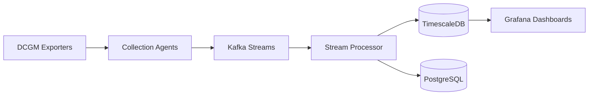
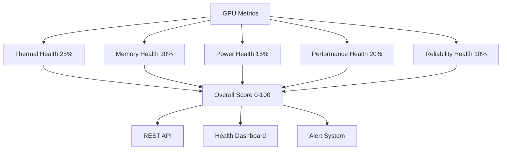
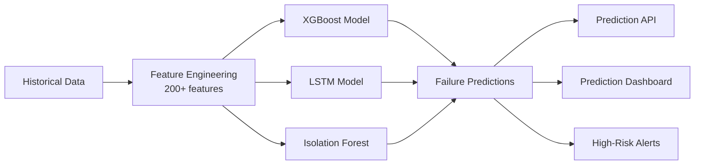
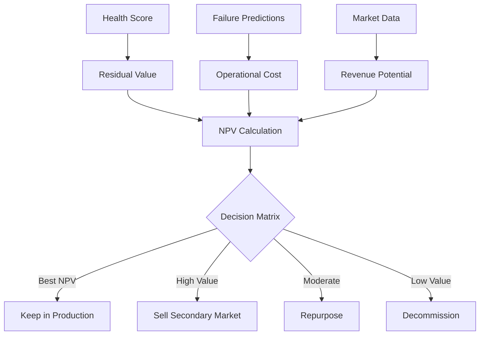
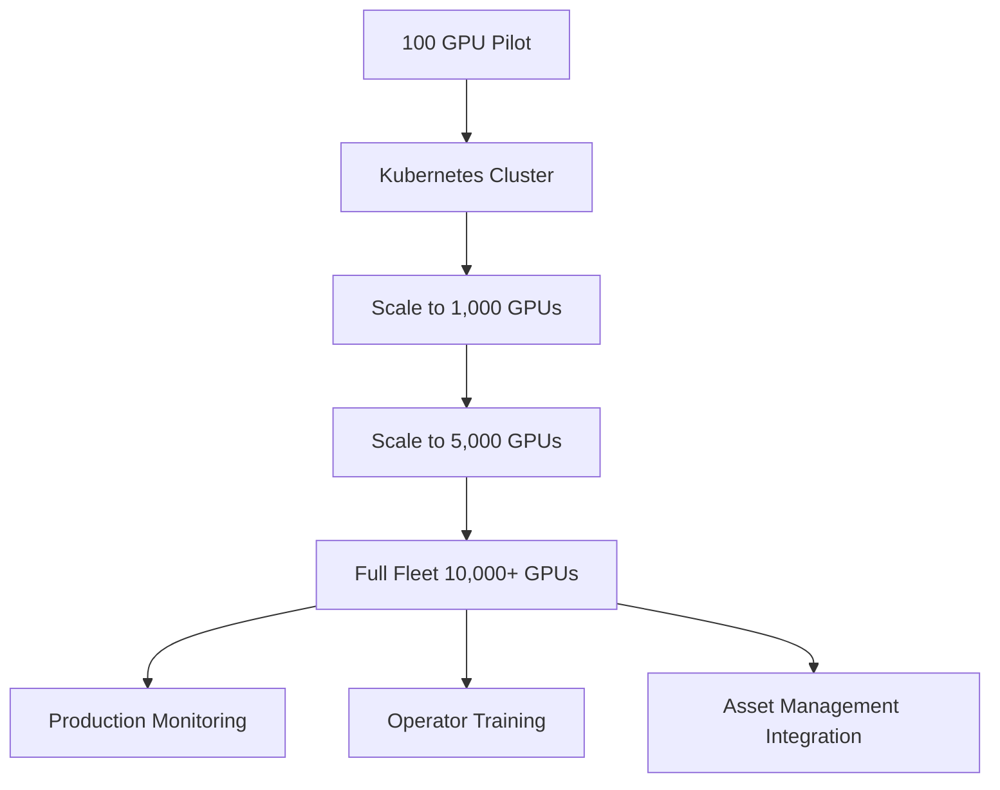
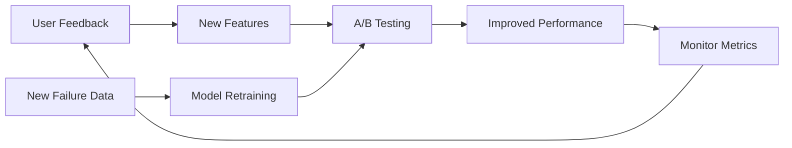

# GPU Health Monitor - Agile Project Summary

## 📊 Project Statistics

- **Total Issues**: 62
- **Total Story Points**: ~600
- **Duration**: 24 weeks (6 months)
- **Milestones**: 6 phases
- **Labels**: 16 categories
- **Team Size**: 8-10 engineers (full rollout)

## 🎯 Phase Overview

```
Phase 1: Foundation [Weeks 1-4] ━━━━━━━━━━━━━━━━━━━━━━━━━━━━━━━━ 9 issues (70 pts)
Phase 2: Health Scoring [Weeks 5-8] ━━━━━━━━━━━━━━━━━━━━━━━━━ 10 issues (70 pts)
Phase 3: Predictive Analytics [Weeks 9-14] ━━━━━━━━━━━━━━━━━ 11 issues (125 pts)
Phase 4: Economic Engine [Weeks 15-18] ━━━━━━━━━━━━━━━━━━━━━ 10 issues (70 pts)
Phase 5: Full Fleet Rollout [Weeks 19-24] ━━━━━━━━━━━━━━━━ 13 issues (145 pts)
Phase 6: Continuous Improvement [Ongoing] ━━━━━━━━━━━━━━━━━ 9 issues (120 pts)
```

## 📈 Roadmap Timeline

```
Month 1          Month 2          Month 3          Month 4          Month 5          Month 6
|━━━━━━━━━━━━━━━|━━━━━━━━━━━━━━━|━━━━━━━━━━━━━━━|━━━━━━━━━━━━━━━|━━━━━━━━━━━━━━━|━━━━━━━━━━━━━━━|
|                                |                                |                                |
|← Phase 1: Foundation →         |← Phase 3: ML Models →          |← Phase 5: Production →        |
                |← Phase 2: Health →|            |← Phase 4: Economics →|                ↓
                                                                                    Ongoing Improvement
```

## 🏗️ Architecture Components (by Phase)

### Phase 1: Foundation


**Key Deliverables:**
- ✅ DCGM exporters on 100 pilot GPUs
- ✅ Kafka cluster with 3 brokers
- ✅ TimescaleDB for metrics storage
- ✅ Basic Grafana dashboards

### Phase 2: Health Scoring


**Key Deliverables:**
- ✅ Multi-dimensional health scoring (5 dimensions)
- ✅ Health scores updated every 15 minutes
- ✅ REST API for health queries
- ✅ Health dashboard with drill-down

### Phase 3: Predictive Analytics


**Key Deliverables:**
- ✅ ML models trained (XGBoost, LSTM, Isolation Forest)
- ✅ Predictions generated daily
- ✅ >85% accuracy on 30-day predictions
- ✅ Prediction dashboard showing risk levels

### Phase 4: Economic Engine


**Key Deliverables:**
- ✅ Residual value calculator
- ✅ Operational cost projections
- ✅ Revenue estimator
- ✅ Economic decision recommendations
- ✅ Secondary market pricing

### Phase 5: Full Fleet Rollout


**Key Deliverables:**
- ✅ All 10,000+ GPUs instrumented
- ✅ Kubernetes auto-scaling
- ✅ Multi-region deployment
- ✅ 99.95% fleet reporting
- ✅ Operators trained

### Phase 6: Continuous Improvement


**Key Deliverables:**
- ✅ A/B testing framework
- ✅ Weekly model retraining
- ✅ Advanced features (NVLink, RCA)
- ✅ Secondary market integration
- ✅ Mobile app (future)

## 📋 Issue Distribution by Type

| Type | Count | Percentage |
|------|-------|------------|
| **Epic** | 6 | 10% |
| **Feature** | 50 | 81% |
| **Enhancement** | 2 | 3% |
| **Documentation** | 4 | 6% |

## 🎨 Issue Distribution by Area

| Area | Count | Notes |
|------|-------|-------|
| **Backend** | 25 | Python, Go services |
| **Infrastructure** | 15 | Kubernetes, Kafka, databases |
| **ML** | 11 | Model training, feature engineering |
| **Frontend** | 5 | Grafana dashboards, mobile app |
| **Data Pipeline** | 4 | Stream processing, ETL |
| **Database** | 3 | Schema, optimization |
| **Monitoring** | 3 | Observability, alerting |
| **Documentation** | 4 | Guides, training materials |

## 🔥 Priority Distribution

| Priority | Count | Focus |
|----------|-------|-------|
| **P0-Critical** | 18 | Core functionality, blocking work |
| **P1-High** | 28 | Important features |
| **P2-Medium** | 10 | Standard priority |
| **P3-Low** | 6 | Future enhancements |

## 👥 Recommended Team Structure

### Phase 1-2 (Weeks 1-8)
- 1 DevOps Engineer (infrastructure)
- 2 Backend Engineers (data pipeline, health scoring)
- 1 Data Engineer (databases)
- 1 Frontend Engineer (dashboards)

**Team Size: 5 engineers**

### Phase 3-4 (Weeks 9-18)
- 2 ML Engineers (models, feature engineering)
- 2 Backend Engineers (APIs, economic engine)
- 1 Data Engineer (feature store)
- 1 Frontend Engineer (dashboards)
- 1 Data Analyst (economic validation)

**Team Size: 7 engineers**

### Phase 5 (Weeks 19-24)
- 2 DevOps/SRE (Kubernetes, production)
- 3 Backend Engineers (scaling, integrations)
- 2 ML Engineers (model refinement)
- 1 Frontend Engineer (final dashboards)
- 1 Training Specialist (operator training)

**Team Size: 9 engineers**

### Phase 6 (Ongoing)
- Full team for continuous improvement

## 📊 Sprint Planning Guide

### 2-Week Sprint Capacity

**Assumptions:**
- Team of 7 engineers
- Average velocity: 40-60 story points per sprint
- 10 sprints for Phases 1-5 (20 weeks)
- 2 weeks buffer for testing/hardening

### Sample Sprint Breakdown

**Sprint 1-2 (Phase 1):**
- Issues #1-9 (Foundation)
- Focus: Get data flowing end-to-end

**Sprint 3-4 (Phase 2):**
- Issues #10-20 (Health Scoring)
- Focus: Calculate and visualize health scores

**Sprint 5-7 (Phase 3):**
- Issues #21-31 (Predictive Analytics)
- Focus: Train and deploy ML models

**Sprint 8-9 (Phase 4):**
- Issues #32-42 (Economic Engine)
- Focus: Economic decision framework

**Sprint 10-12 (Phase 5):**
- Issues #43-55 (Full Fleet Rollout)
- Focus: Production deployment

## 🎯 Success Metrics

### Technical KPIs
- [ ] 99.95% of fleet reporting metrics
- [ ] <30s end-to-end latency (GPU → dashboard)
- [ ] >85% prediction accuracy (30-day window)
- [ ] <5% false positive rate on alerts
- [ ] 99.99% system uptime

### Business KPIs
- [ ] >80% of failures predicted 7+ days early
- [ ] $3-5M annual cost savings
- [ ] 6-10x ROI
- [ ] >90% operator satisfaction
- [ ] 15% improvement in secondary market pricing

## 📚 Documentation Hierarchy

```
gpu-health-monitor/
├── README.md                              # Overview and quick start
├── gpu-health-system-architecture.md      # Complete technical architecture
├── gpu-health-poc-implementation.md       # POC deployment guide
├── AGILE_PROJECT_SETUP.md                 # This file - project setup guide
├── PROJECT_SUMMARY.md                     # Visual project overview
├── create_issues.py                       # Automated issue creation script
├── docs/
│   ├── deployment/                        # Deployment procedures
│   ├── operations/                        # Operations manuals
│   ├── development/                       # Development guides
│   └── api/                              # API documentation
└── examples/
    ├── dashboards/                        # Sample Grafana dashboards
    ├── configs/                           # Configuration examples
    └── queries/                           # Sample SQL queries
```

## 🚀 Getting Started

1. **Run the setup script**:
   ```bash
   export GITHUB_TOKEN="your_token"
   python3 create_issues.py
   ```

2. **Create GitHub Project board**:
   - Settings → Projects → New Project → Board
   - Columns: Backlog, To Do, In Progress, Review, Done

3. **Add issues to project**:
   - Bulk add all issues to Backlog

4. **Start with Phase 1**:
   - Move Phase 1 issues to "To Do"
   - Assign to team members
   - Begin development!

## 📞 Support

- **Repository**: https://github.com/SolidRegardless/gpu-health-monitor
- **Email**: stuarthart@msn.com
- **Issues**: Open a GitHub issue for questions

---

**Ready to build?** Let's monitor some GPUs! 🎮📊
