# Architecture Comparison: Kafka vs Prometheus for GPU Health Monitoring

## Executive Summary

**TL;DR:** For a GPU health monitoring system, **Prometheus is the better starting choice** for most deployments. Kafka adds significant complexity that's only justified at massive scale (10,000+ GPUs) or with complex event processing requirements.

---

## The Two Approaches

### Approach 1: Prometheus-Native (Industry Standard)


**Components:**
- DCGM Exporter (NVIDIA official)
- Prometheus (metrics storage + scraping)
- Grafana (visualization)
- Python + Prometheus API (ML pipeline)

---

### Approach 2: Kafka-First (Event Streaming)


**Components:**
- DCGM Exporter (format only)
- Custom collector (scrape & push)
- Kafka cluster (3+ brokers)
- Zookeeper (3+ nodes)
- Stream processors (Kafka Streams/Flink)
- TimescaleDB + PostgreSQL
- ML pipeline

---

## Detailed Comparison

### Operational Complexity

| Aspect | Prometheus | Kafka |
|--------|-----------|-------|
| **Components to run** | 2-3 (Prom, Grafana, optional AM) | 7+ (Kafka, ZK, collectors, processors, DBs) |
| **Deployment time** | 1-2 hours | 3-5 days |
| **Team expertise needed** | Prometheus/PromQL | Kafka, stream processing, multiple DBs |
| **Failure modes** | Prometheus down = no scraping | Kafka down, ZK split-brain, collector failures |
| **Debugging difficulty** | Simple (check targets, metrics) | Complex (pipeline stages, offset lag) |
| **Upgrade complexity** | Low (single service) | High (coordinated cluster upgrades) |

**Winner: Prometheus** (10x simpler operationally)

---

### Performance & Scale

| Metric | Prometheus | Kafka | Notes |
|--------|-----------|-------|-------|
| **GPU capacity** | 1,000-5,000 per instance | 10,000+ (distributed) | Prom vertical scale limit |
| **Metric cardinality** | 10M series (with tuning) | Unlimited (horizontal) | Kafka distributes load |
| **Query latency** | 100-500ms (local TSDB) | 200-2000ms (depends on pipeline) | Prom is faster for simple queries |
| **Ingestion rate** | 1M samples/sec | 10M+ events/sec | Kafka higher throughput |
| **Storage efficiency** | Excellent (compressed TSDB) | Good (depends on sink) | Prom TSDB very efficient |
| **Backfill capability** | Limited (complex) | Excellent (replay topics) | Kafka keeps event log |

**Winner: Depends on scale**
- < 5,000 GPUs: **Prometheus** (simpler, adequate)
- > 5,000 GPUs: **Kafka** (better horizontal scaling)

---

### Feature Comparison

#### Querying & Analysis

| Feature | Prometheus | Kafka |
|---------|-----------|-------|
| **Query language** | PromQL (purpose-built) | SQL on TimescaleDB | Both good, PromQL more metrics-focused |
| **Ad-hoc queries** | Excellent (Grafana Explore) | Good (Grafana + SQL) | Prom faster for exploration |
| **Aggregations** | Real-time (on query) | Pre-computed (streams) | Kafka faster for complex aggs |
| **Time-series functions** | Rich (rate, deriv, predict_linear) | Basic (SQL window fns) | Prom more time-series native |
| **ML integration** | Remote Read API | Direct DB access | Both work, Kafka more flexible |

**Winner: Prometheus** (better for metrics-specific queries)

---

#### Real-Time Processing

| Feature | Prometheus | Kafka |
|---------|-----------|-------|
| **Stream processing** | None (pull-based) | Native (Kafka Streams) | Kafka purpose-built for this |
| **Event correlation** | Complex (PromQL joins) | Natural (stream joins) | Kafka better for complex event processing |
| **Stateful processing** | Limited (recording rules) | Rich (state stores) | Kafka more powerful |
| **Exactly-once semantics** | N/A | Yes (Kafka transactions) | Kafka guarantees stronger |
| **Complex transformations** | Hard (PromQL limits) | Easy (arbitrary code) | Kafka very flexible |

**Winner: Kafka** (if you need stream processing)

---

#### Alerting

| Feature | Prometheus | Kafka |
|---------|-----------|-------|
| **Built-in alerting** | Yes (Alertmanager) | No (build custom) | Prom battle-tested |
| **Alert deduplication** | Native | Custom implementation | Prom mature |
| **Routing complexity** | Good (label-based) | Flexible (any logic) | Kafka more programmable |
| **SLA tracking** | Recording rules | Stream processors | Both work |

**Winner: Prometheus** (mature alerting ecosystem)

---

### Data Retention & Cost

| Aspect | Prometheus | Kafka | Notes |
|--------|-----------|-------|-------|
| **Short-term storage** | Excellent (local SSD) | Good (broker disks) | Prom very efficient |
| **Long-term storage** | Remote write to object store | Tiered storage (S3) | Both support cheap long-term |
| **Compression** | ~1.3 bytes/sample | Varies (depends on format) | Prom TSDB highly optimized |
| **Query on cold data** | Slow (Thanos/Cortex) | Fast (if in TimescaleDB) | Architecture dependent |
| **Storage cost (1 year, 1000 GPUs)** | ~500 GB (Prom) + S3 | ~1-2 TB (TSDB) + Kafka | Prom more efficient |

**Winner: Prometheus** (better compression, lower cost)

---

## When to Choose Each

### Choose **Prometheus** if:

✅ **Fleet size < 5,000 GPUs**  
✅ **Simple to moderate complexity** (health scoring, basic predictions)  
✅ **Small team** (1-2 engineers for monitoring)  
✅ **Fast time-to-value** (need results in weeks, not months)  
✅ **Standard monitoring workflows** (dashboards, alerts, on-call)  
✅ **Limited budget** (fewer servers, simpler ops)  
✅ **Kubernetes environment** (Prom native integration)

**Use case:** Most production GPU monitoring deployments

---

### Choose **Kafka** if:

✅ **Fleet size > 10,000 GPUs**  
✅ **Complex event processing** (multi-stream joins, stateful transformations)  
✅ **Multiple consumers** (ML pipeline, billing, compliance, etc. all reading same data)  
✅ **Event sourcing requirements** (need to replay/reprocess historical data)  
✅ **Real-time decisioning** (automated remediation, workload scheduling)  
✅ **Dedicated platform team** (3+ engineers managing data infrastructure)  
✅ **Existing Kafka infrastructure** (already running Kafka for other systems)

**Use case:** Hyperscale data centers, multi-tenant GPU clouds

---

## Hybrid Approach (Recommended for Growth)

Start with Prometheus, add Kafka later if needed:


**Migration path:**
1. **Start:** Prometheus + Grafana (POC, 50 GPUs)
2. **Grow:** Add remote write, ML pipeline (1,000 GPUs)
3. **Scale:** Federation or Prometheus → Kafka bridge (5,000+ GPUs)

---

## Industry Practice: What Do Others Use?

### NVIDIA's Recommendations

- **Official:** DCGM Exporter → Prometheus (documented approach)
- **DGX Cloud:** Prometheus-based monitoring
- **Base Command:** Prometheus + Grafana stack

### Cloud Providers

- **AWS (EC2 P4/P5 instances):** CloudWatch (pull-based, similar to Prometheus)
- **Azure (NC/ND series):** Azure Monitor (metrics-based)
- **GCP (A2/A3 instances):** Cloud Monitoring (Prometheus-compatible)

### Major ML Platforms

- **Kubernetes (Kubeflow, etc.):** Prometheus native
- **SLURM clusters:** Often Prometheus + Node Exporter
- **Ray clusters:** Prometheus metrics

**Consensus:** Prometheus is the industry standard for GPU monitoring.

---

## Recommendation for Your Architecture

### Current Architecture Issues

Your architecture uses Kafka but:

❌ **Over-engineered for 50-1,000 GPU POC**  
❌ **6+ additional components to maintain** (Kafka, ZK, collectors, processors)  
❌ **Longer implementation time** (3-5 days infrastructure vs. 1 day Prom)  
❌ **Doesn't leverage NVIDIA's official tooling** (DCGM Exporter designed for Prom)  
❌ **Higher operational risk** (more failure modes)  
❌ **Steeper learning curve** for team

### Suggested Revision

**For POC & Initial Deployment (0-1,000 GPUs):**

```
DCGM Exporter → Prometheus → Grafana
                    ↓
              Python ML Pipeline
              (Prom Remote Read API)
```

**Benefits:**
- ✅ 80% faster to deploy
- ✅ 1/3 the operational complexity
- ✅ Industry-standard tooling
- ✅ Easier to hire for (Prometheus skills > Kafka skills)
- ✅ Lower cloud costs (~40% savings)

**For Scale-out (5,000+ GPUs):**

Add Kafka **selectively**:
- Keep Prometheus for metrics collection
- Add Kafka only for:
  - Complex event processing (failure correlation)
  - Multi-consumer scenarios (billing + monitoring + ML)
  - Event replay requirements

---

## Prometheus-Native Architecture (Recommended)

```mermaid
graph TB
    subgraph "GPU Fleet (50-5000 GPUs)"
        G1[DCGM Exporter<br/>Node 1<br/>:9400]
        G2[DCGM Exporter<br/>Node 2<br/>:9400]
        G3[DCGM Exporter<br/>Node N<br/>:9400]
    end
    
    subgraph "Monitoring Layer"
        Prom[Prometheus<br/>━━━━━━━━━━<br/>• Scrape every 15s<br/>• Local TSDB<br/>• 15 day retention]
        
        AM[Alertmanager<br/>━━━━━━━━━━<br/>• Alert routing<br/>• Deduplication]
        
        RW[Remote Write<br/>━━━━━━━━━━<br/>Thanos/Mimir/VictoriaMetrics]
    end
    
    subgraph "Visualization"
        Grafana[Grafana<br/>━━━━━━━━━━<br/>• Health dashboards<br/>• Exploration<br/>• Annotations]
    end
    
    subgraph "Analytics Pipeline"
        Extract[Feature Extractor<br/>Python + PromQL]
        
        Health[Health Scorer<br/>Batch Job<br/>every 15min]
        
        Predict[Failure Predictor<br/>XGBoost/LSTM<br/>Daily training]
        
        Economic[Economic Model<br/>Weekly analysis]
    end
    
    subgraph "Storage"
        PG[(PostgreSQL<br/>━━━━━━━━━━<br/>• Health scores<br/>• Predictions<br/>• GPU assets)]
        
        S3[(Object Storage<br/>━━━━━━━━━━<br/>• Long-term metrics<br/>• Model artifacts)]
    end
    
    G1 -->|HTTP GET<br/>/metrics| Prom
    G2 -->|HTTP GET<br/>/metrics| Prom
    G3 -->|HTTP GET<br/>/metrics| Prom
    
    Prom --> AM
    Prom --> Grafana
    Prom -->|Remote Write| RW
    RW --> S3
    
    Prom -->|Query API| Extract
    Extract --> Health
    Extract --> Predict
    
    Health --> PG
    Predict --> PG
    Predict --> Economic
    Economic --> PG
    
    PG --> Grafana
    
    style Prom fill:#c8e6c9
    style Grafana fill:#bbdefb
    style Health fill:#fff9c4
    style Predict fill:#ffccbc
    style PG fill:#f3e5f5
```



**Simplified to 5 core components:**
1. DCGM Exporter (NVIDIA official)
2. Prometheus (monitoring + TSDB)
3. Grafana (dashboards)
4. PostgreSQL (structured data)
5. Python ML pipeline (analytics)

---

## Decision Matrix

| Requirement | Prometheus Score | Kafka Score | Weight |
|-------------|-----------------|-------------|--------|
| Fast deployment | 10 | 3 | 20% |
| Operational simplicity | 10 | 3 | 20% |
| Cost efficiency | 9 | 5 | 15% |
| ML integration | 7 | 8 | 15% |
| Scalability (0-5k GPUs) | 9 | 10 | 10% |
| Alerting maturity | 10 | 5 | 10% |
| Team skills availability | 9 | 6 | 10% |
| **Weighted Total** | **8.95** | **5.35** | **100%** |

**Winner: Prometheus** (67% higher score)

---

## Conclusion

**For a GPU health monitoring system:**

1. **Start with Prometheus** - Industry standard, simpler, faster to value
2. **Prove the concept** - Get health scoring and predictions working
3. **Scale vertically first** - Prometheus can handle 1,000-5,000 GPUs
4. **Add Kafka only if needed** - When you hit scale/complexity limits

**The current Kafka-first architecture is over-engineered for the stated requirements.** Save the complexity for when you actually need it.

---

## Next Steps

If you want to revise the architecture:

1. I can update `gpu-health-system-architecture.md` to use Prometheus
2. Simplify the POC implementation guide
3. Update the DCGM integration doc to emphasize Prometheus pattern
4. Create a "Kafka migration guide" for future scale-out

Let me know if you want me to proceed with the revision! 🐾
