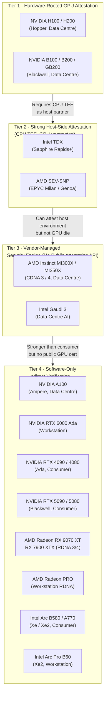
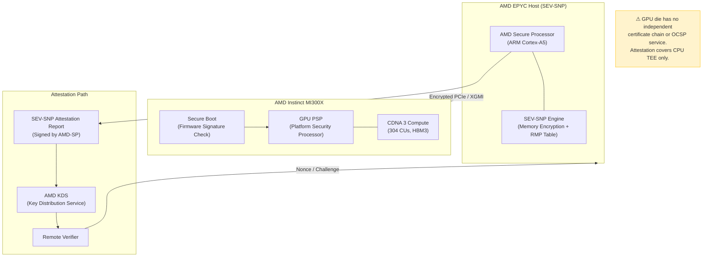
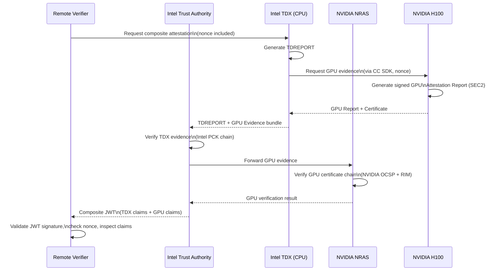
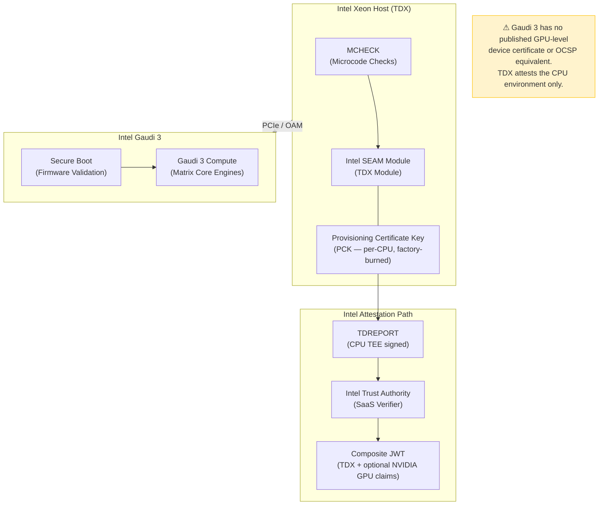
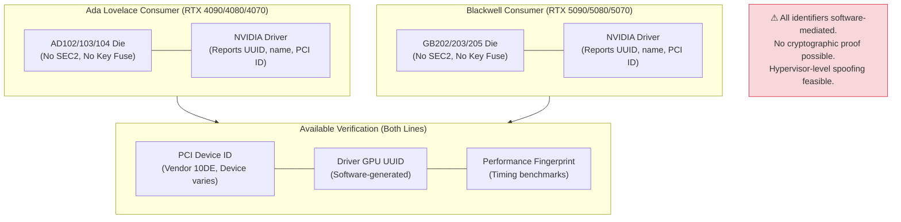
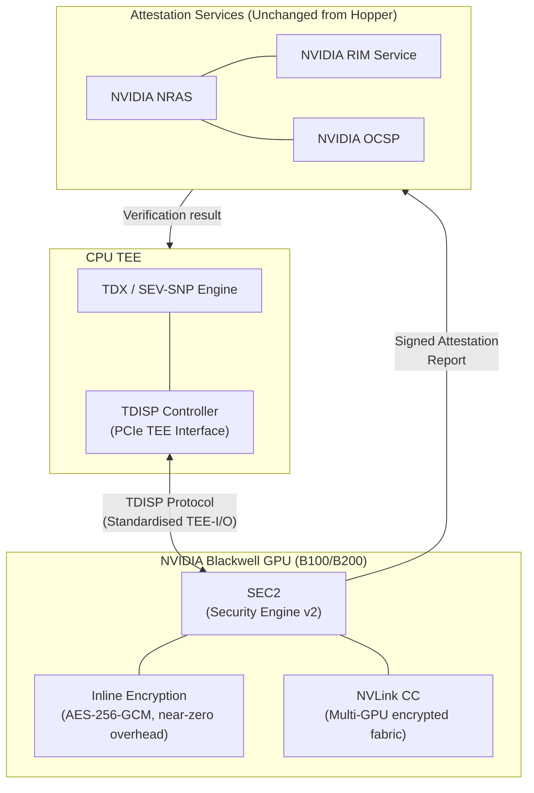
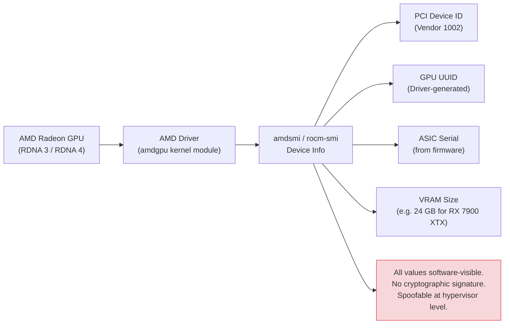
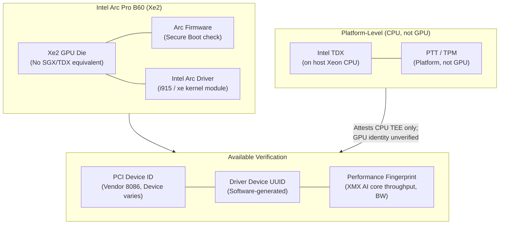
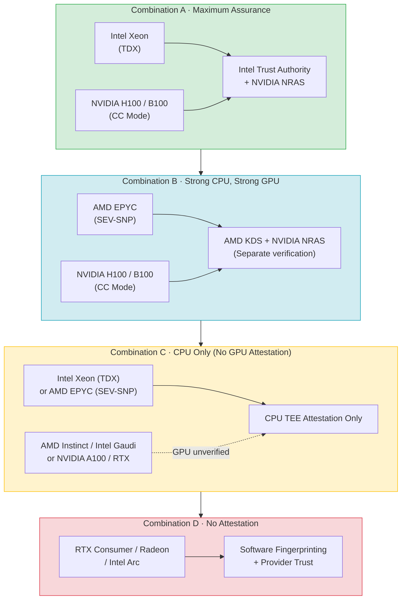
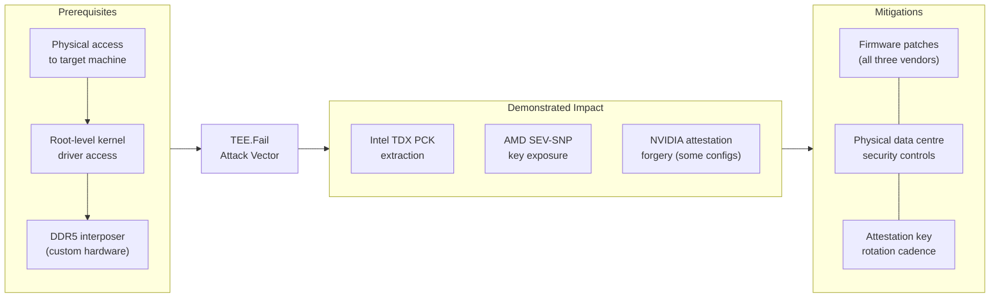

# Formal Technical Analysis: GPU Identity Attestation and Cryptographic Verification
## AMD, Intel, and Consumer-Grade GPU Architectures

**Document Classification:** Technical Reference  
**Version:** 1.0  
**Date:** February 2026  
**Subject:** Hardware-Rooted Attestation Capabilities Across AMD Instinct, Intel Gaudi/Arc, NVIDIA RTX Consumer/Workstation, AMD Radeon, and Intel Arc GPU Lines  
**Companion Document:** *GPU Identity Attestation — A100 and H100 Architectures* (v1.0)

---

## Table of Contents

1. [Executive Summary](#1-executive-summary)
2. [Landscape Overview](#2-landscape-overview)
3. [AMD Instinct Data Centre GPUs](#3-amd-instinct-data-centre-gpus)
4. [Intel Data Centre GPUs: Gaudi and Ponte Vecchio](#4-intel-data-centre-gpus-gaudi-and-ponte-vecchio)
5. [NVIDIA RTX Consumer and Workstation GPUs](#5-nvidia-rtx-consumer-and-workstation-gpus)
6. [NVIDIA Blackwell Architecture Update](#6-nvidia-blackwell-architecture-update)
7. [AMD Radeon Consumer and Workstation GPUs](#7-amd-radeon-consumer-and-workstation-gpus)
8. [Intel Arc Consumer and Workstation GPUs](#8-intel-arc-consumer-and-workstation-gpus)
9. [Cross-Vendor Attestation Ecosystem](#9-cross-vendor-attestation-ecosystem)
10. [TEE.Fail and Physical Attack Research](#10-teefail-and-physical-attack-research)
11. [Full Vendor Comparison Matrix](#11-full-vendor-comparison-matrix)
12. [Recommendations by Use Case](#12-recommendations-by-use-case)
13. [References and Further Reading](#13-references-and-further-reading)

---

## 1. Executive Summary

This document extends the companion analysis of NVIDIA A100/H100 attestation to cover the broader GPU ecosystem. The principal findings are:

**AMD** has meaningful confidential computing capabilities at the *CPU level* (SEV-SNP on EPYC processors) but its Instinct GPU line (MI300X, MI350X) currently lacks an equivalent to NVIDIA's hardware-rooted GPU-specific attestation. AMD GPU CC is an active area of development, with AMD publicly stating that Instinct accelerators are advancing GPU confidential computing capabilities, but no independently verifiable, hardware-provisioned GPU device certificate scheme comparable to NVIDIA's NRAS/OCSP stack is publicly available as of February 2026.

**Intel** occupies an interesting position: its CPU-side attestation (SGX, TDX) is the most mature in the industry and is actively used as the *host TEE* in composite attestation workflows with NVIDIA H100s. Intel's Gaudi 3 data centre AI accelerator does not expose a GPU-level hardware attestation API comparable to NVIDIA's. Intel Arc consumer and workstation GPUs have no hardware attestation capability.

**NVIDIA RTX consumer and workstation GPUs** (Ada Lovelace/RTX 4000 series, Blackwell/RTX 5000 series, and RTX 6000 workstation cards) do *not* support Confidential Computing or hardware attestation. This is an explicit design decision: CC features are restricted to the Hopper and Blackwell *data centre* GPU lines (H100, H200, B100, B200, GB200). Consumer RTX cards, including the RTX 6000 Ada professional workstation card, lack the Security Engine hardware required.

**The net result** is that hardware-rooted GPU identity attestation — as of February 2026 — is effectively exclusive to the NVIDIA Hopper and Blackwell data centre lines, with Intel providing the strongest *host-side* attestation as the CPU TEE partner. All other GPU categories must rely on the indirect, software-mediated verification strategies discussed in the companion document.

---

## 2. Landscape Overview

The following diagram places all GPU families on a single attestation capability axis, from the strongest hardware-rooted cryptographic guarantee to no native capability at all.

---

## 3. AMD Instinct Data Centre GPUs

### 3.1 Architecture Context

AMD's data centre GPU line, the Instinct MI-series, is built on the CDNA (Compute DNA) architecture — a separate lineage from the RDNA consumer/workstation GPUs. Current flagship products are the MI300X and MI325X (CDNA 3), with the MI350X and MI355X (CDNA 4) launched in mid-2025.

AMD's security strategy for the data centre is built around the EPYC CPU's **Secure Processor** (AMD-SP), which underpins SEV, SEV-ES, and SEV-SNP. This provides extremely strong CPU-level attestation. The MI-series GPU, however, does not expose an equivalent dedicated security subsystem with a hardware-provisioned device certificate.

### 3.2 What AMD Does Provide

AMD publicly states that Instinct accelerators are advancing GPU confidential computing capabilities, building on AMD's expertise in virtualisation. Key available features include:

- **Silicon Root of Trust** on the GPU: The MI300X includes a secure boot flow that validates firmware signatures before the GPU becomes operational. This prevents unsigned firmware from running but does not provide a remote attestation report.
- **Secure Development Lifecycle (SDL)**: AMD validates GPU hardware and firmware through the Open Compute Project (OCP) S.A.F.E. framework for third-party security review.
- **Integration with AMD SEV-SNP**: When a GPU workload runs inside a Confidential VM backed by AMD SEV-SNP on an EPYC host, the *VM* can be attested end-to-end. The attestation proves the CPU TEE is genuine; the GPU's presence and type are visible to the driver but are not cryptographically included in the GPU-side attestation evidence with the same hardware-rooted chain as NVIDIA's NRAS.

### 3.3 Architecture Diagram

### 3.4 AMD vs. NVIDIA Attestation Gap

The critical difference between AMD Instinct and NVIDIA H100 attestation is the **absence of a GPU-side hardware identity certificate** on AMD hardware. A verifier using AMD SEV-SNP can confirm:
- The CPU TEE is a genuine AMD EPYC processor with unmodified SEV-SNP firmware.
- The Confidential VM is isolated from the hypervisor.

But the verifier **cannot** confirm from cryptographic evidence alone that:
- The GPU attached is a genuine MI300X rather than a lesser GPU.
- The GPU firmware has not been modified.
- The specific GPU die has the identity claimed by the driver.

This is a meaningful gap for decentralised compute markets and ZK proof generation use cases where GPU-type verification is commercially significant.

### 3.5 AMD MI300X — Available Verification Methods

In the absence of GPU-level hardware attestation, the same layered approach applicable to the A100 applies here:

| Method | Confidence | Spoofable by Hypervisor? |
|---|---|---|
| PCI Device ID (0x740C for MI300X) | Low | Yes |
| ROCm `rocm-smi` device UUID | Low | Yes |
| AMD GPU serial number (amdsmi) | Low | Yes |
| Performance fingerprint (GEMM, BW) | Medium | Difficult but possible |
| Cloud provider attestation | Medium | No (trust delegation) |
| SEV-SNP VM attestation (CPU only) | High (CPU) | No |

---

## 4. Intel Data Centre GPUs: Gaudi and Ponte Vecchio

### 4.1 Intel's Data Centre AI Strategy

Intel's data centre AI accelerator portfolio comprises:
- **Intel Gaudi 3** (successor to Gaudi 2): A purpose-built AI training and inference accelerator targeting competition with NVIDIA H100/H200. OCP-compatible, liquid-cooled.
- **Intel Ponte Vecchio / Data Centre GPU Max**: HPC-oriented, now largely superseded by Gaudi 3 in the AI market.

Intel's security story is dominated by its **CPU-side** technologies — SGX (Software Guard Extensions) and TDX (Trust Domain Extensions) — which are the most mature and widely deployed hardware attestation technologies in the industry.

### 4.2 Intel TDX: The Strongest CPU-Side Attestation

Intel TDX, available on 4th Gen Xeon Scalable (Sapphire Rapids) and later, provides:

- **TDREPORT**: A hardware-signed attestation report generated by the CPU's Trust Domain Extensions hardware.
- **Quote Generation**: A TDREPORT can be converted into a remotely verifiable *Quote* using the TDQE (Quote Generation Enclave), signed with a key traceable to Intel's Provisioning Certificate Key (PCK).
- **Intel Trust Authority (ITA)**: A SaaS attestation service that verifies TDX evidence. Crucially, ITA also integrates NVIDIA GPU attestation — meaning an ITA-based workflow can produce a *composite* JWT token containing both TDX CPU claims and NVIDIA H100 GPU claims.

### 4.3 Intel Gaudi 3 — Attestation Capabilities

Unlike the NVIDIA H100, **Intel Gaudi 3 does not have a publicly documented hardware GPU device attestation mechanism** comparable to NVIDIA's NRAS. Gaudi 3's security features focus on:

- **Secure Boot**: Firmware signature validation at power-on.
- **OCP S.A.F.E. Compliance**: Third-party hardware security audit under the Open Compute Project Security Appraisal Framework and Enablement programme.
- **Host-Side TDX**: Gaudi 3 deployments can benefit from Intel TDX on the host CPU, which attests the *environment* but not the Gaudi 3 die specifically.

Gaudi 3 does not appear to have a factory-provisioned device certificate, an OCSP service, or a reference integrity manifest service equivalent to NVIDIA's CC stack.

### 4.4 Intel GPU Architecture: Attestation Summary

### 4.5 The Intel+NVIDIA Composite Attestation Pattern

It is worth emphasising that Intel TDX is not a competitor to NVIDIA GPU attestation — they are *complementary*. The preferred production pattern for confidential AI workloads is:

> **Intel TDX (host CPU attestation) + NVIDIA H100 CC (GPU attestation) → Composite JWT via Intel Trust Authority**

This combination provides the most complete attestation coverage currently available commercially. The CPU TEE proves the host environment is genuine; the GPU attestation proves the accelerator is genuine. Neither alone is sufficient.

---

## 5. NVIDIA RTX Consumer and Workstation GPUs

### 5.1 The Consumer/Workstation Divide

NVIDIA makes an explicit architectural and licensing distinction between its data centre and consumer/workstation GPU lines:

| Product Line | Architecture | CC Support | Attestation |
|---|---|---|---|
| H100 / H200 | Hopper (GH100) | Yes | Yes |
| B100 / B200 / GB200 | Blackwell (GB100/102) | Yes | Yes |
| **RTX 6000 Ada** | Ada Lovelace (AD102) | **No** | **No** |
| **RTX 4090 / 4080 / 4070** | Ada Lovelace (AD102/103/104) | **No** | **No** |
| **RTX 5090 / 5080 / 5070** | Blackwell (GB202/203/205) | **No** | **No** |
| **RTX PRO 6000 Blackwell** | Blackwell (workstation) | **No** | **No** |

The Security Engine (SEC2) responsible for generating attestation reports and holding the device identity key is **not present in consumer or workstation Ada/Blackwell dies**. This is not a driver or firmware restriction — it is a hardware omission. Even with full access to the GPU die, the attestation infrastructure cannot be unlocked because the cryptographic key fuses and SEC2 subsystem are absent.

### 5.2 RTX 6000 Ada Generation

The RTX 6000 Ada is NVIDIA's highest-end workstation card, based on the AD102 die with 48 GB of GDDR6 memory. It is commonly used as an A100 substitute in workstation and small-cluster environments due to its large VRAM and competitive ML performance.

Despite its positioning, it inherits all the limitations of consumer Ada hardware:

- **No Security Engine / SEC2**
- **No hardware device certificate**
- **No NVIDIA OCSP service entry**
- **No CC mode support**
- **No encrypted PCIe capability**

From an attestation perspective, the RTX 6000 Ada is in the same category as a gaming RTX 4090. Any claims about its identity rely entirely on driver-reported values.

### 5.3 RTX 4000 and 5000 Series (Ada Lovelace / Blackwell Consumer)

### 5.4 Performance Fingerprinting for Consumer GPUs

While no hardware attestation is possible, the RTX 4090 and RTX 5090 have sufficiently distinct performance characteristics that a well-designed benchmark suite can provide moderate confidence:

| Test | RTX 4090 Signature | RTX 5090 Signature |
|---|---|---|
| FP32 TFLOPS (peak) | ~82.6 | ~209 |
| Memory bandwidth | ~1,008 GB/s | ~1,792 GB/s |
| Tensor Core throughput (FP16) | ~165 TFLOPS | ~838 TFLOPS |
| VRAM capacity | 24 GB GDDR6X | 32 GB GDDR7 |
| PCIe generation | Gen 4 x16 | Gen 5 x16 |
| Warp scheduler timing signature | Distinct | Distinct |

A test suite covering all dimensions simultaneously is increasingly difficult for a software adversary to fake precisely, but remains theoretically defeatable.

---

## 6. NVIDIA Blackwell Architecture Update

### 6.1 Blackwell CC Advances Over Hopper

While the companion document focused on H100 (Hopper), the **Blackwell architecture** (B100, B200, GB200, launched 2024–2025) brings meaningful improvements to the CC and attestation story:

- **First TEE-I/O capable GPU**: Blackwell implements the PCIe TEE Device Interface Security Protocol (TDISP), enabling a standardised hardware interface between the CPU TEE and GPU TEE. This supersedes Hopper's proprietary encrypted PCIe mechanism.
- **NVLink CC extension**: Blackwell extends confidential computing protection across NVLink to multi-GPU configurations, enabling rack-scale confidential compute (GB200 NVL72).
- **Near-unencrypted performance**: Blackwell's inline encryption engine achieves near-native throughput in CC mode, eliminating the ~5–10% performance penalty seen with Hopper.
- **Vera Rubin (2026+)**: NVIDIA's next architecture after Blackwell, announced as supporting rack-scale CC spanning CPU, GPU, and NVLink domains.

### 6.2 Blackwell CC Architecture

---

## 7. AMD Radeon Consumer and Workstation GPUs

### 7.1 RDNA Architecture Overview

AMD's consumer GPU line — Radeon RX 7000 (RDNA 3) and RX 9000 (RDNA 4) — and its workstation counterpart Radeon PRO are built on the RDNA architecture, distinct from the CDNA architecture used in Instinct accelerators.

Neither RDNA 3 nor RDNA 4 GPUs have any hardware attestation capability. The PSP (Platform Security Processor) present in AMD APUs and EPYC CPUs is not present as a standalone security subsystem within discrete Radeon GPU dies.

### 7.2 Available Identifiers (Software-Mediated Only)

### 7.3 Key AMD Radeon / Radeon PRO Products

| Product | Architecture | VRAM | PCI Device ID | Attestation |
|---|---|---|---|---|
| RX 9070 XT | RDNA 4 (Navi 48) | 16 GB GDDR6 | 0x7470 | None |
| RX 7900 XTX | RDNA 3 (Navi 31) | 24 GB GDDR6 | 0x744C | None |
| RX 7800 XT | RDNA 3 (Navi 32) | 16 GB GDDR6 | 0x747E | None |
| Radeon PRO W7900 | RDNA 3 (Navi 31) | 48 GB GDDR6 | 0x7448 | None |
| Radeon PRO W7800 | RDNA 3 (Navi 31) | 32 GB GDDR6 | 0x7449 | None |

### 7.4 The AMD Ecosystem: CPU + GPU Attestation Gap

It is important to note that AMD SEV-SNP provides strong CPU-level attestation, but this does not extend to the Radeon GPU. An AMD-based workstation running a Radeon Pro GPU cannot attest the GPU at all — and this gap is larger than the AMD Instinct gap, because even the Instinct's PSP-based secure boot is typically absent in Radeon Pro dies.

---

## 8. Intel Arc Consumer and Workstation GPUs

### 8.1 Intel Arc Architecture

Intel Arc GPUs (Alchemist/Xe-HPG, Battlemage/Xe2-HPG) are Intel's re-entry into the discrete GPU market. The consumer line (Arc A-series, Arc B-series) and workstation line (Arc Pro A-series, Arc Pro B-series) share the Xe/Xe2 GPU architecture.

Intel's GPU security features at the Arc level focus on:
- **Platform Trust Technology (PTT)**: A firmware-based TPM 2.0 equivalent, available on the *platform*, not the GPU die itself.
- **Secure Boot for firmware**: Arc Pro cards validate firmware signatures at boot.
- **Intel VT-d / IOMMU support**: Ensures GPU DMA is isolated from other system memory.

None of these provide remote attestation of the GPU identity.

### 8.2 Intel Arc Pro B-Series (Xe2 Workstation)

The Arc Pro B60 (launched 2025, ~350W, 24 GB GDDR6) is Intel's workstation counterpart to the RTX 6000 Ada and AMD Radeon PRO W7900. It offers competitive ray-tracing and AI throughput at a lower price point, and benefits from Intel's open driver ecosystem and OneAPI.

From an attestation perspective, it is identical to consumer Arc: no hardware device certificate, no remote attestation API, no Intel Trust Authority integration for GPU identity.

### 8.3 Arc Consumer Products Summary

| Product | Architecture | VRAM | Attestation |
|---|---|---|---|
| Arc B580 | Xe2-HPG (Battlemage) | 12 GB GDDR6 | None |
| Arc B570 | Xe2-HPG (Battlemage) | 10 GB GDDR6 | None |
| Arc A770 | Xe-HPG (Alchemist) | 16 GB GDDR6 | None |
| Arc Pro B60 | Xe2-HPG (Battlemage) | 24 GB GDDR6 | None |
| Arc Pro A60M | Xe-HPG (Alchemist, mobile) | 12 GB LPDDR5 | None |

---

## 9. Cross-Vendor Attestation Ecosystem

### 9.1 The Composite Attestation Stack

In practice, production confidential computing deployments combine CPU TEE attestation and GPU attestation. The current viable combinations are:

### 9.2 Attestation Service Comparison

| Attestation Service | Operator | Covers | Standards |
|---|---|---|---|
| NVIDIA NRAS | NVIDIA | H100, B100, B200 GPU | IETF RATS (draft) |
| NVIDIA OCSP | NVIDIA | GPU device certificates | RFC 6960 |
| Intel Trust Authority (ITA) | Intel | TDX CPU + NVIDIA GPU (composite) | IETF EAT / JWT |
| AMD KDS | AMD | EPYC SEV-SNP CPU | IETF RATS (draft) |
| Azure Attestation Service | Microsoft | TDX, SEV-SNP, H100 (cloud) | Proprietary + RATS |
| Google Cloud Attestation | Google | TDX, SEV-SNP, H100 (cloud) | Proprietary + RATS |
| Amber (open-source) | Intel + Community | TDX, SGX | IETF EAT |

---

## 10. TEE.Fail and Physical Attack Research

### 10.1 October 2025 Research Disclosure

In October 2025, researchers published "TEE.Fail" — a DDR5-based ciphertext side-channel attack that demonstrated, under laboratory conditions with physical access, the ability to extract cryptographic keys from Intel TDX and AMD SEV-SNP environments. The attack was also demonstrated against NVIDIA GPU attestation in certain configurations.

Key findings relevant to this analysis:

- The attack requires **physical access** to the target machine and root-level privileges for kernel driver modification. It is not a remotely exploitable vulnerability.
- Under the attack, researchers demonstrated the ability to obtain Intel's Provisioning Certificate Key (PCK) from a Xeon server — the key used for verifying CPU identity in TDX attestation.
- NVIDIA, Intel, and AMD were all notified prior to publication. Firmware patches were issued.
- In practice, this attack moves the threat boundary from software to physical access, which most data centre deployments protect against through physical security controls.

### 10.2 Implications for the Attestation Landscape

The TEE.Fail research underscores that hardware attestation, while powerful, does not eliminate all attack vectors. The trust root ultimately terminates in physical security of the hardware. This reinforces the recommendation that GPU attestation be viewed as one layer in a defence-in-depth strategy, not a complete security solution.

---

## 11. Full Vendor Comparison Matrix

| GPU | Vendor | Architecture | Market | HW Identity Cert | GPU TEE | Encrypted PCIe | CC Mode | Remote Attestation API | Resistance: T1 | Resistance: T2 | Resistance: T3 |
|---|---|---|---|---|---|---|---|---|---|---|---|
| H100 / H200 | NVIDIA | Hopper | DC | ✅ | ✅ | ✅ | ✅ | NRAS + OCSP | High | High | Medium |
| B100 / B200 | NVIDIA | Blackwell | DC | ✅ | ✅ | ✅ (TDISP) | ✅ | NRAS + OCSP | High | High | Medium |
| A100 | NVIDIA | Ampere | DC | ❌ | ❌ | ❌ | ❌ | None | Low | Very Low | Very Low |
| RTX 6000 Ada | NVIDIA | Ada (AD102) | WS | ❌ | ❌ | ❌ | ❌ | None | Low | Very Low | Very Low |
| RTX 4090/80/70 | NVIDIA | Ada Lovelace | Consumer | ❌ | ❌ | ❌ | ❌ | None | Low | Very Low | Very Low |
| RTX 5090/80/70 | NVIDIA | Blackwell (consumer) | Consumer | ❌ | ❌ | ❌ | ❌ | None | Low | Very Low | Very Low |
| MI300X / MI325X | AMD | CDNA 3 | DC | ❌ | ❌ (dev) | ❌ | ❌ (dev) | None (public) | Low | Very Low | Very Low |
| MI350X / MI355X | AMD | CDNA 4 | DC | ❌ | ❌ (dev) | ❌ | ❌ (dev) | None (public) | Low | Very Low | Very Low |
| RX 9070 XT | AMD | RDNA 4 | Consumer | ❌ | ❌ | ❌ | ❌ | None | Very Low | Very Low | Very Low |
| RX 7900 XTX | AMD | RDNA 3 | Consumer | ❌ | ❌ | ❌ | ❌ | None | Very Low | Very Low | Very Low |
| Radeon PRO W7900 | AMD | RDNA 3 | WS | ❌ | ❌ | ❌ | ❌ | None | Very Low | Very Low | Very Low |
| Gaudi 3 | Intel | Gaudi | DC | ❌ | ❌ | ❌ | ❌ | None (public) | Low | Very Low | Very Low |
| Arc Pro B60 | Intel | Xe2-HPG | WS | ❌ | ❌ | ❌ | ❌ | None | Very Low | Very Low | Very Low |
| Arc B580 | Intel | Xe2-HPG | Consumer | ❌ | ❌ | ❌ | ❌ | None | Very Low | Very Low | Very Low |
| Arc A770 | Intel | Xe-HPG | Consumer | ❌ | ❌ | ❌ | ❌ | None | Very Low | Very Low | Very Low |

*T1 = OS-level attacker; T2 = Hypervisor-level attacker; T3 = Physical attacker. DC = Data Centre, WS = Workstation. "Dev" = under development, not publicly deployed.*

---

## 12. Recommendations by Use Case

### 12.1 Decentralised GPU Compute Markets

For marketplaces requiring verifiable GPU type claims:

- **Tier 1 nodes (H100/B100):** Mandate CC mode attestation reports with nonce verification via NRAS. Accept only reports from firmware versions in the current RIM.
- **Tier 2 nodes (A100, MI300X, Gaudi 3, RTX 6000 Ada):** Apply four-layer indirect verification. Clearly label these nodes as *unattested* in the marketplace UI. Price accordingly (no cryptographic premium).
- **Consumer GPUs:** Do not accept as verified nodes for any workload requiring proof of hardware type. Use only for best-effort compute pools.

### 12.2 ZK Proof Generation

- Deploy ZK provers exclusively on H100 or B100 in CC mode with a CPU TEE (Intel TDX or AMD SEV-SNP) as the host.
- Include the ZK circuit binary hash in the attestation scope — either by hashing it into the TDREPORT or by having the operator sign it alongside the NRAS attestation.
- Implement on-chain or oracle-based verification of the composite attestation JWT before accepting proofs from untrusted provers.

### 12.3 Trusted AI Inference (Enterprise)

- For regulated workloads (financial services, healthcare), use H100/B100 + Intel TDX composite attestation via Intel Trust Authority.
- For lower-sensitivity workloads where GPU type verification is commercially but not cryptographically required, AMD SEV-SNP CPU attestation with MI300X or Gaudi 3 provides meaningful environment isolation even without GPU-level identity proof.

### 12.4 Workstation and Edge Deployments

- No hardware attestation is possible for RTX 6000 Ada, RTX 4000/5000 series, Radeon PRO, or Intel Arc Pro.
- For workloads requiring integrity, implement TPM 2.0 platform attestation on the host (covers the platform boot chain) combined with UEFI Secure Boot. This cannot attest the GPU but can detect tampering with the host OS and driver stack.
- Performance fingerprinting remains the best available GPU-level signal in these environments.

---

## 13. References and Further Reading

- NVIDIA Corporation. *NVIDIA Blackwell Architecture Technical Brief*. 2024.
- NVIDIA Corporation. *NVIDIA Secure AI with Blackwell and Hopper GPUs Whitepaper* (WP-12554-001, v1.3). August 2025.
- NVIDIA Corporation. *NVIDIA Attestation Suite Documentation*. docs.nvidia.com/attestation
- Intel Corporation. *GPU Remote Attestation with Intel Trust Authority*. docs.trustauthority.intel.com
- Intel Corporation. *Intel TDX Architecture Specification, Module 1.5*. 2024.
- AMD Corporation. *Helping Secure GPUs That Advance AI*. AMD Engineering Blog, April 2025.
- AMD Corporation. *AMD Secure Encrypted Virtualization (SEV-SNP)*. amd.com/en/developer/sev.html
- Borrello, P. et al. *TEE.Fail: Attacking Confidential Computing Across Intel, AMD, and NVIDIA*. October 2025.
- Scopelliti, A. et al. *Understanding Trust Relationships in Cloud-Based Confidential Computing*. EuroSPW 2024. DOI: 10.1109/EuroSPW61312.2024.00023
- Anonymous et al. *NVIDIA GPU Confidential Computing Demystified*. arXiv:2507.02770, July 2025.
- TCG (Trusted Computing Group). *TPM 2.0 Library Specification*. 2019.
- IETF RFC 9334. *Remote ATtestation procedureS (RATS) Architecture*. 2023.
- Open Compute Project. *Security Appraisal Framework and Enablement (S.A.F.E.) Specification*. 2023.

---

*End of Document*

---

> **Disclaimer:** This document reflects publicly available technical information as of February 2026. GPU security features, vendor attestation services, and associated SDKs are subject to change. Always verify current capabilities against official vendor documentation. AMD and Intel GPU confidential computing capabilities are areas of active development and may have advanced beyond what is documented here.
