# Formal Technical Analysis: GPU Identity Attestation and Cryptographic Verification for A100 and H100 Architectures

**Document Classification:** Technical Reference  
**Version:** 1.0  
**Date:** February 2026  
**Subject:** Hardware-Rooted Attestation of NVIDIA A100 and H100 GPUs with Application to Distributed Compute and Blockchain Workloads

---

## Table of Contents

1. [Executive Summary](#1-executive-summary)
2. [Problem Statement](#2-problem-statement)
3. [Architecture Overview](#3-architecture-overview)
4. [A100 Architecture and Attestation Limitations](#4-a100-architecture-and-attestation-limitations)
5. [H100 Confidential Computing Architecture](#5-h100-confidential-computing-architecture)
6. [Cryptographic Attestation Protocol](#6-cryptographic-attestation-protocol)
7. [Trust Hierarchy and Certificate Chain](#7-trust-hierarchy-and-certificate-chain)
8. [Threat Model and Attack Surface](#8-threat-model-and-attack-surface)
9. [Application to Blockchain and Ethereum Workloads](#9-application-to-blockchain-and-ethereum-workloads)
10. [Comparative Capability Matrix](#10-comparative-capability-matrix)
11. [Implementation Architecture](#11-implementation-architecture)
12. [Limitations and Open Problems](#12-limitations-and-open-problems)
13. [Conclusions and Recommendations](#13-conclusions-and-recommendations)
14. [References and Further Reading](#14-references-and-further-reading)

---

## 1. Executive Summary

This document provides a formal technical analysis of the mechanisms available to verify the identity and integrity of NVIDIA A100 and H100 GPUs, with particular focus on cryptographic attestation. The analysis is motivated by the growing use of high-performance GPUs in distributed computing markets, zero-knowledge proof generation, and blockchain-adjacent workloads, where participants require verifiable assurance that compute resources are genuine and unmodified.

The principal finding is that **the NVIDIA H100 (Hopper) architecture introduces hardware-rooted cryptographic attestation** via its Confidential Computing (CC) framework, enabling a verifier to receive a signed attestation report directly attributable to a specific, factory-provisioned GPU. The A100 architecture lacks this capability natively, requiring operators to rely on indirect, software-mediated verification techniques that are inherently more susceptible to spoofing.

This document details the cryptographic protocols, certificate hierarchies, threat models, and practical deployment considerations for both GPU generations.

---

## 2. Problem Statement

### 2.1 The Identity Gap in GPU Computing

Unlike a CPU with an integrated TPM (Trusted Platform Module), or a smart card with an embedded private key, commodity GPUs have historically been **stateless, passive compute accelerators**. They possess no cryptographic identity, no tamper-resistant key storage, and no mechanism to attest to their own configuration or genuineness.

This creates a fundamental verification problem:

> *Given a compute result claimed to have been produced by an NVIDIA H100 GPU, how can a remote verifier confirm that the result was actually produced by a genuine, unmodified H100, rather than by a different GPU, emulator, or software simulation?*

### 2.2 Motivation

The motivation for solving this problem is substantial and growing across several domains:

- **Decentralised GPU compute markets** (e.g., io.net, Akash Network, Render Network) rely on GPU type declarations for pricing and SLA enforcement.
- **Zero-knowledge proof generation**, particularly for ZK-Rollups and zkEVM implementations, requires trusted provers that cannot fabricate proof generation.
- **AI model inference verification** requires assurance that a specific model ran on specific hardware without tampering.
- **Regulatory and compliance** requirements increasingly mandate hardware provenance tracking.

### 2.3 Scope

This analysis is scoped to:
- NVIDIA A100 (Ampere architecture, SXM4/PCIe variants)
- NVIDIA H100 (Hopper architecture, SXM5/PCIe/NVL variants)
- Software environments: CUDA 12.x, NVIDIA Confidential Computing SDK
- Operating systems: Linux (Ubuntu 22.04+), with VFIO/KVM virtualisation where applicable

---

## 3. Architecture Overview

The following diagram illustrates the high-level landscape of GPU attestation, from hardware root of trust through to a remote verifier.

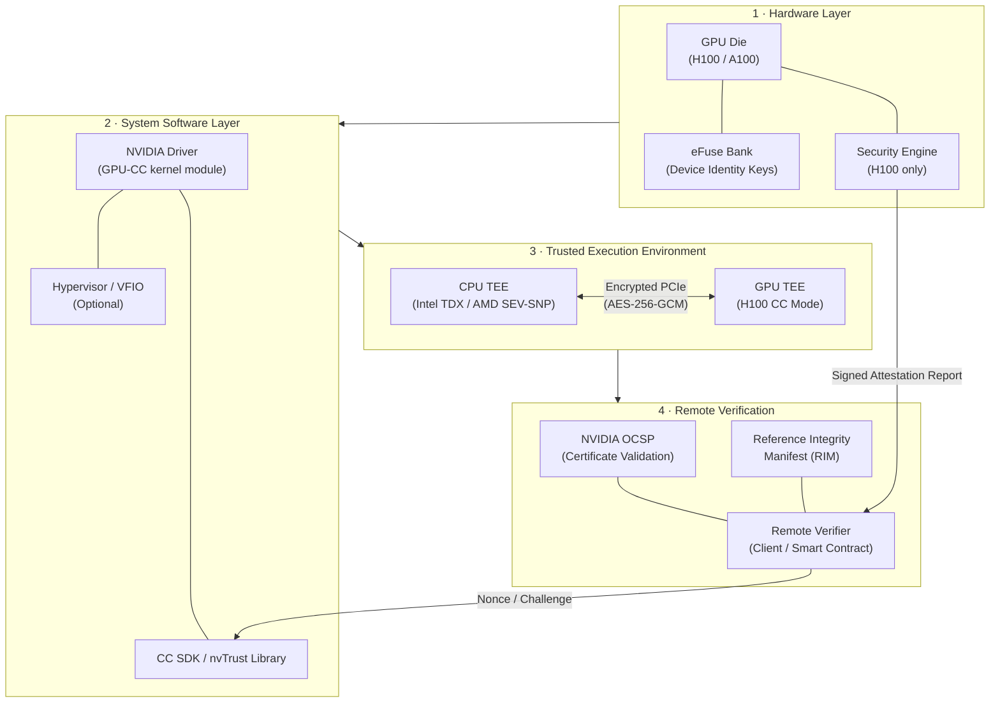

---

## 4. A100 Architecture and Attestation Limitations

### 4.1 Hardware Characteristics

The A100 (Ampere, GA100 die) was designed prior to the confidential computing era. Its security feature set is limited to:

| Feature | A100 Support |
|---|---|
| ECC Memory | Yes |
| Secure Boot (firmware) | Partial (driver-enforced) |
| Hardware identity key | No |
| TEE mode | No |
| Attestation report generation | No |
| Encrypted PCIe bus | No |

### 4.2 Available Verification Methods for A100

Despite lacking hardware attestation, several indirect techniques can be combined to increase confidence in A100 identity:

#### 4.2.1 Driver-Reported Identifiers

The NVIDIA driver exposes several identifiers via NVML (NVIDIA Management Library):

```
nvmlDeviceGetUUID()         → GPU UUID (e.g., GPU-a1b2c3d4-...)
nvmlDeviceGetSerial()       → Board serial number
nvmlDeviceGetPciInfo()      → PCI Bus ID, Vendor ID (10DE), Device ID (20B5 for A100 80GB)
nvmlDeviceGetName()         → "NVIDIA A100-SXM4-80GB"
```

**Limitation:** All of these values are read from firmware and driver tables. A malicious hypervisor with full control of the PCIe bus can intercept and alter MMIO reads, returning fabricated values. They are **not cryptographically signed**.

#### 4.2.2 Performance Fingerprinting

A100 execution timing profiles are highly characteristic. A suite of microbenchmarks can be run against declared hardware:

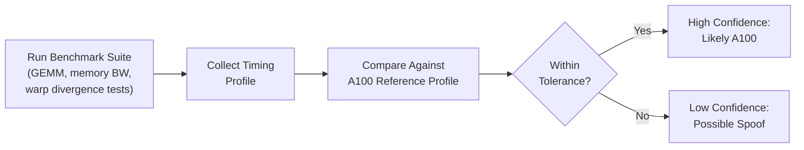

This approach is probabilistic, not deterministic. A sufficiently well-resourced adversary could calibrate a different GPU or emulator to match timing signatures.

#### 4.2.3 Trusted Data Centre Attestation (Delegation Model)

In cloud and co-location scenarios, the operator (AWS, Azure, GCP, CoreWeave) provides out-of-band attestation that specific VM instances are backed by specific GPU hardware. This delegates trust to the provider rather than establishing cryptographic proof.

### 4.3 A100 Spoofing Risk Assessment

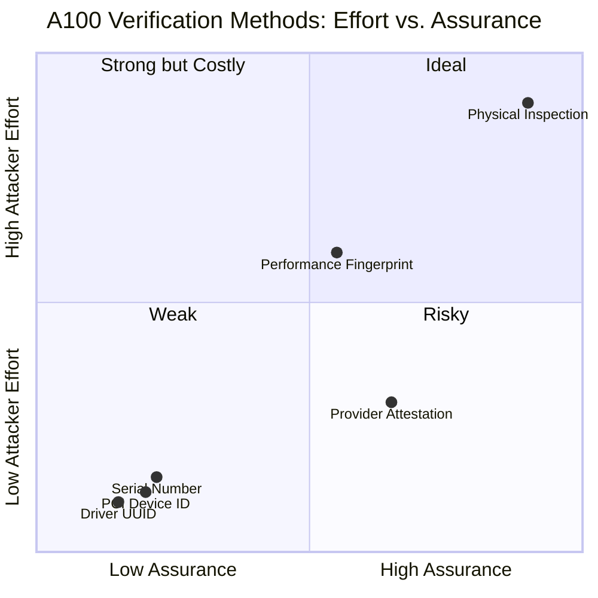

No software-only method for the A100 achieves cryptographic assurance. All are susceptible to a sufficiently privileged attacker controlling the host OS or hypervisor.

---

## 5. H100 Confidential Computing Architecture

### 5.1 The Hopper Security Architecture

The H100 introduces a dedicated **Security Engine** within the GPU die, alongside a hardware-provisioned asymmetric key pair that is generated and stored during manufacturing. This constitutes a genuine hardware root of trust.

Key hardware additions in H100 over A100:

| Component | Purpose |
|---|---|
| Security Engine (SE) | Cryptographic operations, key management, attestation report signing |
| eFuse-stored Device Key | Asymmetric key pair, private key never leaves the die |
| AES-GCM Engine | Encrypted PCIe bus traffic (GPU ↔ CPU) |
| CC Mode Firmware | Firmware image measured at boot, hash included in attestation |
| Secure Memory Encryption | All GPU VRAM encrypted at rest |

### 5.2 CC Mode Operation

When the H100 is placed in Confidential Computing mode (via driver configuration and system firmware), the following protections are activated:

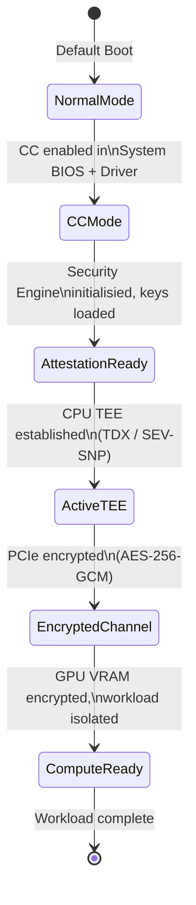

### 5.3 Encrypted PCIe Communication

A critical security property of H100 CC mode is that all data traversing the PCIe bus between the CPU and GPU is encrypted. This prevents a malicious hypervisor from inspecting or modifying workload data even with direct PCIe bus access.

The encryption uses **AES-256-GCM** with session keys negotiated during the CC mode initialisation handshake, authenticated by the GPU's hardware identity.

---

## 6. Cryptographic Attestation Protocol

### 6.1 Protocol Overview

The H100 attestation protocol allows a remote verifier to receive a **signed, freshness-guaranteed statement** from the GPU. The complete protocol flow is as follows:

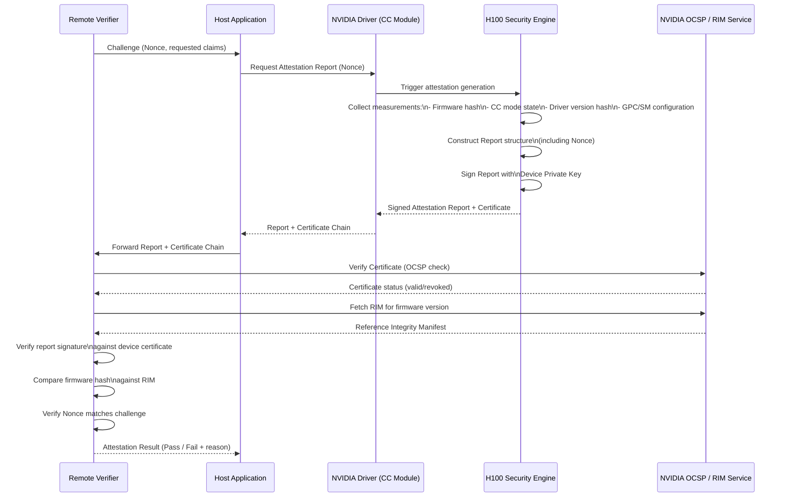

### 6.2 Attestation Report Structure

The attestation report produced by the H100 Security Engine contains the following principal fields:

```
AttestationReport {
    version:            uint32          // Report format version
    nonce:              bytes[32]       // Caller-provided nonce (replay protection)
    timestamp:          uint64          // Unix timestamp (SE-generated)
    gpu_certificate:    X.509           // Device certificate (DER-encoded)
    
    measurements {
        firmware_hash:      bytes[48]   // SHA-384 of CC mode firmware image
        driver_hash:        bytes[48]   // SHA-384 of loaded driver module
        cc_mode:            bool        // CC mode active
        ecc_mode:           bool        // ECC active
        gpc_count:          uint8       // Number of active GPCs
        sm_count:           uint16      // Number of active SMs
        vbios_version:      string      // VBIOS version string
        pci_device_id:      uint16      // PCI Device ID
        pci_subsystem_id:   uint16      // PCI Subsystem ID
    }
    
    signature:          bytes[96]       // ECDSA-P384 signature over all above fields
}
```

### 6.3 Key Cryptographic Algorithms

| Operation | Algorithm | Key Size |
|---|---|---|
| Device identity signature | ECDSA | P-384 (384-bit) |
| Attestation report hash | SHA-384 | 384-bit |
| PCIe session encryption | AES-GCM | 256-bit |
| Certificate chain | X.509 v3 | RSA-3072 or ECDSA P-384 |

### 6.4 Replay Attack Prevention

The inclusion of a caller-supplied **nonce** in the signed attestation report is critical for preventing replay attacks. Without a nonce, an adversary could capture a valid attestation report from a genuine H100 and re-use it indefinitely to impersonate that device.

The verifier must:
1. Generate a fresh, cryptographically random nonce (minimum 256 bits).
2. Provide it to the attestation request.
3. Verify that the returned report contains the exact nonce provided.
4. Discard the nonce after verification (never reuse).

---

## 7. Trust Hierarchy and Certificate Chain

### 7.1 NVIDIA Certificate Authority Structure

The H100 device certificate is rooted in NVIDIA's managed Certificate Authority hierarchy:

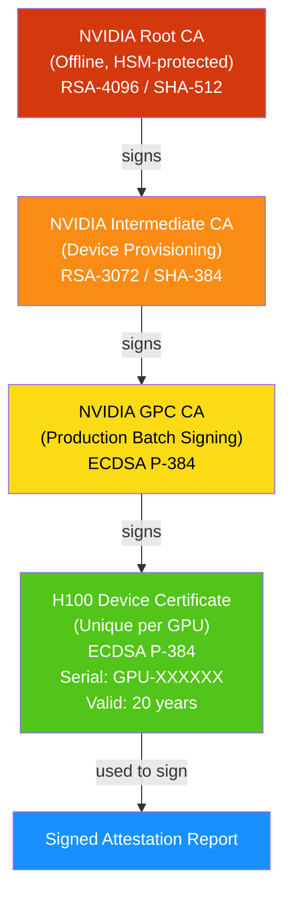

### 7.2 Certificate Verification Steps

A verifier performing full chain validation must:

1. **Obtain the device certificate** from the attestation report.
2. **Download intermediate certificates** if not already cached (NVIDIA publishes these at known URIs).
3. **Validate the chain** up to the NVIDIA Root CA (which must be pinned locally — do not rely on a live download for the root).
4. **Check revocation status** via NVIDIA's OCSP responder for each certificate in the chain.
5. **Verify the attestation report signature** using the device certificate's public key.
6. **Validate certificate fields**: Subject Alternative Name, Key Usage, Extended Key Usage (must include `id-kp-serverAuth` or the NVIDIA-defined OID for GPU attestation).

### 7.3 Trust Anchors

The security of the entire attestation scheme rests on the following trust assumptions:

- NVIDIA's manufacturing process correctly generates and binds device keys.
- NVIDIA's Root CA private key is secure and not compromised.
- NVIDIA's OCSP service is available and honest.
- The verifier has correctly pinned the NVIDIA Root CA certificate.

These assumptions represent the **irreducible trust requirement** of the scheme. Hardware attestation moves the trust boundary from the software stack to the silicon manufacturer.

---

## 8. Threat Model and Attack Surface

### 8.1 Attacker Capability Tiers

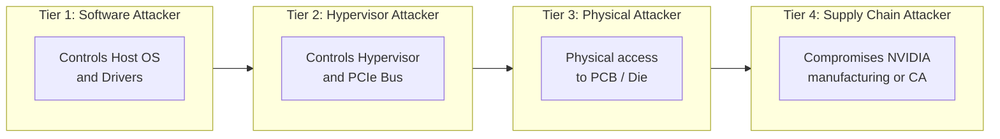

### 8.2 Attack Scenarios and Mitigations

| Attack | Tier | A100 Vulnerable | H100 Vulnerable | Mitigation (H100) |
|---|---|---|---|---|
| Forge driver-reported GPU UUID | T1 | Yes | Yes (without CC) | CC mode makes driver spoofing detectable |
| MMIO intercept to falsify device ID | T2 | Yes | Partial | Encrypted PCIe prevents data inspection |
| Replay captured attestation report | T2 | N/A | Yes | Nonce-based freshness |
| Present different GPU as H100 | T2 | Yes | No | Hardware key non-exportable from die |
| Modify firmware to bypass CC mode | T3 | Yes | Partial | Firmware hash in attestation report; RIM comparison |
| Compromise NVIDIA CA | T4 | N/A | Yes | Certificate pinning + public audit |
| Side-channel key extraction from die | T3 | N/A | Theoretical | Physical tamper resistance (limited) |
| VM escape to access GPU TEE state | T2 | Yes | No | CC mode isolates GPU state from hypervisor |

### 8.3 Residual Risks

Even with H100 CC mode and full attestation, the following residual risks exist:

1. **NVIDIA CA compromise**: If NVIDIA's intermediate or root CA is compromised, an attacker could issue fraudulent device certificates. Mitigation: Certificate Transparency logs, key ceremony auditing.
2. **Silicon-level attacks**: Nation-state adversaries with access to a GPU die and electron microscopy or fault injection tooling could theoretically extract the device private key. NVIDIA does not publish details of physical tamper resistance measures.
3. **Known firmware vulnerabilities**: If a firmware version with a known vulnerability is in use, the attestation report honestly reports this — but the verifier must check the RIM and refuse to accept outdated firmware versions.
4. **Revocation latency**: Between a key being compromised and OCSP being updated, an attacker could present a still-valid certificate. Verifiers should implement short OCSP response caching windows.

---

## 9. Application to Blockchain and Ethereum Workloads

### 9.1 Proof of Work (Ethereum Classic / EtcHash)

In a PoW context, GPU spoofing concerns are partially self-correcting: if you submit a valid share, you did the work. However, hashrate misrepresentation in mining pools or hashrate derivative markets is a real concern.

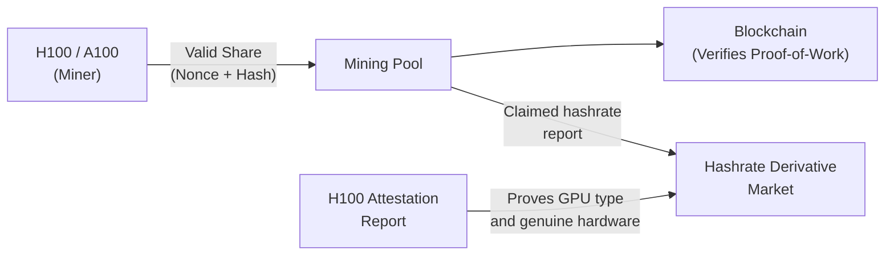

**Use case:** GPU attestation provides cryptographic proof to hashrate markets that a miner possesses genuine H100s, supporting higher-value hashrate contracts.

### 9.2 ZK-Rollups and zkEVM Proof Generation

This is the most significant and rapidly developing use case. ZK proof generation is computationally intensive and is increasingly GPU-accelerated. The integrity of a ZK proof depends entirely on the prover running the correct, unmodified proof circuit.

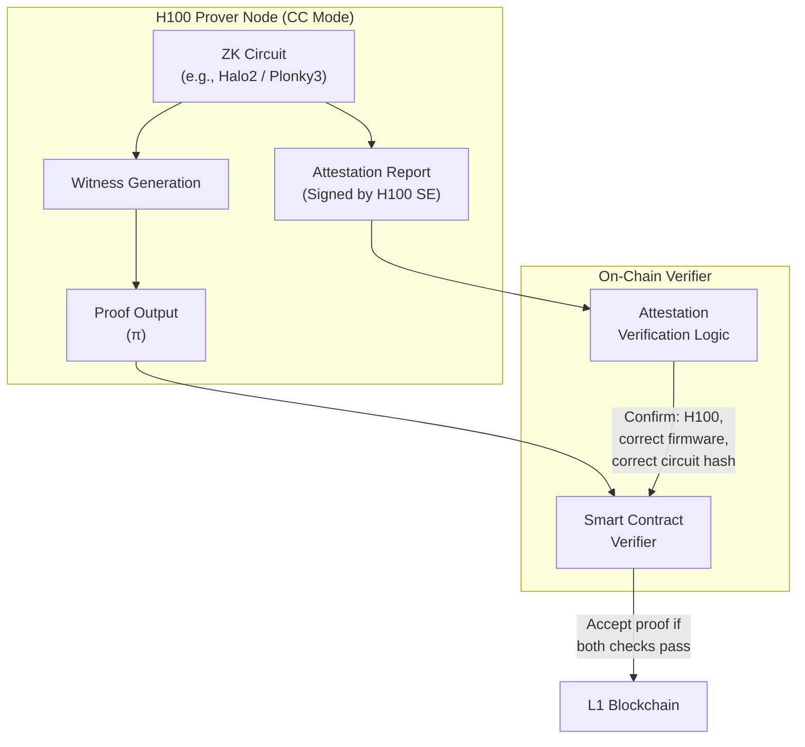

**Key insight:** The attestation report can include a hash of the ZK circuit code that ran. A verifier (or smart contract via an oracle) can confirm:
1. A genuine H100 produced the proof.
2. The correct, unmodified circuit was used.
3. The firmware was not tampered with.

This provides a layer of **proof provenance** that goes beyond the mathematical verification of the proof itself.

### 9.3 Decentralised GPU Compute Markets

GPU attestation directly enables trustless GPU marketplaces:

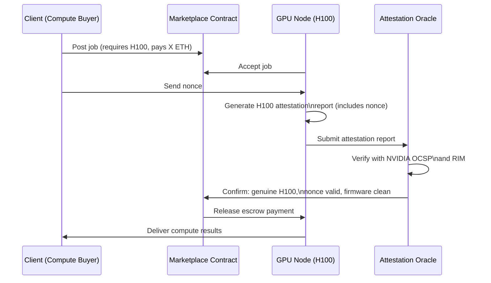

---

## 10. Comparative Capability Matrix

| Capability | A100 (Software Only) | A100 (Provider Attested) | H100 (No CC) | H100 (CC Mode) |
|---|---|---|---|---|
| Hardware identity certificate | ❌ | ❌ | ❌ | ✅ |
| Cryptographic GPU identity proof | ❌ | ❌ | ❌ | ✅ |
| Signed attestation report | ❌ | ❌ | ❌ | ✅ |
| Firmware integrity measurement | ❌ | Partial | ❌ | ✅ |
| Nonce-based freshness guarantee | ❌ | ❌ | ❌ | ✅ |
| Encrypted PCIe channel | ❌ | ❌ | ❌ | ✅ |
| GPU VRAM encryption | ❌ | ❌ | ❌ | ✅ |
| Hypervisor isolation | ❌ | ❌ | ❌ | ✅ |
| Compute result provenance | ❌ | ❌ | ❌ | Partial |
| Resistance to T1 (OS-level) attacker | Low | Low | Low | High |
| Resistance to T2 (Hypervisor) attacker | Very Low | Low | Very Low | High |
| Resistance to T3 (Physical) attacker | Very Low | Very Low | Very Low | Medium |
| Resistance to T4 (Supply chain) attacker | Very Low | Very Low | Very Low | Low |

---

## 11. Implementation Architecture

### 11.1 Reference Implementation Stack

The following diagram shows a complete implementation stack for a verifiable GPU compute service:

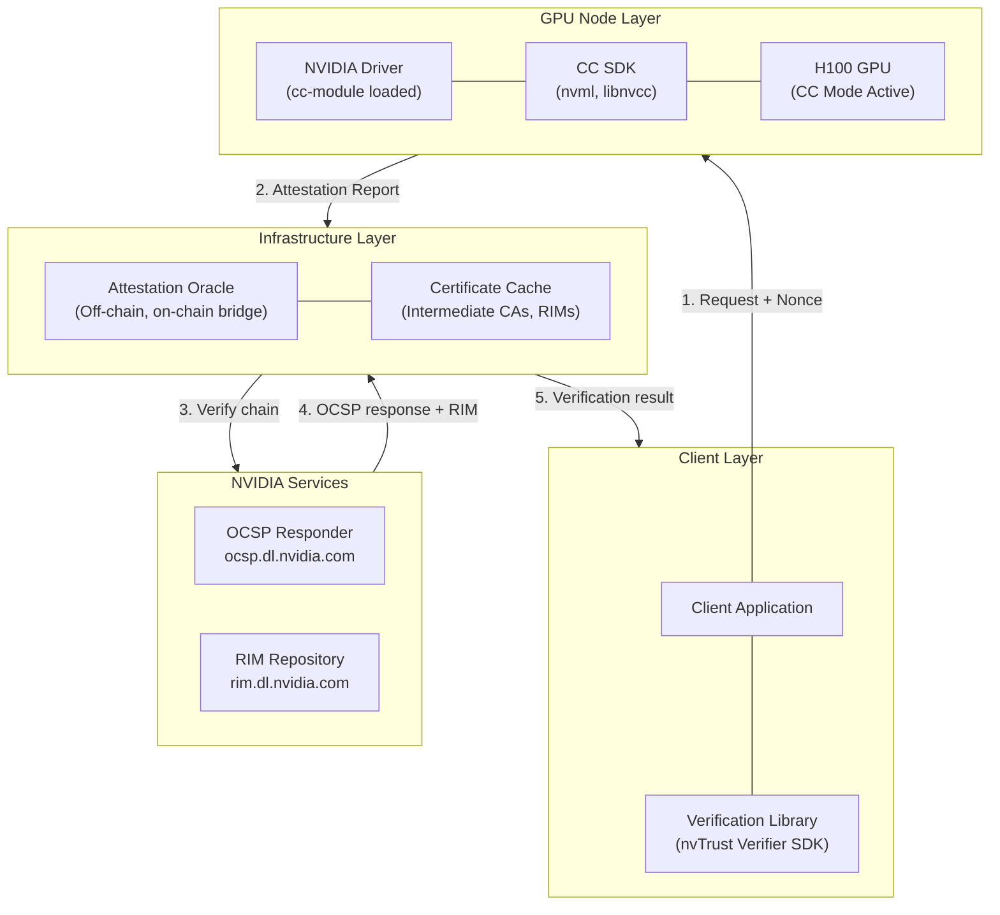

### 11.2 Software Prerequisites

To implement H100 attestation in a production environment:

```
System Requirements:
- Linux kernel 5.15+ with VFIO support
- NVIDIA Driver 525.85.12+ (CC-enabled build)
- CUDA 12.1+
- nvTrust SDK (github.com/NVIDIA/nvtrust)
- System BIOS with CC mode support (typically UEFI 2.7+)
- CPU with Intel TDX or AMD SEV-SNP support (for full stack TEE)

Key Libraries:
- libnvidia-ml.so  → NVML for device enumeration and report request
- libnvcc.so       → Confidential Computing primitives
- libverifier.so   → Report signature verification
```

### 11.3 Minimal Attestation Request (Pseudocode)

```python
import nvml
import nvtrust

def request_gpu_attestation(device_index: int) -> AttestationResult:
    # 1. Generate fresh nonce
    nonce = secrets.token_bytes(32)
    
    # 2. Initialise NVML and obtain device handle
    nvml.init()
    device = nvml.DeviceGetHandleByIndex(device_index)
    
    # 3. Request attestation report from Security Engine
    report = nvtrust.getAttestationReport(device, nonce)
    
    # 4. Verify locally or forward to oracle
    verifier = nvtrust.Verifier(
        ocsp_url="https://ocsp.dl.nvidia.com",
        rim_url="https://rim.dl.nvidia.com",
        root_ca_path="/etc/nvidia/nvidia_root_ca.pem"  # Pinned locally
    )
    
    result = verifier.verify(report, expected_nonce=nonce)
    
    # 5. Inspect result
    assert result.gpu_is_genuine
    assert result.cc_mode_active
    assert result.firmware_hash_matches_rim
    assert result.nonce_matches
    
    return result
```

---

## 12. Limitations and Open Problems

### 12.1 Computation Result Signing

A critical distinction must be drawn: **GPU attestation proves the environment, not the result.**

The H100 attestation report confirms:
- The GPU is genuine.
- The firmware is unmodified.
- CC mode is active.

It does **not** produce a per-computation signature asserting "this specific output was produced by this computation." This distinction matters for:

- **Non-deterministic workloads**: Floating-point operations may produce different bit-exact results on different hardware even with identical inputs, due to differing FMA fusion, rounding, or instruction scheduling.
- **Stateful computations**: Multi-step jobs where intermediate state is not logged cannot be retrospectively verified.

**Partial solution:** For deterministic algorithms (e.g., modular arithmetic in ZK proofs, SHA-256 hashing), running the computation inside a CPU TEE that also interfaces with the H100 CC mode allows the CPU TEE's attestation to include a hash of both inputs and outputs, providing end-to-end computation integrity.

### 12.2 Scalability of NVIDIA OCSP

The NVIDIA OCSP service represents a centralised dependency. In a high-throughput decentralised compute market with thousands of attestation requests per second, this could become a bottleneck. Proposed mitigations include:

- **Stapled OCSP responses**: Cache OCSP responses client-side with short TTLs.
- **Certificate Transparency integration**: Allow verifiers to cross-check against CT logs without live OCSP queries.
- **On-chain certificate registry**: Publish valid device certificate fingerprints to a blockchain for decentralised verification.

### 12.3 A100 in Production

Many production deployments today use A100s, which lack CC support. For these environments, the recommended approach is a **layered verification strategy**:

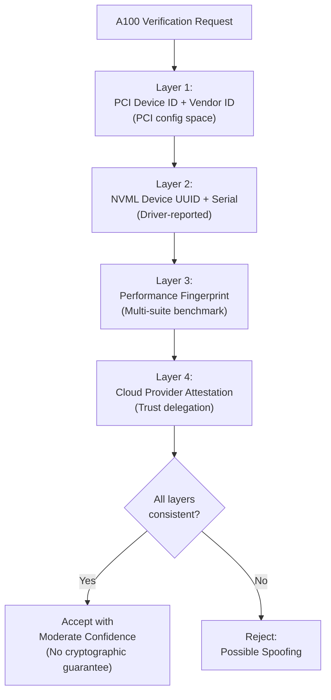

This provides defence-in-depth without cryptographic assurance. It is appropriate for scenarios where the threat model does not include a hypervisor-level attacker.

### 12.4 Future Directions

Several developments are expected to improve the landscape:

- **NVIDIA Blackwell (B100/B200)**: Expected to extend and improve upon H100 CC capabilities, potentially including per-computation signing primitives.
- **Open RIM repositories**: Decentralised RIM publication (e.g., on IPFS or a blockchain) would reduce dependence on NVIDIA's infrastructure.
- **Multi-party GPU attestation**: Protocols where multiple independent verifiers attest the same GPU simultaneously, reducing single-point-of-failure in the trust chain.
- **Verifiable Delay Functions on GPU**: GPU-optimised VDFs could provide timestamped proof of sustained GPU computation, complementing identity attestation.

---

## 13. Conclusions and Recommendations

### 13.1 Summary of Findings

1. **The A100 cannot provide cryptographic attestation of its identity.** All available verification methods are software-mediated and susceptible to a hypervisor-level adversary. They provide probabilistic confidence, not cryptographic assurance.

2. **The H100 in CC mode provides genuine hardware-rooted attestation** via a factory-provisioned device private key and a NVIDIA-managed certificate authority. This constitutes a meaningful and deployable cryptographic guarantee.

3. **The trust root is NVIDIA, not a decentralised authority.** The scheme's security depends on the integrity of NVIDIA's manufacturing process and certificate authority. This is an inherent limitation of any manufacturer-provisioned attestation scheme.

4. **Attestation proves environment, not computation.** For applications requiring per-computation integrity, additional architecture (CPU TEE integration, deterministic algorithms, input/output hashing) is required.

5. **Application to blockchain and distributed compute is significant.** H100 attestation enables trustless GPU compute markets, verifiable ZK proof generation, and honest hashrate reporting — all previously reliant on trust in centralized parties.

### 13.2 Recommendations

| Stakeholder | Recommendation |
|---|---|
| **Compute marketplace operators** | Require H100 CC attestation for premium tier listings; use layered verification for A100 nodes with explicit confidence labelling |
| **ZK proof system designers** | Architect provers to run within H100 CC + CPU TEE combined environments; include circuit code hash in attestation scope |
| **Smart contract developers** | Integrate with a reputable attestation oracle; implement on-chain certificate fingerprint registry as a fallback |
| **Enterprises leasing GPU compute** | Demand H100 CC attestation reports at job submission time; verify nonces and RIM compliance before accepting results |
| **Infrastructure operators running A100s** | Implement all four verification layers; document the absence of cryptographic guarantees clearly in SLAs |

---

## 14. References and Further Reading

- NVIDIA Corporation. *NVIDIA Hopper H100 GPU Architecture Whitepaper*. 2022.
- NVIDIA Corporation. *NVIDIA Confidential Computing: Protecting AI Models and Data*. Technical Brief, 2023.
- NVIDIA Corporation. *nvTrust SDK Documentation*. github.com/NVIDIA/nvtrust
- NVIDIA Corporation. *NVIDIA GPU Attestation: RIM and OCSP Services*. developer.nvidia.com/confidential-computing
- Intel Corporation. *Intel Trust Domain Extensions (TDX) Architecture Specification*. 2023.
- AMD Corporation. *AMD SEV-SNP: Strengthening VM Isolation with Integrity Protection and More*. 2020.
- Dwork, C., & Naor, M. *Pricing via Processing or Combatting Junk Mail*. CRYPTO 1992. *(foundational PoW reference)*
- Groth, J. *On the Size of Pairing-Based Non-Interactive Arguments*. EUROCRYPT 2016. *(ZK proofs reference)*
- NIST SP 800-193. *Platform Firmware Resiliency Guidelines*. 2018.
- TCG (Trusted Computing Group). *TPM 2.0 Library Specification*. 2019. *(Reference architecture for hardware attestation)*

---

*End of Document*

---

> **Disclaimer:** This document reflects publicly available technical information as of February 2026. NVIDIA's Confidential Computing features, SDK APIs, and certificate infrastructure are subject to change. Always consult the official NVIDIA developer documentation for current implementation details.
