# GPU Health & Reliability System Architecture

**Version:** 1.0  
**Date:** 2026-02-09  
**Author:** Stuart Hart

---

## Executive Summary

This document defines the architecture for a production-grade GPU Health & Reliability System designed for large-scale fleets of NVIDIA A100/H100 GPUs. The system addresses the complete lifecycle of GPU asset management from deployment through decommissioning, with a focus on predictive failure detection, economic optimization, and data-driven decision making.

**Key Objectives:**
- Define and monitor GPU health metrics in real-time
- Predict degradation and failure before critical impact
- Enable data-driven decommissioning and pricing decisions
- Maximize GPU fleet ROI through proactive maintenance
- Support secondary market asset valuation

**Scale Requirements:**
- 10,000+ GPUs across multiple data centers
- Sub-minute detection of critical health issues
- 99.99% uptime for monitoring infrastructure
- Retention of 2+ years of telemetry data
- Real-time economic impact assessment

---

## Table of Contents

1. [System Overview](#system-overview)
2. [Architecture Layers](#architecture-layers)
3. [Core Components](#core-components)
4. [Data Models](#data-models)
5. [Health Definition Framework](#health-definition-framework)
6. [Predictive Analytics Engine](#predictive-analytics-engine)
7. [Economic Decision Engine](#economic-decision-engine)
8. [Technology Stack](#technology-stack)
9. [Implementation Phases](#implementation-phases)
10. [Proof of Concept Scope](#proof-of-concept-scope)
11. [API Specifications](#api-specifications)
12. [Security & Compliance](#security-compliance)

---

## System Overview

### High-Level Architecture

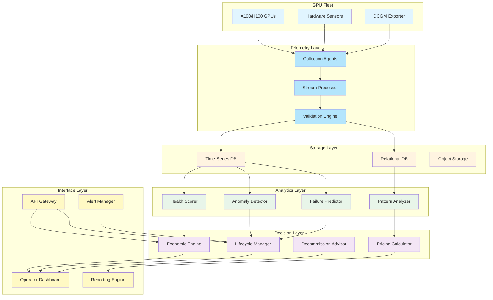

### Key Design Principles

1. **Hardware-First Philosophy**: Metrics collection happens at the lowest level possible (NVIDIA DCGM, hardware sensors)
2. **Real Financial Impact**: Every health decision translates to dollar amounts
3. **Predictive Over Reactive**: Catch issues before they become failures
4. **Data-Driven Decisions**: No gut calls - all decommissioning backed by evidence
5. **Continuous Learning**: Models improve with every failure and success
6. **Economic Optimization**: Balance operational cost vs asset value

---

## Architecture Layers

### 1. Telemetry Collection Layer

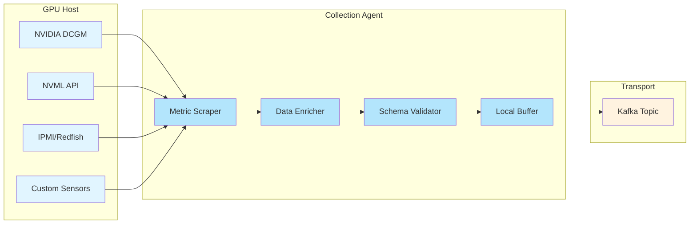

**Responsibilities:**
- Collect 100+ metrics per GPU every 10 seconds
- Enrich with metadata (location, age, workload type)
- Validate schema and ranges before transmission
- Handle network failures with local buffering
- Compress and batch for efficient transport

**Key Metrics Collected:**

| Category | Metrics | Frequency |
|----------|---------|-----------|
| Temperature | GPU temp, memory temp, hotspot | 10s |
| Power | Draw, limit, violations | 10s |
| Utilization | GPU %, memory %, SM activity | 10s |
| Memory | ECC errors (correctable/uncorrectable), usage | 10s |
| Clock | Current clocks, throttle reasons | 10s |
| PCIe | Link speed, errors, replay count | 60s |
| NVLink | Bandwidth, errors, CRC errors | 60s |
| Environmental | Ambient temp, fan speed, pressure | 60s |
| Workload | Process info, kernel execution | 60s |

### 2. Stream Processing Layer

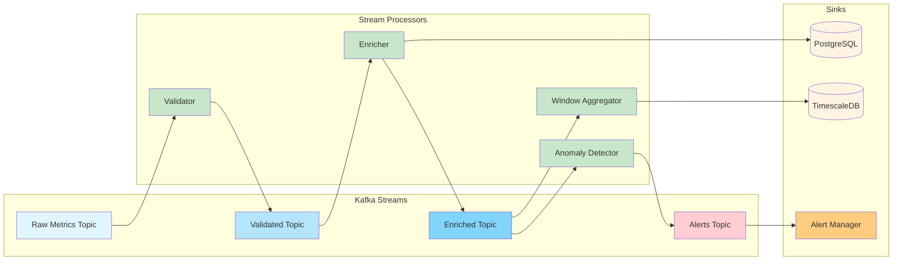

**Processing Pipeline:**

1. **Validation**: Schema check, range validation, duplicate detection
2. **Enrichment**: Add GPU metadata, historical context, fleet averages
3. **Anomaly Detection**: Real-time outlier detection using streaming algorithms
4. **Windowing**: 1min/5min/15min/1hour/1day aggregations
5. **Alerting**: Critical thresholds trigger immediate alerts

### 3. Storage Layer

**Time-Series Database (TimescaleDB)**
- Primary storage for all telemetry metrics
- Optimized for high-frequency writes
- Retention: 2 years full resolution, then downsampled
- Partitioned by time and GPU ID
- Continuous aggregates for common queries

**Relational Database (PostgreSQL)**
- GPU asset inventory and metadata
- Workload history and job assignments
- Failure events and root cause analysis
- Economic models and pricing history
- User accounts and permissions

**Object Storage (S3-compatible)**
- Raw event logs for forensic analysis
- Model training datasets
- Historical reports and snapshots
- Backup and disaster recovery

---

## Core Components

### Health Scoring Engine

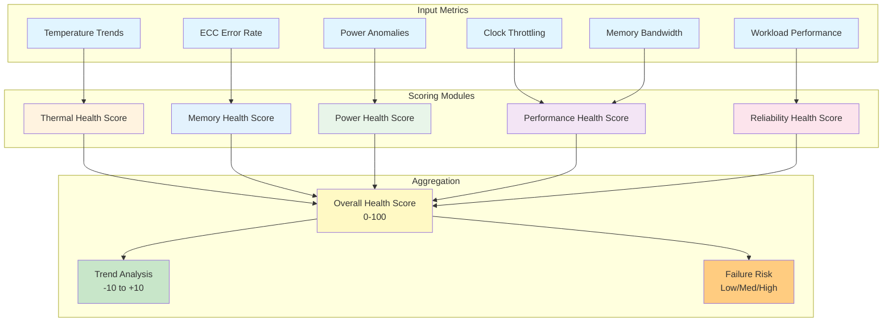

**Health Score Calculation:**

```python
# Pseudocode for health scoring
health_score = (
    thermal_health * 0.25 +      # Temperature management
    memory_health * 0.30 +       # ECC errors, bandwidth
    power_health * 0.15 +        # Power draw stability
    performance_health * 0.20 +  # Compute throughput
    reliability_health * 0.10    # Historical stability
)

# Each sub-score is 0-100, with degradation penalties:
# - ECC errors: -5 per correctable, -20 per uncorrectable
# - Thermal throttling: -10 per occurrence in 24h
# - Power spikes: -3 per occurrence
# - Performance degradation: -1 per 1% below baseline
```

### Failure Prediction Engine

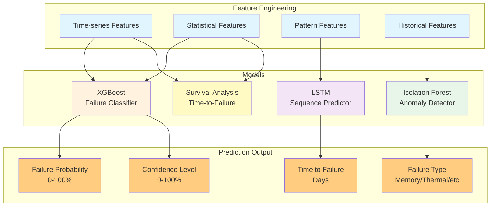

**Predictive Features (Top 50):**

| Feature Category | Examples | Predictive Power |
|-----------------|----------|------------------|
| ECC Trends | 7d/30d correctable rate, uncorrectable count | Very High |
| Temperature | Max/avg/std dev, thermal throttle count | High |
| Power | Anomaly frequency, variance, cap violations | High |
| Performance | Degradation vs baseline, workload variance | Medium |
| Age | Days in service, total runtime hours | Medium |
| Workload | Job failure rate, OOM events | Medium |

**Model Training Pipeline:**

1. **Data Collection**: Historical failures + 6 months pre-failure telemetry
2. **Labeling**: Classify failures (memory, thermal, power, unknown)
3. **Feature Engineering**: 200+ derived features from raw metrics
4. **Training**: Ensemble of models, weekly retraining
5. **Validation**: Holdout set + live A/B testing
6. **Deployment**: Canary rollout with performance monitoring

### Economic Decision Engine

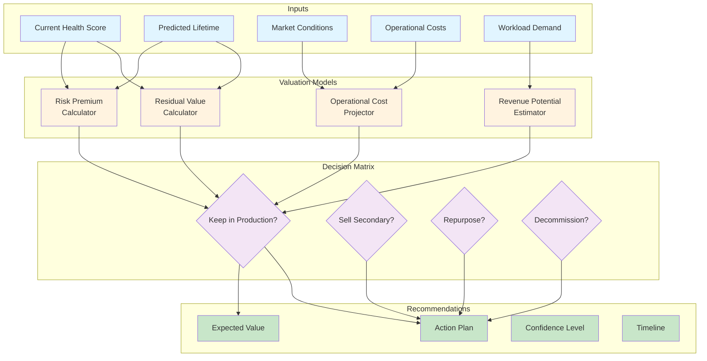

**Economic Decision Logic:**

```python
# Simplified decision tree
if health_score > 85 and predicted_lifetime > 365:
    action = "KEEP_PRODUCTION"
    priority = "HIGH_UTILIZATION"
    
elif health_score > 70 and predicted_lifetime > 180:
    action = "KEEP_PRODUCTION"
    priority = "MEDIUM_UTILIZATION"
    
elif health_score > 50 and secondary_market_value > repair_cost:
    action = "SELL_SECONDARY"
    expected_value = secondary_market_value - transaction_cost
    
elif health_score > 40 and repurpose_value > decommission_value:
    action = "REPURPOSE"
    target_workload = "low_criticality_inference"
    
else:
    action = "DECOMMISSION"
    salvage_value = component_value + scrap_value
```

**Pricing Model:**

```
Secondary Market Price = 
    Base Price (model, age) 
    × Health Multiplier (0.5-1.2)
    × Demand Multiplier (0.8-1.5)
    × Urgency Discount (0.9-1.0)
    - Transaction Costs
```

---

## Data Models

### GPU Asset Record

```sql
CREATE TABLE gpu_assets (
    gpu_id UUID PRIMARY KEY,
    serial_number VARCHAR(64) UNIQUE NOT NULL,
    model VARCHAR(32) NOT NULL, -- 'A100-80GB', 'H100-SXM'
    pci_bus_id VARCHAR(32) NOT NULL,
    
    -- Location
    datacenter_id UUID NOT NULL,
    rack_id VARCHAR(32),
    host_id UUID NOT NULL,
    pci_slot INTEGER,
    
    -- Lifecycle
    manufactured_date DATE,
    deployed_date TIMESTAMP NOT NULL,
    decommissioned_date TIMESTAMP,
    status VARCHAR(32) NOT NULL, -- 'active', 'degraded', 'maintenance', 'decommissioned'
    
    -- Economic
    purchase_price DECIMAL(10,2),
    current_valuation DECIMAL(10,2),
    total_revenue DECIMAL(10,2),
    
    -- Hardware
    firmware_version VARCHAR(32),
    driver_version VARCHAR(32),
    vbios_version VARCHAR(32),
    
    -- Metadata
    created_at TIMESTAMP DEFAULT NOW(),
    updated_at TIMESTAMP DEFAULT NOW(),
    
    CONSTRAINT fk_datacenter FOREIGN KEY (datacenter_id) REFERENCES datacenters(id),
    CONSTRAINT fk_host FOREIGN KEY (host_id) REFERENCES hosts(id)
);

CREATE INDEX idx_gpu_status ON gpu_assets(status);
CREATE INDEX idx_gpu_datacenter ON gpu_assets(datacenter_id);
CREATE INDEX idx_gpu_deployed ON gpu_assets(deployed_date);
```

### Health Metrics (TimescaleDB Hypertable)

```sql
CREATE TABLE gpu_health_metrics (
    time TIMESTAMPTZ NOT NULL,
    gpu_id UUID NOT NULL,
    
    -- Temperature (Celsius)
    temp_gpu INTEGER,
    temp_memory INTEGER,
    temp_hotspot INTEGER,
    
    -- Power (Watts)
    power_draw INTEGER,
    power_limit INTEGER,
    power_violation_count INTEGER,
    
    -- Utilization (%)
    util_gpu SMALLINT,
    util_memory SMALLINT,
    util_encoder SMALLINT,
    util_decoder SMALLINT,
    
    -- Memory
    memory_used BIGINT,
    memory_total BIGINT,
    ecc_correctable_count BIGINT,
    ecc_uncorrectable_count BIGINT,
    
    -- Clocks (MHz)
    clock_gpu INTEGER,
    clock_memory INTEGER,
    clock_sm INTEGER,
    throttle_reason BIGINT, -- Bitmask
    
    -- PCIe
    pcie_link_gen SMALLINT,
    pcie_link_width SMALLINT,
    pcie_replay_count BIGINT,
    
    -- NVLink (if applicable)
    nvlink_bandwidth_rx BIGINT,
    nvlink_bandwidth_tx BIGINT,
    nvlink_errors BIGINT,
    
    -- Performance
    sm_occupancy REAL,
    tensor_activity REAL,
    
    PRIMARY KEY (time, gpu_id)
);

-- Convert to hypertable
SELECT create_hypertable('gpu_health_metrics', 'time');

-- Create continuous aggregates
CREATE MATERIALIZED VIEW gpu_metrics_1h
WITH (timescaledb.continuous) AS
SELECT time_bucket('1 hour', time) AS bucket,
       gpu_id,
       avg(temp_gpu) as avg_temp,
       max(temp_gpu) as max_temp,
       avg(power_draw) as avg_power,
       sum(ecc_correctable_count) as total_ecc_correctable,
       sum(ecc_uncorrectable_count) as total_ecc_uncorrectable,
       avg(util_gpu) as avg_utilization
FROM gpu_health_metrics
GROUP BY bucket, gpu_id;
```

### Health Score History

```sql
CREATE TABLE gpu_health_scores (
    gpu_id UUID NOT NULL,
    calculated_at TIMESTAMP NOT NULL,
    
    overall_score SMALLINT NOT NULL CHECK (overall_score >= 0 AND overall_score <= 100),
    thermal_score SMALLINT NOT NULL,
    memory_score SMALLINT NOT NULL,
    power_score SMALLINT NOT NULL,
    performance_score SMALLINT NOT NULL,
    reliability_score SMALLINT NOT NULL,
    
    score_trend REAL, -- -10 to +10
    risk_level VARCHAR(16), -- 'low', 'medium', 'high', 'critical'
    
    failure_probability REAL CHECK (failure_probability >= 0 AND failure_probability <= 1),
    predicted_ttf_days INTEGER, -- Time to failure
    
    PRIMARY KEY (gpu_id, calculated_at),
    CONSTRAINT fk_gpu FOREIGN KEY (gpu_id) REFERENCES gpu_assets(gpu_id)
);

CREATE INDEX idx_health_risk ON gpu_health_scores(risk_level, calculated_at);
CREATE INDEX idx_health_score ON gpu_health_scores(overall_score, calculated_at);
```

### Failure Events

```sql
CREATE TABLE failure_events (
    event_id UUID PRIMARY KEY,
    gpu_id UUID NOT NULL,
    detected_at TIMESTAMP NOT NULL,
    confirmed_at TIMESTAMP,
    resolved_at TIMESTAMP,
    
    failure_type VARCHAR(32) NOT NULL, -- 'memory_error', 'thermal_shutdown', 'power_failure'
    severity VARCHAR(16) NOT NULL, -- 'warning', 'error', 'critical'
    
    symptoms JSONB, -- Detailed symptoms as JSON
    root_cause TEXT,
    resolution_action TEXT,
    
    predicted BOOLEAN DEFAULT FALSE, -- Was this predicted before it occurred?
    prediction_lead_time INTEGER, -- Days of lead time if predicted
    
    financial_impact DECIMAL(10,2), -- Revenue loss from downtime
    
    CONSTRAINT fk_gpu FOREIGN KEY (gpu_id) REFERENCES gpu_assets(gpu_id)
);

CREATE INDEX idx_failure_type ON failure_events(failure_type, detected_at);
CREATE INDEX idx_failure_predicted ON failure_events(predicted);
```

### Economic Decisions

```sql
CREATE TABLE economic_decisions (
    decision_id UUID PRIMARY KEY,
    gpu_id UUID NOT NULL,
    decision_date TIMESTAMP NOT NULL,
    
    action VARCHAR(32) NOT NULL, -- 'keep', 'sell', 'repurpose', 'decommission'
    reason TEXT NOT NULL,
    
    -- Economic factors
    current_health_score SMALLINT,
    predicted_lifetime_days INTEGER,
    residual_value DECIMAL(10,2),
    operational_cost DECIMAL(10,2),
    expected_revenue DECIMAL(10,2),
    
    -- Decision confidence
    confidence_level REAL CHECK (confidence_level >= 0 AND confidence_level <= 1),
    algorithm_version VARCHAR(16),
    
    -- Outcome tracking
    decision_executed BOOLEAN DEFAULT FALSE,
    execution_date TIMESTAMP,
    actual_outcome TEXT,
    outcome_value DECIMAL(10,2),
    
    CONSTRAINT fk_gpu FOREIGN KEY (gpu_id) REFERENCES gpu_assets(gpu_id)
);
```

---

## Health Definition Framework

### Multi-Dimensional Health Model

Health is not a single number - it's a multi-dimensional assessment across several axes:

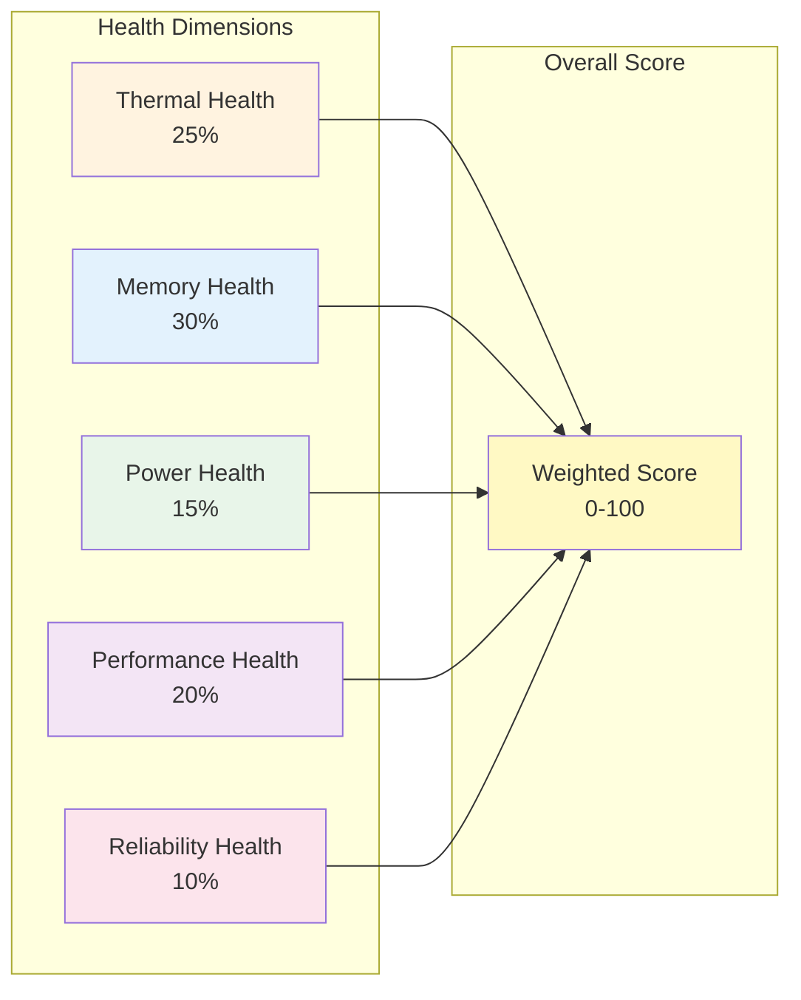

### 1. Thermal Health (25%)

**Baseline Definition:**
- GPU Temperature: < 80°C normal, 80-85°C elevated, > 85°C concerning
- Memory Temperature: < 85°C normal, 85-90°C elevated, > 90°C concerning
- Hotspot Temperature: < 90°C normal, 90-95°C elevated, > 95°C concerning

**Degradation Indicators:**
- Thermal throttling events (any occurrence in 24h: -10 points)
- Temperature trend increasing > 2°C per month (-5 points)
- Temperature variance > 10°C during stable workload (-3 points)
- Fan speed consistently > 90% (-5 points)

**Scoring Logic:**
```python
thermal_score = 100
thermal_score -= throttle_events_24h * 10
thermal_score -= max(0, (avg_temp - 75)) * 2  # Penalty above 75C
thermal_score -= temp_variance_penalty
thermal_score = max(0, min(100, thermal_score))
```

### 2. Memory Health (30%)

**Baseline Definition:**
- ECC Correctable Errors: < 10/day normal, 10-50/day elevated, > 50/day concerning
- ECC Uncorrectable Errors: 0 normal, 1/week elevated, > 1/week critical
- Memory Bandwidth: > 95% of spec normal, 90-95% elevated, < 90% concerning

**Critical Rules:**
- ANY uncorrectable ECC error in last 7 days: score capped at 70
- > 100 correctable errors/day for 3+ days: score capped at 60
- Uncorrectable error trend increasing: immediate escalation

**Scoring Logic:**
```python
memory_score = 100

# Correctable errors
correctable_per_day = correctable_count_7d / 7
memory_score -= min(50, correctable_per_day)  # Max -50 points

# Uncorrectable errors
if uncorrectable_count_7d > 0:
    memory_score = min(memory_score, 70)
if uncorrectable_count_30d > 4:
    memory_score = min(memory_score, 50)

# Bandwidth degradation
bandwidth_ratio = actual_bandwidth / spec_bandwidth
if bandwidth_ratio < 0.95:
    memory_score -= (1 - bandwidth_ratio) * 100

memory_score = max(0, min(100, memory_score))
```

### 3. Power Health (15%)

**Baseline Definition:**
- Power Draw: Within 10% of workload average
- Power Limit Violations: 0/day normal, 1-5/day elevated, > 5/day concerning
- Power Efficiency: > 90% of baseline for given workload

**Degradation Indicators:**
- Sudden power draw changes (> 20W variation for stable workload)
- Power limit violations frequency increasing
- Power efficiency degrading over time

### 4. Performance Health (20%)

**Baseline Definition:**
- Compute Throughput: > 95% of baseline for workload type
- Memory Bandwidth: > 95% of spec
- SM Occupancy: Matches historical average for workload
- Kernel Execution Time: Within 5% of baseline

**Degradation Indicators:**
- Performance regression > 5% from baseline
- Increasing variance in execution times
- Clock throttling during compute-intensive work

### 5. Reliability Health (10%)

**Baseline Definition:**
- Uptime: > 99.9% over 30 days
- Job Success Rate: > 99%
- Driver/Firmware Stability: No crashes or resets

**Degradation Indicators:**
- Unexpected resets or crashes
- Driver errors or hangs
- Increasing job failure rate

### Health Score Thresholds

| Score Range | Classification | Action |
|-------------|---------------|--------|
| 90-100 | Excellent | Prime production workloads |
| 80-89 | Good | Standard production workloads |
| 70-79 | Fair | Monitor closely, lower-priority workloads |
| 60-69 | Degraded | Reduce workload, plan replacement |
| 50-59 | Poor | Secondary market candidate |
| 40-49 | Critical | Immediate evaluation for decommission |
| 0-39 | Failed | Decommission or salvage |

---

## Predictive Analytics Engine

### Failure Prediction Models

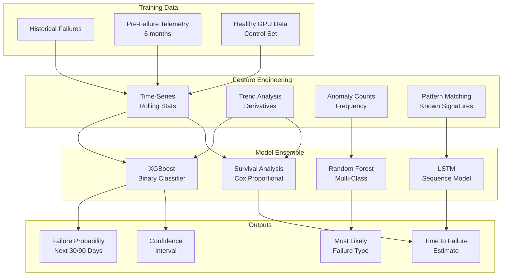

### Feature Categories

**1. ECC Error Features (Highest Predictive Power)**
- 7-day correctable error rate
- 30-day correctable error trend
- Uncorrectable error count (any period)
- Error rate acceleration (2nd derivative)
- Time since last uncorrectable error
- Error spatial pattern (if available)

**2. Thermal Features**
- Temperature percentiles (p50, p95, p99)
- Temperature variance over 24h windows
- Thermal throttle event frequency
- Temperature trend (linear regression slope)
- Delta from ambient temperature
- Cooling effectiveness (temp vs fan speed correlation)

**3. Power Features**
- Power draw variance
- Power limit violation frequency
- Power efficiency trend
- Sudden power spikes count
- Power vs utilization correlation
- Abnormal power pattern detection

**4. Performance Features**
- Compute throughput degradation
- Memory bandwidth degradation
- Clock frequency stability
- SM occupancy variance
- Kernel execution time variance
- Performance vs power efficiency

**5. Temporal Features**
- Age in days
- Total runtime hours
- Workload intensity history
- Time since last maintenance
- Seasonal patterns
- Workload change frequency

### Model Training Process

**Data Preparation:**
1. Identify all GPU failures in training window (18-24 months)
2. Extract 6 months of pre-failure telemetry
3. Extract equivalent periods from healthy GPUs (3x failure count)
4. Label failure types: memory, thermal, power, other
5. Create balanced training set with oversampling

**Feature Engineering:**
```python
# Example feature extraction
features = []

# Rolling statistics (7d, 30d windows)
for window in [7, 30]:
    features.append(f'ecc_correctable_mean_{window}d')
    features.append(f'ecc_correctable_std_{window}d')
    features.append(f'ecc_correctable_max_{window}d')
    features.append(f'ecc_correctable_trend_{window}d')

# Temperature percentiles
for percentile in [50, 75, 90, 95, 99]:
    features.append(f'temp_gpu_p{percentile}_7d')
    features.append(f'temp_gpu_p{percentile}_30d')

# Anomaly counts
features.append('thermal_throttle_count_7d')
features.append('power_violation_count_7d')
features.append('performance_anomaly_count_7d')

# Trend features (slope over 30d)
features.append('temp_trend_30d')
features.append('ecc_trend_30d')
features.append('performance_trend_30d')

# Total: ~200 features
```

**Model Training:**
```python
# XGBoost for binary classification (will fail in 30 days?)
xgb_model = XGBClassifier(
    max_depth=8,
    n_estimators=500,
    learning_rate=0.05,
    scale_pos_weight=3,  # Handle class imbalance
    objective='binary:logistic'
)

# Train on labeled data
xgb_model.fit(X_train, y_train)

# Evaluate on holdout set
predictions = xgb_model.predict_proba(X_test)[:, 1]
auc_score = roc_auc_score(y_test, predictions)
# Target: AUC > 0.90 for production deployment
```

**Continuous Learning:**
- Retrain models weekly with new failure data
- A/B test new models against current production
- Track prediction accuracy vs actual failures
- Adjust thresholds based on false positive/negative rates
- Feature importance analysis for model interpretability

### Prediction Accuracy Targets

| Prediction Window | Target Accuracy | Acceptable False Positive Rate |
|-------------------|-----------------|-------------------------------|
| 7 days | 95%+ | < 2% |
| 30 days | 85%+ | < 5% |
| 90 days | 70%+ | < 10% |

### Alert Thresholds

```python
# Critical: Immediate action required
if failure_probability_7d > 0.80 and confidence > 0.85:
    alert_level = "CRITICAL"
    action = "Remove from production immediately"

# High: Plan replacement within days
elif failure_probability_30d > 0.70 and confidence > 0.80:
    alert_level = "HIGH"
    action = "Schedule replacement within 7 days"

# Medium: Monitor and plan
elif failure_probability_90d > 0.50 and confidence > 0.75:
    alert_level = "MEDIUM"
    action = "Schedule replacement within 30 days"

# Low: Watchlist
elif failure_probability_90d > 0.30:
    alert_level = "LOW"
    action = "Add to watchlist, monitor trends"
```

---

## Economic Decision Engine

### Decision Framework

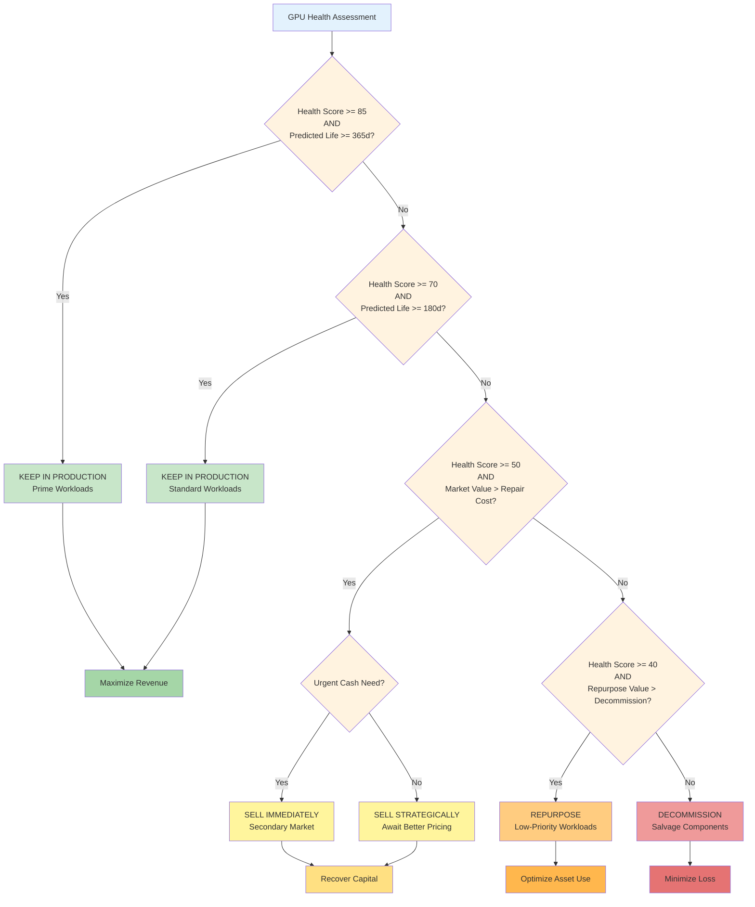

### Economic Model Components

**1. Residual Value Calculator**

```python
def calculate_residual_value(gpu_asset):
    """
    Calculate current market value of GPU
    """
    # Base value from model and age
    base_value = get_market_price(gpu_asset.model)
    age_months = (datetime.now() - gpu_asset.deployed_date).days / 30
    age_depreciation = 1 - (age_months / 60) * 0.5  # 50% depreciation over 5 years
    
    # Health multiplier (0.5 - 1.2)
    health_multiplier = 0.5 + (gpu_asset.health_score / 100) * 0.7
    
    # Market demand multiplier (from current pricing data)
    demand_multiplier = get_market_demand_multiplier(gpu_asset.model)
    
    # Warranty/support factor
    warranty_value = calculate_warranty_value(gpu_asset)
    
    residual_value = (
        base_value 
        * age_depreciation 
        * health_multiplier 
        * demand_multiplier
        + warranty_value
    )
    
    return residual_value

# Example pricing:
# H100-SXM 80GB:
#   - New: $40,000
#   - 12 months old, health=95: ~$32,000 (80%)
#   - 24 months old, health=85: ~$24,000 (60%)
#   - 36 months old, health=70: ~$16,000 (40%)
```

**2. Operational Cost Projector**

```python
def project_operational_costs(gpu_asset, months_ahead=12):
    """
    Project operational costs for next N months
    """
    # Power cost
    avg_power_kw = gpu_asset.avg_power_draw / 1000
    power_cost_per_kwh = 0.10  # $0.10/kWh
    monthly_power_cost = avg_power_kw * 730 * power_cost_per_kwh  # 730h/month
    
    # Cooling cost (typically 0.3x power cost for modern DCs)
    monthly_cooling_cost = monthly_power_cost * 0.3
    
    # Maintenance cost (increases with age and health degradation)
    base_maintenance = 50  # $50/month base
    health_penalty = (100 - gpu_asset.health_score) * 2  # $2/point below 100
    monthly_maintenance = base_maintenance + health_penalty
    
    # Risk cost (expected value of failure)
    failure_probability = get_failure_probability(gpu_asset, months_ahead)
    failure_cost = estimate_failure_impact(gpu_asset)
    monthly_risk_cost = (failure_probability / months_ahead) * failure_cost
    
    # Rack space allocation
    monthly_rack_cost = 100  # $100/month rack space
    
    total_monthly = (
        monthly_power_cost +
        monthly_cooling_cost +
        monthly_maintenance +
        monthly_risk_cost +
        monthly_rack_cost
    )
    
    return total_monthly * months_ahead

# Example for H100:
# - Power: ~700W avg = $51/month
# - Cooling: $15/month
# - Maintenance: $50-200/month (health dependent)
# - Risk: $10-500/month (health dependent)
# - Rack: $100/month
# Total: ~$226-866/month depending on health
```

**3. Revenue Potential Estimator**

```python
def estimate_revenue_potential(gpu_asset, months_ahead=12):
    """
    Estimate revenue from GPU utilization
    """
    # Market rate for GPU compute (varies by model and demand)
    hourly_rate = get_market_rate(gpu_asset.model)  # e.g., $2-4/hour for H100
    
    # Expected utilization based on health and workload availability
    if gpu_asset.health_score >= 85:
        utilization_rate = 0.90  # 90% billable utilization
    elif gpu_asset.health_score >= 70:
        utilization_rate = 0.75  # 75% billable utilization
    else:
        utilization_rate = 0.50  # Limited to low-priority only
    
    # Availability factor (accounts for downtime, maintenance)
    availability = 1 - get_predicted_downtime(gpu_asset)
    
    monthly_hours = 730
    monthly_revenue = (
        hourly_rate 
        * monthly_hours 
        * utilization_rate 
        * availability
    )
    
    return monthly_revenue * months_ahead

# Example for H100:
# - Rate: $3/hour
# - Utilization: 90% (high health)
# - Availability: 99%
# - Monthly: $3 × 730 × 0.9 × 0.99 = $1,950/month
# - Annual: $23,400
```

**4. Decision Matrix**

```python
def make_economic_decision(gpu_asset):
    """
    Make data-driven decision on GPU lifecycle action
    """
    health_score = gpu_asset.health_score
    predicted_lifetime_days = get_predicted_lifetime(gpu_asset)
    
    # Calculate economic factors
    residual_value = calculate_residual_value(gpu_asset)
    operational_cost_12m = project_operational_costs(gpu_asset, 12)
    revenue_potential_12m = estimate_revenue_potential(gpu_asset, 12)
    
    # Net present value of keeping in production
    npv_keep = revenue_potential_12m - operational_cost_12m
    
    # Value of selling now
    npv_sell = residual_value - transaction_cost(residual_value)
    
    # Value of repurposing to low-priority workload
    revenue_repurpose = estimate_revenue_potential(gpu_asset, 12, workload='low_priority')
    cost_repurpose = project_operational_costs(gpu_asset, 12) * 0.7  # Lower cooling/power
    npv_repurpose = revenue_repurpose - cost_repurpose
    
    # Decommission salvage value
    salvage_value = estimate_salvage_value(gpu_asset)
    
    # Decision logic
    decisions = {
        'keep': npv_keep,
        'sell': npv_sell,
        'repurpose': npv_repurpose,
        'decommission': salvage_value
    }
    
    best_action = max(decisions, key=decisions.get)
    expected_value = decisions[best_action]
    
    # Safety overrides
    if health_score < 40:
        best_action = 'decommission'
        reason = "Health too low for safe operation"
    elif predicted_lifetime_days < 30 and best_action == 'keep':
        best_action = 'sell'
        reason = "Imminent failure risk"
    else:
        reason = f"Maximizes NPV: ${expected_value:,.2f}"
    
    return {
        'action': best_action,
        'expected_value': expected_value,
        'reason': reason,
        'confidence': calculate_decision_confidence(gpu_asset),
        'alternatives': decisions
    }
```

### Pricing Model for Secondary Market

```python
def calculate_secondary_market_price(gpu_asset):
    """
    Calculate optimal pricing for secondary market sale
    """
    base_price = get_market_baseline(gpu_asset.model)
    
    # Health adjustment (0.5 - 1.2 multiplier)
    health_factor = 0.5 + (gpu_asset.health_score / 100) * 0.7
    
    # Urgency discount (if need quick sale)
    urgency_factor = get_urgency_factor()  # 0.9-1.0
    
    # Demand multiplier (market conditions)
    demand_factor = get_current_demand_factor(gpu_asset.model)  # 0.8-1.5
    
    # Bulk discount (if selling multiple)
    quantity = get_pending_sale_count(gpu_asset.model)
    bulk_discount = 1 - min(0.15, quantity * 0.01)  # Up to 15% for bulk
    
    # Warranty/certification premium
    warranty_premium = 0
    if gpu_asset.manufacturer_warranty_remaining > 0:
        warranty_premium = 500  # $500 premium
    
    # Calculate final price
    price = (
        base_price 
        * health_factor 
        * urgency_factor 
        * demand_factor 
        * bulk_discount
        + warranty_premium
    )
    
    # Price bounds (don't go below salvage value or above new price)
    salvage = estimate_salvage_value(gpu_asset)
    new_price = get_new_price(gpu_asset.model)
    
    price = max(salvage * 1.2, min(price, new_price * 0.85))
    
    return {
        'list_price': round(price, -2),  # Round to nearest $100
        'min_acceptable': round(price * 0.90, -2),
        'target_price': round(price, -2),
        'factors': {
            'base': base_price,
            'health': health_factor,
            'demand': demand_factor,
            'urgency': urgency_factor
        }
    }
```

---

## Technology Stack

### Core Infrastructure

| Component | Technology | Rationale |
|-----------|-----------|-----------|
| **Metrics Collection** | NVIDIA DCGM | Industry standard, comprehensive GPU metrics |
| **Collection Agent** | Go | Low overhead, excellent concurrency |
| **Message Queue** | Apache Kafka | High throughput, durable, scalable |
| **Stream Processing** | Kafka Streams | Native Kafka integration, exactly-once semantics |
| **Time-Series DB** | TimescaleDB | PostgreSQL-based, excellent compression, SQL queries |
| **Relational DB** | PostgreSQL 15+ | ACID compliance, JSON support, mature ecosystem |
| **Object Storage** | MinIO / S3 | S3-compatible, cost-effective long-term storage |
| **Caching** | Redis | Fast in-memory cache for hot data |
| **Search** | OpenSearch | Log aggregation, full-text search |

### Analytics & ML

| Component | Technology | Rationale |
|-----------|-----------|-----------|
| **ML Framework** | Scikit-learn, XGBoost | Proven for tabular data, interpretable |
| **Deep Learning** | PyTorch | Flexible, good for time-series (LSTM) |
| **Feature Store** | Feast | Centralized feature management, online/offline |
| **Model Serving** | FastAPI + Ray Serve | Python-native, scalable inference |
| **Experiment Tracking** | MLflow | Model versioning, experiment comparison |
| **Notebooks** | JupyterHub | Data exploration, model development |

### Application Layer

| Component | Technology | Rationale |
|-----------|-----------|-----------|
| **API Gateway** | Kong / FastAPI | Authentication, rate limiting, routing |
| **Backend Services** | Python FastAPI | Fast, async, automatic OpenAPI docs |
| **Frontend** | React + TypeScript | Component-based, type-safe |
| **Visualization** | Grafana | Time-series visualization, alerting |
| **Dashboards** | Custom React | Business-specific views, economic modeling |
| **Alert Manager** | Prometheus Alertmanager | Flexible routing, deduplication |

### DevOps & Infrastructure

| Component | Technology | Rationale |
|-----------|-----------|-----------|
| **Orchestration** | Kubernetes | Container orchestration, auto-scaling |
| **CI/CD** | GitLab CI | Integrated with GitLab, pipeline-as-code |
| **Infrastructure as Code** | Terraform | Multi-cloud, declarative configuration |
| **Monitoring** | Prometheus + Grafana | Metrics collection, visualization |
| **Logging** | Fluentd + OpenSearch | Centralized logging, searchable |
| **Secrets Management** | Vault | Secure credential storage, rotation |

### Deployment Architecture

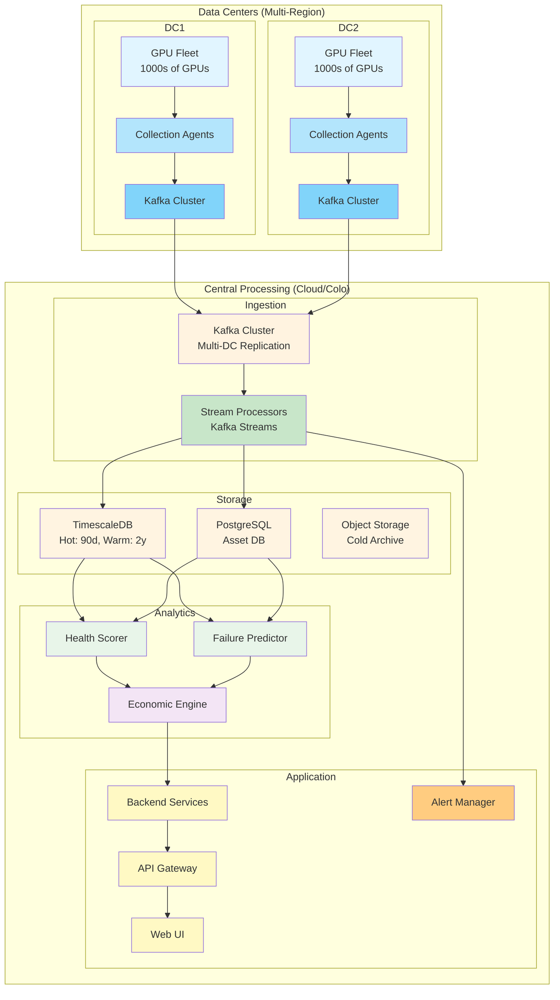

---

## Implementation Phases

### Phase 1: Foundation (Weeks 1-4)

**Goal:** Establish core telemetry pipeline and basic monitoring

**Deliverables:**
- DCGM agents deployed on 100 GPUs (pilot group)
- Kafka cluster operational with multi-DC replication
- TimescaleDB ingesting metrics with 10s granularity
- Basic Grafana dashboards showing real-time metrics
- PostgreSQL asset database with GPU inventory

**Success Criteria:**
- 99.9% metric collection success rate
- < 30s end-to-end latency (GPU → dashboard)
- All 100 pilot GPUs reporting health metrics

**Tech Stack:**
- DCGM exporter (Go)
- Kafka cluster (3 brokers per DC)
- TimescaleDB (primary + replica)
- Grafana + Prometheus

**Team:**
- 1 DevOps engineer (infrastructure)
- 1 Backend engineer (data pipeline)
- 1 Data engineer (database schema)

### Phase 2: Health Scoring (Weeks 5-8)

**Goal:** Implement multi-dimensional health scoring system

**Deliverables:**
- Health scoring algorithm implemented
- Historical health scores backfilled for pilot GPUs
- Health score dashboard with drill-down capabilities
- Automated alerts for health score degradation
- API endpoints for health queries

**Success Criteria:**
- Health scores calculated for all pilot GPUs every 15 minutes
- Scores validated against known good/bad GPUs
- Alert system detecting known issues within 5 minutes

**Tech Stack:**
- Python FastAPI (health scoring service)
- Redis (health score cache)
- PostgreSQL (health history)

**Team:**
- 1 Backend engineer (scoring algorithm)
- 1 Frontend engineer (dashboard)
- 1 Subject matter expert (health definition validation)

### Phase 3: Predictive Analytics (Weeks 9-14)

**Goal:** Build failure prediction models with historical data

**Deliverables:**
- Labeled training dataset (100+ failures + healthy control)
- Feature engineering pipeline (200+ features)
- XGBoost failure prediction model (AUC > 0.85)
- LSTM sequence model for time-series patterns
- Model serving infrastructure (Ray Serve)
- Prediction dashboard showing failure risk

**Success Criteria:**
- Model achieves > 85% AUC on holdout set
- Predictions generated for all pilot GPUs daily
- At least 1 failure correctly predicted 7+ days in advance

**Tech Stack:**
- Python (scikit-learn, XGBoost, PyTorch)
- Feast (feature store)
- MLflow (experiment tracking)
- Ray Serve (model serving)

**Team:**
- 2 ML engineers (model development)
- 1 Data engineer (feature pipeline)
- 1 Backend engineer (serving infrastructure)

### Phase 4: Economic Engine (Weeks 15-18)

**Goal:** Implement economic decision-making framework

**Deliverables:**
- Residual value calculator with market pricing API integration
- Operational cost projection model
- Revenue estimation based on workload and health
- Decision matrix implementation
- Economic dashboard showing NPV analysis
- Secondary market pricing recommendations

**Success Criteria:**
- Economic decisions generated for all pilot GPUs
- Residual value estimates within 15% of actual sales
- At least 3 GPUs sold via recommendations with positive ROI

**Tech Stack:**
- Python (economic models)
- PostgreSQL (economic history)
- External APIs (market pricing data)

**Team:**
- 1 Backend engineer (economic engine)
- 1 Data analyst (pricing models)
- 1 Frontend engineer (economic dashboard)
- 1 Business analyst (validation)

### Phase 5: Full Fleet Rollout (Weeks 19-24)

**Goal:** Scale to entire GPU fleet with automation

**Deliverables:**
- All GPUs (10,000+) instrumented and reporting
- Automated health monitoring and alerting
- Failure predictions running continuously
- Economic recommendations integrated into asset management
- Operator training and documentation
- API integrations for external systems

**Success Criteria:**
- 99.95% of fleet reporting health metrics
- < 1% false positive rate on critical alerts
- > 80% of predictions validated as accurate
- Demonstrable ROI from early failure detection

**Tech Stack:**
- Full production stack
- Kubernetes auto-scaling
- Multi-region deployment

**Team:**
- Full team (8-10 engineers)
- Dedicated SRE for production support
- Training team for operators

### Phase 6: Continuous Improvement (Ongoing)

**Goal:** Refine models and expand capabilities

**Deliverables:**
- Weekly model retraining pipeline
- A/B testing framework for new models
- Expanded feature set (NVLink, workload-specific)
- Root cause analysis automation
- Advanced economic optimization (portfolio theory)
- Integration with secondary market platforms

**Success Criteria:**
- Model performance improves month-over-month
- Feature requests from operators implemented
- Economic ROI exceeds 10x system cost

---

## Proof of Concept Scope

### POC Objectives

**Duration:** 6 weeks  
**Scope:** 50 GPUs in single datacenter  
**Budget:** $50,000 (infrastructure + development time)

**Primary Goals:**
1. Validate telemetry collection at scale (10s intervals, 100+ metrics/GPU)
2. Demonstrate health scoring accuracy on known good/bad GPUs
3. Predict at least 1 failure with 7+ days lead time
4. Show economic value of early detection (cost avoidance)

### POC Architecture

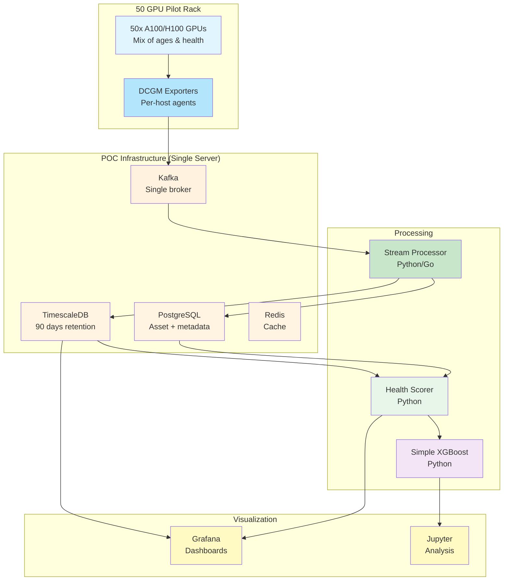

### POC Deliverables

**Week 1-2: Infrastructure Setup**
- Deploy DCGM exporters on all 50 GPUs
- Set up Kafka + TimescaleDB + PostgreSQL on single server
- Verify metric collection (all GPUs reporting every 10s)
- Basic Grafana dashboards (temperature, utilization, ECC errors)

**Week 3-4: Health Scoring**
- Implement simplified health scoring (thermal + memory + power)
- Calculate health scores for all 50 GPUs
- Identify 5 "degraded" GPUs based on scores
- Validate against operator knowledge of problem GPUs

**Week 5: Predictive Model**
- Collect historical data from any failed GPUs (if available)
- Train simple XGBoost model on ECC errors + temperature
- Generate failure risk scores for all 50 GPUs
- Identify top 3 "at risk" GPUs

**Week 6: Economic Analysis**
- Estimate residual value for all 50 GPUs
- Calculate operational costs based on health scores
- Recommend 3 GPUs for secondary market sale
- Project ROI of health monitoring system

### POC Success Criteria

**Minimum Viable Success:**
- 95%+ of pilot GPUs reporting metrics continuously
- Health scores generated and validated against known issues
- At least 1 degraded GPU identified before operator notice
- Economic model shows potential for 5x ROI

**Stretch Goals:**
- Predict actual failure with 7+ days lead time
- Identify cost savings from proactive replacement
- Demonstrate secondary market pricing accuracy

### POC Risks & Mitigations

| Risk | Impact | Mitigation |
|------|--------|-----------|
| Insufficient failure history | Can't train predictive models | Use synthetic data, focus on health scoring |
| DCGM deployment issues | Delayed data collection | Pre-test on 5 GPUs before full rollout |
| GPU workloads interfere | Metrics unreliable | Select low-utilization period for pilot |
| No failures during POC | Can't validate predictions | Use retrospective analysis of past failures |
| Infrastructure costs exceed budget | POC cancelled | Use cloud spot instances, minimal redundancy |

---

## API Specifications

### Health API

**GET /api/v1/gpus/{gpu_id}/health**

Get current health score and details for a specific GPU.

**Response:**
```json
{
  "gpu_id": "550e8400-e29b-41d4-a716-446655440000",
  "timestamp": "2026-02-09T19:00:00Z",
  "overall_score": 87,
  "risk_level": "low",
  "scores": {
    "thermal": 92,
    "memory": 85,
    "power": 90,
    "performance": 88,
    "reliability": 80
  },
  "trend": {
    "7d_change": -3,
    "30d_change": -8,
    "direction": "declining"
  },
  "alerts": [
    {
      "severity": "warning",
      "message": "ECC correctable errors increasing",
      "detected_at": "2026-02-08T14:30:00Z"
    }
  ]
}
```

**GET /api/v1/gpus/{gpu_id}/prediction**

Get failure prediction for a specific GPU.

**Response:**
```json
{
  "gpu_id": "550e8400-e29b-41d4-a716-446655440000",
  "timestamp": "2026-02-09T19:00:00Z",
  "predictions": {
    "7_day": {
      "probability": 0.12,
      "confidence": 0.88
    },
    "30_day": {
      "probability": 0.35,
      "confidence": 0.82
    },
    "90_day": {
      "probability": 0.58,
      "confidence": 0.75
    }
  },
  "estimated_ttf_days": 75,
  "most_likely_failure_type": "memory_degradation",
  "contributing_factors": [
    "Increasing ECC error rate",
    "Memory temperature trending upward",
    "Age > 18 months"
  ]
}
```

**GET /api/v1/gpus/{gpu_id}/economic**

Get economic analysis and recommendation for a GPU.

**Response:**
```json
{
  "gpu_id": "550e8400-e29b-41d4-a716-446655440000",
  "timestamp": "2026-02-09T19:00:00Z",
  "recommendation": {
    "action": "keep",
    "confidence": 0.85,
    "reason": "NPV of continued operation ($18,500) exceeds sale value ($15,200)"
  },
  "valuation": {
    "residual_value": 15200,
    "operational_cost_12m": 4700,
    "revenue_potential_12m": 23200,
    "npv_keep": 18500,
    "npv_sell": 14400
  },
  "market_pricing": {
    "list_price": 15200,
    "min_acceptable": 13700,
    "target_price": 15200,
    "market_demand": "moderate"
  },
  "alternatives": [
    {
      "action": "sell",
      "expected_value": 14400,
      "timeline": "14 days"
    },
    {
      "action": "repurpose",
      "expected_value": 12800,
      "timeline": "immediate"
    }
  ]
}
```

**GET /api/v1/fleet/summary**

Get fleet-wide health and economic summary.

**Response:**
```json
{
  "timestamp": "2026-02-09T19:00:00Z",
  "total_gpus": 10000,
  "health_distribution": {
    "excellent": 6200,
    "good": 2800,
    "fair": 700,
    "degraded": 250,
    "poor": 40,
    "critical": 10
  },
  "risk_distribution": {
    "low": 8500,
    "medium": 1200,
    "high": 250,
    "critical": 50
  },
  "economic_summary": {
    "total_asset_value": 180000000,
    "monthly_revenue": 18500000,
    "monthly_operational_cost": 2200000,
    "recommended_actions": {
      "keep": 9500,
      "sell": 350,
      "repurpose": 120,
      "decommission": 30
    }
  },
  "predictions": {
    "failures_next_30d": 45,
    "failures_next_90d": 180,
    "estimated_downtime_hours": 1200
  }
}
```

### Metrics API

**GET /api/v1/gpus/{gpu_id}/metrics**

Get recent metrics for a GPU.

**Query Parameters:**
- `start`: ISO8601 timestamp (default: 24h ago)
- `end`: ISO8601 timestamp (default: now)
- `interval`: Aggregation interval (default: 1m)
- `metrics`: Comma-separated list (default: all)

**Response:**
```json
{
  "gpu_id": "550e8400-e29b-41d4-a716-446655440000",
  "start": "2026-02-08T19:00:00Z",
  "end": "2026-02-09T19:00:00Z",
  "interval": "1m",
  "metrics": [
    {
      "timestamp": "2026-02-09T19:00:00Z",
      "temp_gpu": 72,
      "temp_memory": 78,
      "power_draw": 310,
      "util_gpu": 95,
      "util_memory": 82,
      "ecc_correctable_count": 0,
      "ecc_uncorrectable_count": 0
    }
  ]
}
```

---

## Security & Compliance

### Security Architecture

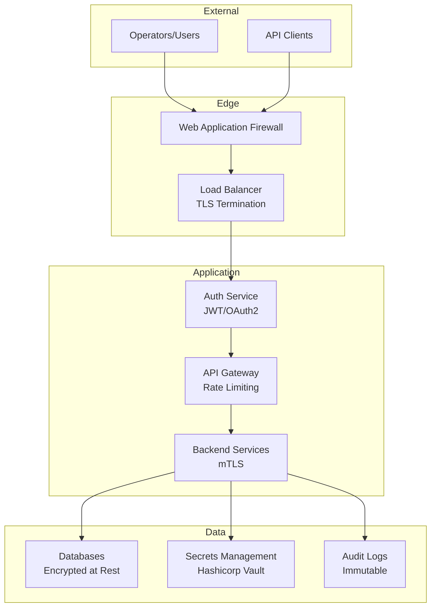

### Security Controls

**Authentication & Authorization:**
- OAuth2 / OIDC for user authentication
- JWT tokens with short expiry (15 minutes)
- Refresh tokens for session management
- Role-based access control (RBAC)
- API keys for service-to-service auth
- Multi-factor authentication for admin access

**Network Security:**
- VPC isolation with private subnets
- Security groups restricting inbound traffic
- TLS 1.3 for all external communications
- mTLS for internal service mesh
- VPN required for administrative access
- DDoS protection via cloud provider

**Data Security:**
- Encryption at rest (AES-256)
- Encryption in transit (TLS 1.3)
- Database connection encryption
- Secrets stored in Vault with rotation
- PII/sensitive data masked in logs
- Regular key rotation (90 days)

**Monitoring & Auditing:**
- Comprehensive audit logging (who, what, when)
- Immutable audit log storage
- Real-time anomaly detection
- Failed authentication alerting
- Privileged access monitoring
- Compliance reporting

### Compliance Considerations

**SOC 2 Type II:**
- Access controls and audit trails
- Data encryption and backup procedures
- Incident response plan
- Vendor risk management
- Change management process

**GDPR (if applicable):**
- Data minimization (collect only necessary metrics)
- Right to erasure (remove historical data on request)
- Data portability (export APIs)
- Privacy by design

**Industry Best Practices:**
- Regular vulnerability scanning
- Penetration testing (annual)
- Security awareness training
- Incident response drills
- Business continuity planning

---

## Appendices

### A. Glossary

| Term | Definition |
|------|------------|
| DCGM | NVIDIA Data Center GPU Manager - telemetry collection framework |
| ECC | Error Correcting Code - memory error detection/correction |
| Health Score | Multi-dimensional metric (0-100) representing GPU condition |
| NPV | Net Present Value - economic value considering time value of money |
| Residual Value | Estimated market value of GPU at current condition |
| SM | Streaming Multiprocessor - CUDA compute unit |
| Throttling | Automatic reduction of GPU clocks due to thermal/power limits |
| TTF | Time To Failure - predicted days until GPU failure |

### B. References

- NVIDIA DCGM Documentation: https://docs.nvidia.com/datacenter/dcgm/
- NVIDIA Management Library (NVML): https://developer.nvidia.com/nvidia-management-library-nvml
- TimescaleDB Best Practices: https://docs.timescale.com/
- Kafka Streams Documentation: https://kafka.apache.org/documentation/streams/
- XGBoost Documentation: https://xgboost.readthedocs.io/

### C. Future Enhancements

**Short-term (6-12 months):**
- Workload-specific health profiles (training vs inference)
- Automated remediation (clock throttling, workload migration)
- Integration with GPU job schedulers (Slurm, Kubernetes)
- Mobile app for alerts and dashboard
- Advanced root cause analysis with graph neural networks

**Medium-term (12-24 months):**
- Multi-vendor GPU support (AMD, Intel)
- Predictive maintenance scheduling
- Automated secondary market listing/auction
- Portfolio optimization across fleet
- Carbon footprint tracking and optimization

**Long-term (24+ months):**
- Generative AI for failure pattern discovery
- Digital twin simulation for what-if scenarios
- Blockchain-based GPU provenance tracking
- Federated learning across multiple fleets
- Autonomous GPU lifecycle management

---

**Document End**

---

## Implementation Checklist

- [ ] Phase 1: Foundation infrastructure deployed
- [ ] Phase 2: Health scoring operational
- [ ] Phase 3: Predictive models trained and serving
- [ ] Phase 4: Economic engine making recommendations
- [ ] Phase 5: Full fleet rollout complete
- [ ] Phase 6: Continuous improvement process established

**Version History:**
- v1.0 (2026-02-09): Initial architecture design
